# 최대 유량
> 특정 지점에서 다른 지점으로 얼마나 많은 유량(flow)을 동시에 보낼 수 있는지 계산하는 문제

## 기본 용어
- 용량 (Capacity)
  - c(u, v) : 정점 u에서 v로 전송할 수 있는 최대 용량
- 유량 (Flow)
  - f(u, v) : 정점 u에서 v로 실제 흐르고 있는 유량
- 잔여 용량 (Residual Capacity)
  - r(u, v) = c(u, v) – f(u, v)
  - 간선의 용량과 살제로 흐르는 유량의 차이
- 소스 (Source)
  - s : 모든 유량이 시작되는 정점
- 싱크 (Sink)
  - t : 모든 유량이 도착하는 정점
- 증가 경로
  - 소스에서 싱크로 유량을 보낼 수 있는 경로
 

## 기본 특징
- 용량 제한 속성
  - f(u, v) ≤ c(u, v), 유량은 용량보다 작거나 같다.
- 유량의 대칭성
  - f(u, v) = -f(v, u)
  - u에서 v로 유량이 흐르면, v에서 u로 음수의 유량이 흐르는 것과 동일
- 유량의 보존성
  - 각 정점에 들어오는 유량과 나가는 유량은 같다.
 
## 기존 최대 유량 탐색 방법의 문제점
- 예를 들어, 아래 그림과 같은 네트워크가 있다고 가정해보자.

<p align="center">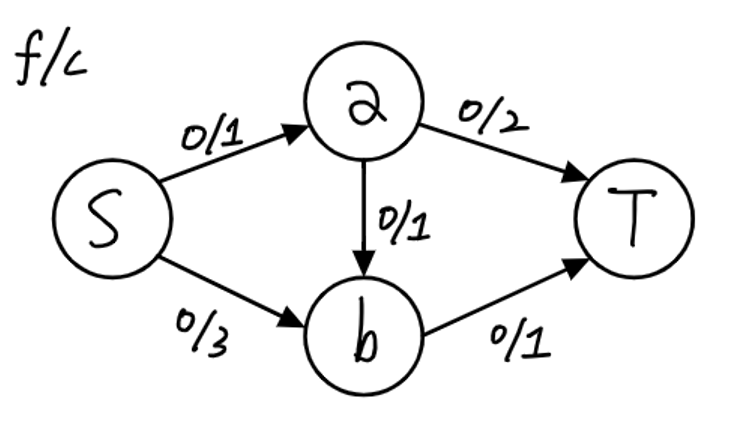</p>

-
  - S에서 T로 가는 모든 경로를 탐색하며 최대 유량을 계산한다.
    - S → a → T
    - S → a → b → T
    - S → b → T

- 만약, 아래 그림과 같이, S → a → T 와 S → b → T 의 경로를 먼저 탐색하게 된다면,
<p align="center">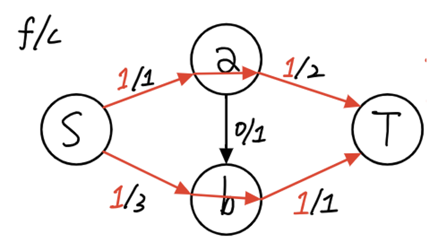</p>

-
  - 해당 네트워크의 최대 유량은 2가 되므로 정답이다.

- 하지만, 만약 아래 그림과 같이, S → a → b → T 의 경로를 가장 먼저 탐색하게 된다면,
<p align="center">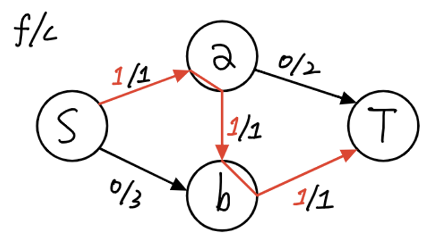</p>

-
  - S → a, a → b, b → T 간선의 유량이 최대치이기 때문에, S → b 에 추가로 연결된 경로를 찾지 못하고, 최대 유량이 1인 상태에서 중지된다.

- 해당 문제는 유량 상쇄를 통해 해결할 수 있다.

## 유량 상쇄
- 모든 경로에 기존에 존재하는 간선들과 반대되는 방향의 간선을 추가한 뒤 각 간선으로 유량을 흘려보냈을 때, 반대 방향의 간선으로도 음의 유량을 흘려보냄으로써 유량을 상쇄시키는 것을 의미한다.
  - 물론 실제로는 불가능하지만, 음의 유량을 기록함으로써 잔여 용량을 남겨 추가적인 경로를 탐색할 수 있도록 하기 위한 작업이다.
- 예를 들어, a → b의 간선이 존재하고 f(a, b)는 1, c(a, b)는 1이라면, 역간선 b → a의 유량 f(b, a)는 기존 간선의 방향과 반대이므로 -1이 되며, 용량 c(b, a)는 실제 존재하는 간선이 아니므로 0이 된다.
  - 따라서, 역간선 b → a의 잔여 용량 r(b, a)는, c(b, a) - f(b, a) = 0 - (-1) = 1이 된다.
  - 즉, 역간선 b → a로 1의 유량을 추가적으로 흘려보낼 수 있게 된다.
- 해당 규칙은 두 정점이 서로에게 유량을 보내주는 것은 의미가 없기 때문에 성립할 수 있으며, 소스에서 싱크로 가는 총 유량도 변하지 않는다.

## 최대 유량 알고리즘 진행 순서
### 포드-풀커슨 알고리즘 (Ford-Fulkerson Algorithm)
1. 네트워크에 존재하는 모든 간선의 유량을 0으로 초기화하고, 역방향 간선의 유량도 0으로 초기화한다.
2. 소스에서 싱크로 갈 수 있는, __잔여 용량이 남은 경로를 DFS로 탐색__ 한다.
3. 해당 경로에 존재하는 간선들의 잔여 용량 중, 가장 작은 값을 유량으로 흘려보낸다.
4. 해당 유량에 음수값을 취해, 역방향 간선에도 흘려보낸다. (유량 상쇄)
5. 더 이상 잔여 용량이 남은 경로가 존재하지 않을 때까지 반복한다.

### 에드몬드-카프 알고리즘 (Edmonds-Karp Algorithm)
1. 네트워크에 존재하는 모든 간선의 유량을 0으로 초기화하고, 역방향 간선의 유량도 0으로 초기화한다.
2. 소스에서 싱크로 갈 수 있는, __잔여 용량이 남은 경로를 BFS로 탐색__ 합니다.
3. 해당 경로에 존재하는 간선들의 잔여 용량 중, 가장 작은 값을 유량으로 흘려보낸다.
4. 해당 유량에 음수값을 취해, 역방향 간선에도 흘려보낸다. (유량 상쇄)
5. 더 이상 잔여 용량이 남은 경로가 존재하지 않을 때까지 반복한다.

## 포드-풀커슨
<p align="center">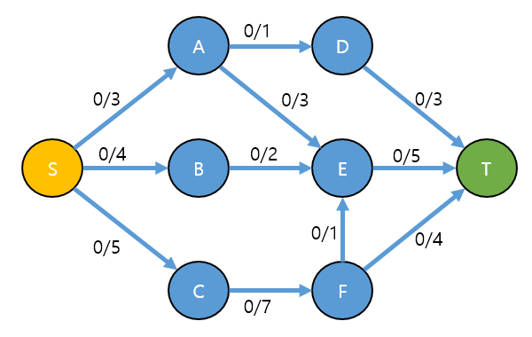</p>

### 1. 증가 경로 탐색
<p align="center">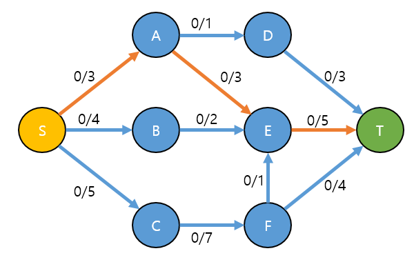</p>

- S → A → E → T 경로를 확인하였다.
- 경로를 찾는 법칙은 존재하지 않는다. (즉 S → B → E → T도 되고, S → C → F → T도 가능하다)
  - 단, 경로를 찾을 때 반드시 경로는 반드시 여유 용량이 남아 있어야 한다. (c(a, b) - f(a, b) > 0)
- 보통은, 경로를 찾는 방법으로 DFS 또는 BFS를 사용하게 된다.
- 경로를 찾았다의 조건은 Source → Sink까지 도달해야 하며, 경로상에 여유 용량이 있어야 한다.

### 2. 찾아낸 경로에 보낼 수 있는 최대 flow 탐색
<p align="center">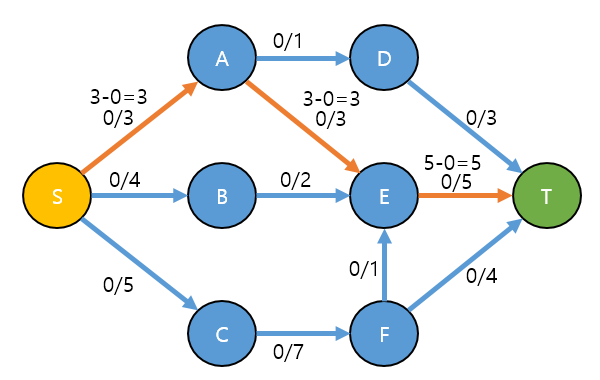</p>

- 경로에서 보낼 수 있는 최대 flow는 각각의 구간에 남은 capacity의 최소값(min)이다.
- S → A → E → T 에서 capacity의 min 값은 3이다.

### 3. 찾아낸 경로에, 최대 flow을 흘려보낸다.
<p align="center">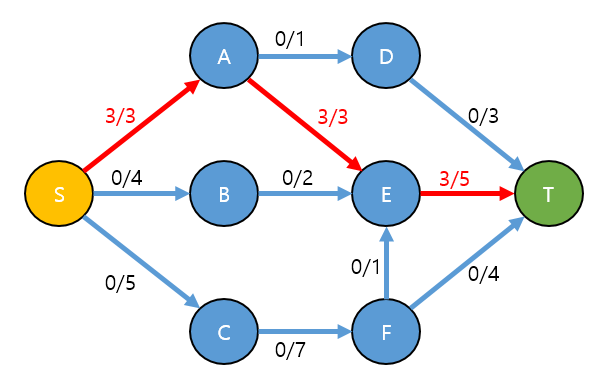</p>

- S → A → E → T 경로에 2번 과정에서 구한 3만큼의 flow를 흘려보낸다.
- 1번 ~ 3번 과정을 반복한다. 종료 조건은 증가경로를 더 이상 찾지 못하는 경우이다.

<p align="center">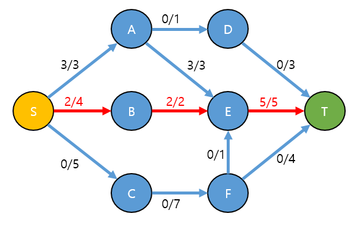</p>

- S → B → E → T 경로를 찾고, 최대 flow가 2인 것을 구한 후 해당 경로에 2만큼 흘려보낸다.

<p align="center">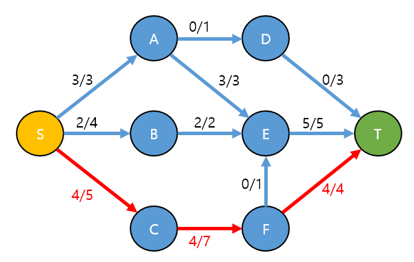</p>

- S → C → F → T 경로를 찾고, 최대 flow가 4인 것을 구한 후 해당 경로에 4만큼 흘려보낸다.
- 증가 경로를 더 이상 찾을 수 없으므로, 여기까지 얻은 total 유량은 9가 된다.

<p align="center">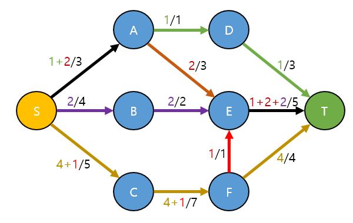</p>

<p align="center">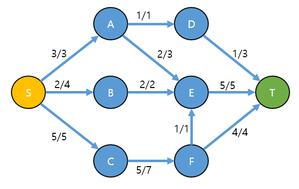</p>

- 하지만 위의 그림대로라면 total 유량은 10이 나온다.

### 4. 실제 정답과 오답 비교
<p align="center">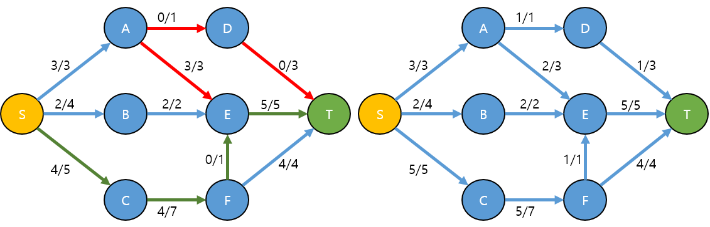</p>

- 실제 정답과, 오답을 비교해보면
  - S → A 로 흐르는 3의 유량이 A → E 로 전부 3으로 흐르는 것이 아닌, A → D로 1이 흐르고 A → E 로 2가 흐름을 알 수 있다.
  - 따라서 A → E → T 가 1 만큼의 여유가 생기고, 해당 여유만큼 S → C → F → E → T 를 통해 1이 흐른다.
- 오답이 정답이 나오게 하려면.
  - 처음 구한 A → E 유량 3을, 2가 되게 하고, 남는 유량 1을 A → E → T 의 경로로 흐르게 하면 된다.
  - 어떻게 해야 흐름을 조정할 수 있을까?
- 이를 가능하게 하는 아이디어가 가상의 간선(역간선)이 있다고 가정하는 것이다.
  - 결국 네트워크 유량의 포드 풀커슨 알고리즘과, 에드몬드 카프 알고리즘의 핵심은 이 가상의 간선(역간선)의 존재를 이용하는 것이다.
- 역간선이 있는 상태에서, 1 → 3 과정을 다시 반복한다.

<p align="center">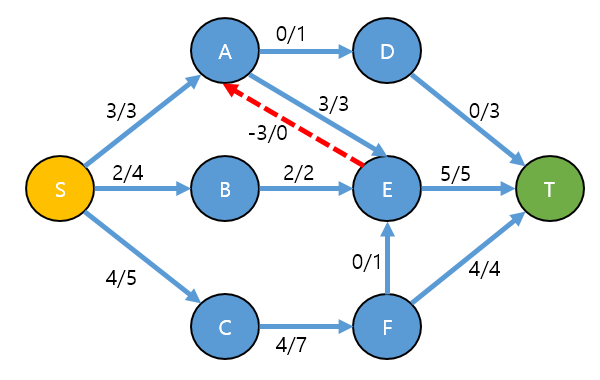</p>

- 역간선이 있다면 다음과 같은 증가 경로를 찾을 수 있다.

<p align="center">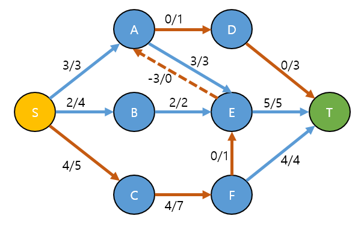</p>

- 증가경로: S → C → F → E → A → D → T
<p align="center">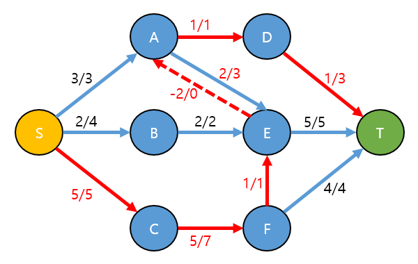</p>

- 증가경로를 더 이상 찾을 수 없으므로, T 까지 도달한 total 유량은 10이 된다.

## 코드로 보기
```java
// 1. Source에서 Sink로 가는 경로를 하나 찾는다.
public static Path findPath() {
    // dfs or bfs
    // c(a, b) - f(a, b) > 0 조건에 따라서 path을 찾을 수 있게 함.
}

// 2. 찾아낸 경로에 보낼 수 있는 최대 flow을 찾는다.
Path path = findPath();
FlowVal f;
for (p in path) {
  FlowVal pathFlow = p.capacity - p.flow;
  f = Math.min(f, pathFlow)
}

// 3. 찾아낸 경로에 실제 flow을 흘려보낸다.
for (p in path) {
    path(a,b).flow += f; // 순방향에는 + 로 흘려준다.
    path(b,a).flow -= f; // 역방향에는 - 로 흘려준다.
}
```

```java
// 1 ~ 3 반복. 종료 조건은, 증가 경로를 찾을 수 없을 때까지
public static Path findPath() {
    // dfs or bfs
    // c(a, b) - f(a, b) > 0 조건에 따라서 path을 찾을 수 있게 함.
}

getMaxTotalFlow() {
    total = 0;
    while( (path = findPath()) != null ) { // 1. 경로 찾기 및 반복
        // 2. flow값 찾기
        FlowVal f;
        for (p in path) {
          FlowVal pathFlow = p.capacity - p.flow;
          f = Math.min(f, pathFlow)
        }

        // 3. flow 흘리기
        for (p in path) {
            path(a,b).flow += f; // 순방향에는 + 로 흘려준다.
            path(b,a).flow -= f; // 역방향에는 - 로 흘려준다.
        }

        total += flow;
    }

    // total 이 최대 유량이 된다.
    return total;
}
```

- 포드-풀커슨의 시간복잡도는 O((|E|+|V|) * F) 이고, 애드몬드-카프의 시간복잡도는 O(|V| * (|E|^2)) 이다.
```
E : 간선
V : 정점
F : 최대 유량
```
- Flow(최대 유량)가 적고, Edge(간선)가 많으면 오히려 포드-풀커슨 알고리즘이 효율적일 수 있다.


