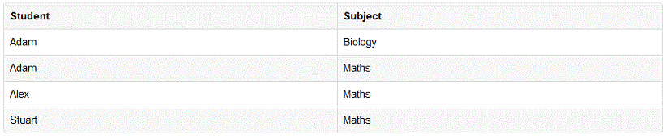

# 정규화 (Normalization)

## 개요
- 데이터베이스를 잘못 설계했을 때 불필요한 데이터 중복으로 인한 공간 낭비를 넘어 부작용을 초래할 수 있다.
- 이러한 부작용을 이상(Anomaly)라고 하는데, 이상 현상의 종류로 삽입 이상, 갱신 이상, 삭제 이상이 있다.

## 이상 현상 (Anomaly)
### 삽입 이상 (Insertion Anomaly)
- 삽입 이상은 특정 데이터가 존재하지 않아 중요한 데이터를 데이터베이스에 삽입할 수 없을 때 발생

- 3개의 학과(경영학과, 물리학과, 컴퓨터공학과)가 존재하고 신설학과인 수학과가 새로 생겼으며, 대학교 테이블에 데이터를 추가해야 한다.
- 하지만, 신설학과인 수학과에는 학생이 존재하지 않기 때문에 대학교 테이블에 데이터를 추가할 수 없다.

### 갱신 이상 (Update Anomaly)
- 테이블의 특정 데이터를 업데이트했는데 정상적으로 변경되지 않은 경우, 그리고 너무 많은 행을 업데이트하는 것

- 경영학과의 학생이 100명이라고 가정하고 경영학과의 학과장이 이름을 개명해서 학과장명을 변경해야 하는 경우를 예로 들어보자.
- 변경되지 않은 행이 한 개라도 존재하면, 데이터가 상이한 문제가 발생하며, 학생이 1000명이라면, 1000개의 데이터를 변경해야 하는 비효율적인 문제가 발생합니다.

### 삭제 이상 (Deletion Anomaly)
- 삭제 이상은 특정 정보를 삭제하면, 원치 않는 정보도 삭제되는 현상

- 컴퓨터공학과의 둘리 학생이 자퇴해서 데이터를 삭제해야 하는 경우 컴퓨터공학과의 학과 코드 및 학과장 정보도 삭제된다.

## 데이터베이스 정규화
> 데이터베이스의 설계를 재구성하는 테크닉
- 불필요한 데이터(redundancy)를 없앨 수 있고, 삽입 / 갱신 / 삭제 시 발생할 수 있는 각종 이상 현상들을 방지할 수 있다.

### 1차 정규화
- 1차 정규형은 각 로우마다 컬럼의 값이 1개씩만 있어야 한다. 이를 컬럼이 원자값(atomic value)을 갖는다고 한다.

- 위와 같은 예시에서, Adam의 Subject가 Biology, Maths로 두 개를 갖기 때문에 1차 정규형을 만족하지 못한다.

- 위와 같이 표현하려면 한 개의 로우를 더 만들게 되고 그만큼 데이터 redundancy는 증가한다. 데이터의 논리적 구성을 위해 이 부분을 희생하는 것으로 볼 수 있다.

### 2차 정규화
- 2차 정규형은 모든 컬럼이 완전 함수적 종속을 만족하는 것이다.
- 이는 다르게 말하면, 특정 컬럼에만 종속된 컬럼(부분적 종속)이 없어야 한다는 것이다.

- 위에서 들었던 예시의 경우 기본 키는 (Student, Subject)에 해당되고 이 두 필드값을 합쳐야 한 로우를 구분할 수 있다.
- 그런데 Age 컬럼의 경우 이 기본키 중에서 Student에만 종속적이다. 따라서 Age가 두 번 들어가는 것은 불필요한 것으로 생각할 수 있다.

- 이를 해결하기 위해 테이블을 쪼개야 한다. 그렇게 되었을 때 두 테이블 모두 2차 정규형을 만족하게 된다.
- 하지만, 이보다 조금 더 복잡한 테이블의 경우 갱신 이상을 겪기도 한다.

### 3차 정규화

- 위와 같은 데이터 구성을 생각해보았을 때, Student_id가 기본키이고 기본키가 하나이므로 2차 정규형을 만족하는 것으로 볼 수 있다.
- 하지만 이 데이터의 Zip 컬럼을 알면 Street, City, State를 결정할 수 있고, 또한 여러 명의 학생들이 같은 Zip 컬럼값을 갖는 경우 Street, City, State, Zip에서 중복된 데이터가 생길 가능성이 있다.
- 3차 정규형은 기본키를 제외한 속성들 간의 이행적 함수 종속이 없는 것이다. 기본키 이외의 다른 컬럼이 그 외 다른 컬럼을 결정할 수 없다.

- 3차 정규화는 위와 같은 방법으로 테이블을 분리함으로써 해결할 수 있는데, 이를 통해 데이터가 논리적인 단위(학생, 주소)로 분리될 수 있고, 데이터의 redundancy도 줄었음을 알 수 있다.

### BCNF (Boyce and Codd Normal Form)

- 3차 정규형으로 해결할 수 없는 이상현상을 해결할 수 있다.
- BCNF란 3차 정규형을 만족하면서 모든 결정자가 후보키 집합에 속한 정규형이다.
|학생|과목|교수|학점|
|--|--|--|--|
|1|CS000|X|A|
|2|CS123|Y|A|
|3|CS123|Y|A|

- 위 릴레이션에는 제약사항이 있다. 한 명의 교수는 한 강의만 담당할 수 있다는 점이다.
- 후보키란 수퍼키 중 최소성을 만족하는 것이다. 위의 테이블에서 후보키에 해당되는 컬럼은 (학생, 과목)이다.
- 하지만, (교수)는 후보키가 아님에도 사전에 정의된 제약조건을 통해 과목을 결정짓고 있다. (후보키가 아닌 일반 컬럼인 교수가 과목의 결정자 역할을 하고 있음)
- 이 경우 이상 현상이 발생할 수 있다.
  - 예를 들어, 교수 Y가 강의하는 과목명이 바뀌었다고 가정하면 두 개의 로우를 갱신해야 한다. (데이터 불일치가 일어날 가능성이 있음)

|교수|과목|
|--|--|
|X|CS000|
|Y|CS123|

|학생|과목|학점|
|--|--|--|
|1|CS000|A|
|2|CS123|A|
|3|CS123|A|

- 위와 같이 테이블을 분리하는 것이 BCNF이다.
- 정리하자면, 3차 정규형을 만족하면서 BCNF를 만족하지 않는 경우는 일반 컬럼이 후보키를 결정하는 경우이다.

### 비정규화 (반정규화, de-normalization)
- 정규화를 진행한 후, 필요에 의해 다시 릴레이션을 합치는 등 데이터를 중복시키는 작업이다.
- 데이터를 조회하는데 지나치게 조인이 많이 필요한 경우, 특정 데이터를 조회하는 프로세스의 수가 많고 특정 범위만을 조회할 경우 이 비정규화가 필요하다.
- 하지만 지나치게 비정규화를 하게 될 경우 데이터 무결성에 문제가 있을 수 있음

