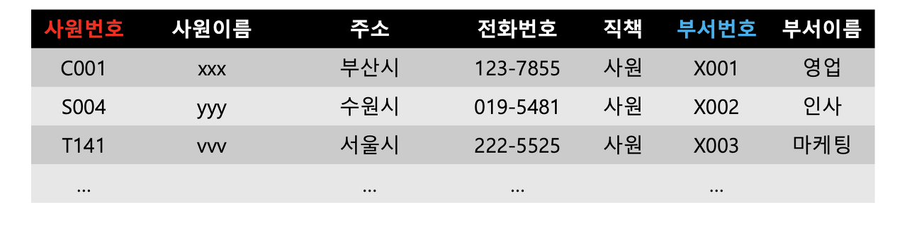
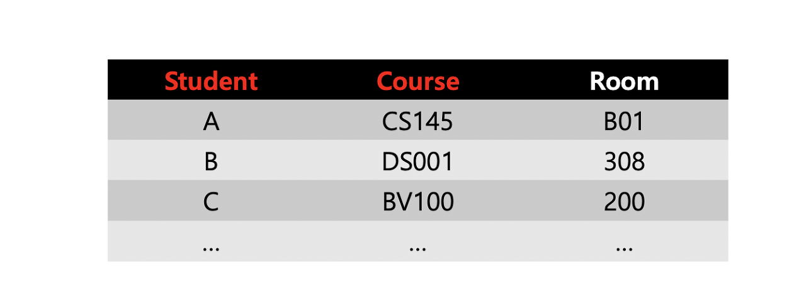
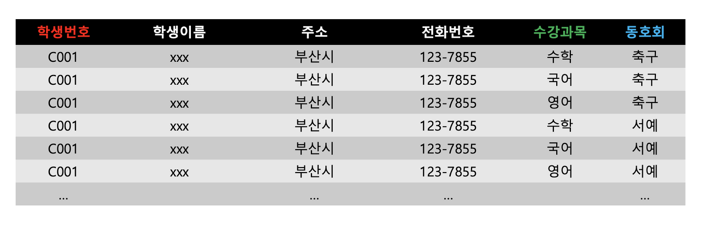

# 함수 종속성 (Functional Dependency)
## 1. 개요 
- 데이터베이스는 최신 정보 시스템의 기본 구성 요소이며, 데이터베이스의 설계 및 관리는 데이터베이스가 저장하는 데이터의 정확성, 일관성 및 신뢰성을 보장하는 데 중요한 역할을 한다.
- 데이터베이스 설계의 주요 개념 중 하나는 데이터베이스 테이블의 속성 간의 관계를 설명하는 함수 종속성이다.
- 함수 종속성은 데이터베이스에서 데이터 무결성을 보장하고 데이터 중복성을 줄이는 데 중요한 역할을 한다.
- 함수 종속성은 데이터베이스 테이블의 속성 간의 관계를 제어하는 규칙 세트이다.
  - 한 속성의 값이 동일한 테이블에서 다른 속성의 값을 결정하는 방법을 설명한다.
  - 예를 들어, 고객 테이블에서 고객의 이메일 주소는 고유한 고객 ID에 따라 달라질 수 있다.
  - 고객 ID가 변경되면 데이터 무결성을 유지하기 위해 이메일 주소도 변경해야 한다.
- 함수 종속성은 중복성을 줄이고 데이터 일관성을 향상시키기 위해 데이터베이스에서 데이터를 구성하는 프로세스인 데이터베이스 정규화에서 광범위하게 사용된다.
- 정규화에는 큰 테이블을 함수 종속성을 통해 서로 관련된 더 작고 관리하기 쉬운 테이블로 나누는 작업이 포함된다.
- 함수 종속성을 이해하는 것은 조직의 요구 사항에 따라 확장할 수 있는 효율적이고 유지 관리 가능한 데이터베이스를 생성할 수 있으므로, 데이터베이스 디자이너와 관리자에게 매우 중요하다.
- 함수 종속성을 식별하고 활용함으로써 데이터베이스 설계자는 데이터 중복을 줄이고 오류 및 불일치 위험을 최소화하며 쿼리 성능을 최적화할 수 있다.

## 2. 정의
- 함수 종속(functional dependency)은 데이터베이스의 릴레이션(relation)에서 두 개의 속성(attribute) 집합 간 제약의 일종입니다.
- 어떤 릴레이션 R에서, X와 Y를 각각 R의 속성(attribute) 집합의 부분 집합이라고 가정해보자.
  - 속성(attribute) X의 값 각각에 대해 시간에 관계없이 항상 속성(attribute) Y의 값이 오직 하나만 연관되어 있을 때 Y는 X에 함수 종속이라 하고, X → Y라고 표기한다.
  - 즉, R 내의 속성(attribute)의 집합 X와 역시 R 내에 있는 또 다른 속성(attribute)의 집합 Y에 대해, 각각의 X 값에 대해 최대 한 개의 Y 값에 연관되어 있을 때, 속성(attribute)의 집합 X를 함수 결정한다고 말한다.
  - X를 결정자(determinant set)라 하고, Y를 종속자(dependent attribute)라고 합니다.
- 함수 종속을 찾아내는 것은, 관계형 모델 하의 데이터베이스를 설계하거나, 데이터베이스 정규화, 데이터베이스 비정규화를 할 때 수행하는 매우 중요한 과정 중 하나이다.
  - 함수 종속은 유저 도메인에 맞지 않은 가능한 한 많은 데이터를 제거하기 위한 제약을 생성하기 위해 애트리뷰트 도메인과 함께 선택된다.
- 예를 들어 차량과 엔진 배기량을 추적 관리하는 시스템을 설계한다고 가정해보자.
  - 각 차량에는 차량별 고유한 차량 식별 번호(VIN)를 부여한다. 그러면 "VIN → 배기량"이라고 적을 수 있다. 차량 한 대에는 배기량 하나만 있는 것이 맞기 때문이다.
  - 그러나 "배기량 → VIN"이라고 적는 것은 틀린 것이다. 같은 배기량을 가진 여러 대의 차가 있을 수 있기 때문이다.
- 함수 종속은 애트리뷰트 "배기량" 이 후보 키 "VIN" 과 함께 하나의 릴레이션 안에 배치될 수 있다는 가능성을 보여준다.
- 그러나 이러한 하나의 릴레이션 안에 배치되는 것이 항상 옳은 것은 아니다. 함수 종속은 이행적(transitive) 함수 종속의 결과로 나타날 수도 있다.
  - VIN → 차량모델, 차량모델 → 차량배기량의 경우 이행적(Transitivity) 함수 종속이다. 이 경우 보통의 정규화된 관계가 성립되지 않는다.

## 3. 함수 종속성의 종류
### 3-1. 완전 함수 종속 (Full Functional Dependency) 
- 종속자가 기본키에만 종속되며, 기본키가 여러 속성으로 구성되어 있을 경우 기본키를 구성하는 모든 속성이 포함된 기본키의 부분집합에 종속된 경우

- 위 그림은 사원 정보가 저장된 릴레이션으로, 사원번호와 부서번호가 기본키로 지정되어 있다.
- 기본키(사원번호, 부서번호)를 통해 종속자(직책)를 완전 함수 종속하는 경우를 완전 함수 종속이라고 한다.

### 3-2. 부분 함수 종속 (Partial Functional Dependency)
- 릴레이션에서 종속자가 기본키가 아닌 다른 속성에 종속되거나, 기본키가 여러 속성으로 구성되어 있을 경우 기본키를 구성하는 속성 중 일부만 종속된 경우

- 부분 함수 종속의 경우, 기본키 중 사원번호를 통해 종속자(사원이름, 주소, 전화번호)를 종속할 수 있으며, 기본키 중 부서번호를 통해 종속자(부서이름)를 종속할 수 있다.

### 3-3. 이행 함수 종속 (Transitive Functional Dependecy)
- 릴레이션에서 X, Y, Z라는 3개의 속성이 있을 때 X→Y, Y→Z 이란 종속 관계가 있을 경우, X→Z가 성립될 때 이행적 함수 종속이라고 한다.

- 위의 그림으로 X→Y, Y→Z 이란 종속 관계가 있을 경우, X→Z 가 성립되는지 확인해보자.
  - X(사원번호)를 통해서 Y(사원이름)을 종속할 수 있다. Y(사원이름)를 통해서 Z(주소, 전화번호, 직책)등을 종속할 수 있다.
  - 또한 X(사원번호)를 통해서 Z(주소, 전화번호, 직책)등을 종속할 수 있으므로 이는 이행 함수 종속이 된다.

 
### 3-4. 결정자 함수 종속 (Boyce-codd Normalization)
- 함수 종속의 결정자가 후보키가 아닌 경우
 

- 위의 사진은 학생의 수강과목 정보가 있는 릴레이션이다. 기본키는 Student와 Course로 설정되어 있다.
- 결정자(Student, Course)에 의해 Room이 종속될 수 있다. 그러나 Room으로 Course를 종속시키는 것은 불가능하다.
- Room은 기본키로 사용될 수 없는 문제가 발생하며, 이를 이행 함수 종속이라고 합니다.

 

### 3-5. 다중값 종속 (Multi-Valued Dependency)
- 한 Relation에서 둘 이상의 독립적인 다중값 속성이 존재하는 경우
 

- 위 그림은 학생의 기본 정보와 수강과목, 동호회 등의 정보가 포함된 릴레이션입니다.

- 현재 수강과목은 3개이고, 동호회는 2개이다. 그러나 하나의 과목을 더 수강하게 되면 동호회 정보도 함께 입력해야 하므로, 2개의 데이터(새로운 과목명 + 축구, 새로운 과목명 + 서예)를 추가해야 한다.
- 반대로 동호회를 하나 더 가입하면 3개의 데이터가 추가된다. 이는 A(학생번호), B(수강과목), C(동호회)를 각각 다중 결정하여 발생하는 다중값 종속 현상으로, 중복되는 불필요한 정보가 발생한다.

 
### 3-6. 조인(결합) 종속 (Adjoin Dependency)
- Relation 중에서 둘로 나눌 때는 원래의 Relation로 회복할 수 없으나, 셋 또는 그 이상으로 분리시킬 때 원래의 Relation를 복원할 수 있는 특수한 경우.
 

## 4. 결론
- 결론적으로 기능 종속성은 데이터 무결성을 보장하고 데이터 중복성을 줄이는 효율적이고 확장 가능하며 유지 관리 가능한 데이터베이스를 생성할 수 있는 데이터베이스 설계의 중요한 구성 요소이다.
- 기능 종속성을 이해하고 이를 데이터베이스 설계에 활용함으로써 조직은 데이터의 오류 및 불일치 위험을 최소화하고 쿼리 성능을 최적화하며 진화하는 비즈니스 요구 사항을 충족할 수 있다.
  - 데이터베이스 디자이너와 관리자는 조직의 요구 사항을 충족하고 비즈니스 목표를 지원하는 강력하고 안정적인 데이터베이스를 구축할 수 있습니다.

