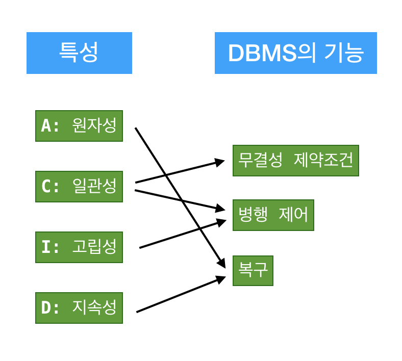
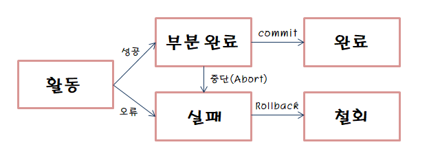
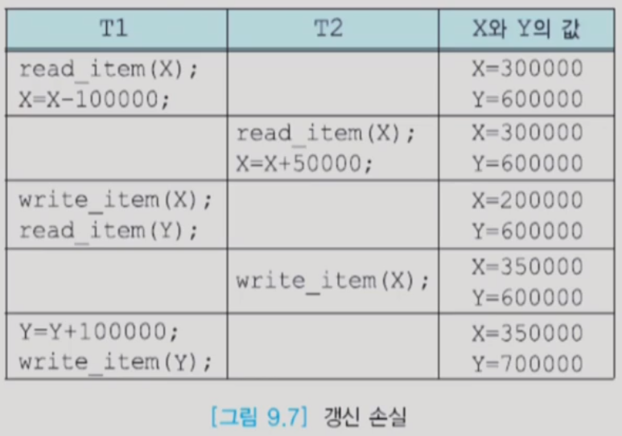
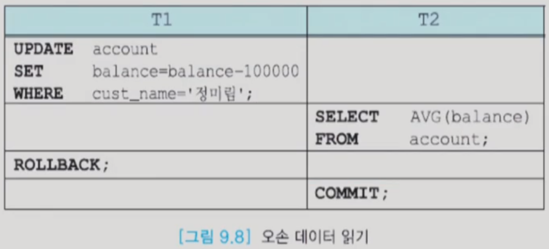
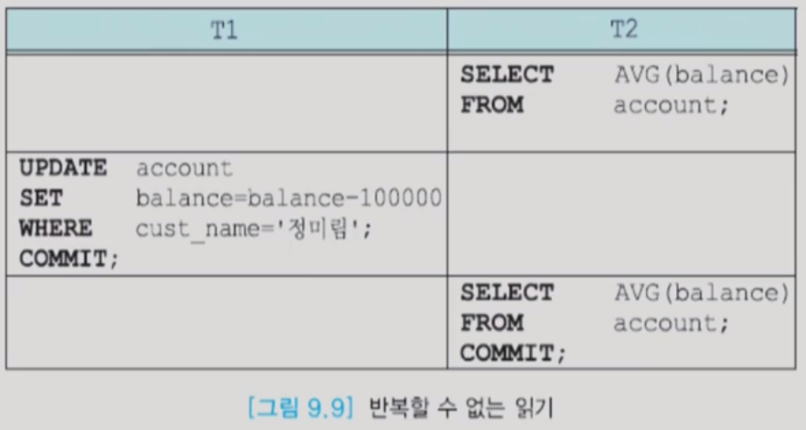

# 트랜잭션 (Transaction)
> 하나의 논리적 작업 단위를 구성하는 일련의 연산들의 집합

## ACID (트랜잭션이 가지는 4가지 성질)
### Atomicity (원자성)
- 이체 과정 중에 트랜잭션이 실패하게 되어 예금이 사라지는 경우가 발생해서는 안 된다.
  - 따라서, DBMS는 완료되지 않은 트랜잭션의 중간 상태를 데이터베이스에 반영해서는 안 된다.
- 즉, 트랜잭션의 모든 연산들이 정상적으로 수행 완료되거나 아니면 전혀 어떠한 연산도 수행되지 않은 상태를 보장해야 한다. Atomicity는 쉽게 __'all or nothing'__ 특성으로 설명된다.

### Consistency (일관성)
- 고립된 트랜잭션의 수행이 데이터베이스의 일관성을 보존해야 한다. 즉, 성공적으로 수행된 트랜잭션은 정당한 데이터들만을 데이터베이스에 반영해야 한다.
- 트랜잭션의 수행을 데이터베이스 상태 간의 전이(transition)로 봤을 때, 트랜잭션 수행 전후의 데이터베이스 상태는 각각 일관성이 보장되는 서로 다른 상태가 된다.
- 트랜잭션 수행이 보존해야 할 일관성은 기본 키, 외래 키 제약과 같은 명시적인 무결성 제약 조건들뿐만 아니라, 자금 이체 예에서 두 계좌 잔고의 합은 이체 전후가 같아야 한다는 사항과 같은 비명시적인 일관성 조건들도 있다.

### Isolation (고립성)
- 여러 트랜잭션이 동시에 수행되더라도 각각의 트랜잭션은 다른 트랜잭션의 수행에 영향을 받지 않고 독립적으로 수행되어야 한다.
- 한 트랜잭션에서 데이터베이스를 변경한 내용은 트랜잭션이 커밋되기 전까지는 다른 어떤 질의나 트랜잭션과도 고립되어야만 한다. 즉, 각 트랜잭션은 시스템 내에서 동시에 수행되고 있는 다른 트랜잭션들을 알지 못한다.
  - 한 트랜잭션의 중간 결과가 다른 트랜잭션에게는 숨겨져야 한다는 의미인데, 이러한 isolation 성질이 보장되지 않으면 트랜잭션이 원래 상태로 되돌아갈 수 없게 된다.
- DBMS의 병행 제어 모듈이 트랜잭션의 고립성을 보장한다.

### Durability (지속성)
- 트랜잭션이 성공적으로 완료되어 커밋되고 나면, 해당 트랜잭션에 의한 모든 변경은 향후에 어떤 소프트웨어나 하드웨어 장애가 발생되더라도 보존되어야 한다.
- 데이터베이스 시스템은 데이터베이스의 현재 상태가 유실되지 않도록 시스템 충돌 등의 문제로부터 복구할 수 있는 방법을 갖추고 있어야 한다.
- DBMS의 복구 모듈은 시스템이 다운되는 경우에도 트랜잭션의 지속성을 보장한다.

## 트랜잭션의 상태

#### 활동(Active)
- 트랜잭션이 실행 중인 상태

#### 실패(Failed) 
- 트랜잭션 실행에 오류가 발생하여 중단된 상태

#### 철회(Aborted) 
- 트랜잭션이 비정상적으로 종료되어 Rollback 연산을 수행한 상태

#### 부분 완료(Partially Committed) 
- 트랜잭션의 마지막 연산까지 실행했지만, Commit 연산이 실행되기 직전의 상태

#### 완료(Committed) 
- 트랜잭션이 성공적으로 종료되어 Commit 연산을 실행한 후의 상태

#### Commit
- Commit 연산은 한 개의 논리적 단위(트랜잭션)에 대한 작업이 성공적으로 끝났고 데이터베이스가 다시 일관된 상태에 있을 때, 이 트랜잭션이 행한 갱신 연산이 완료된 것을 트랜잭션 관리자에게 알려주는 연산이다.

#### Rollback
- 하나의 트랜잭션 처리가 비정상적으로 종료되어 데이터베이스의 일관성을 깨뜨렸을 때, 이 트랜잭션의 일부가 정상적으로 처리되었더라도 트랜잭션의 원자성을 구현하기 위해 이 트랜잭션이 행한 모든 연산을 취소(Undo)하는 연산
- Rollback 시에는 해당 트랜잭션을 재시작하거나 폐기한다.

## 병행 제어 (Concurrency Control)
- 대부분의 DBMS들은 다수 사용자용이기 때문에, 동시에 여러 사용자들이 동일 테이블에 접근하기도 한다.
  - DBMS의 성능을 높이기 위해 여러 사용자의 질의나 프로그램들을 동시에 수행하는 것이 필수적
- 동시성 제어 기법은 여러 사용자들이 다수의 트랜잭션을 동시에 수행하는 환경에서 서로 간의 간섭이 생기지 않도록 한다. (부정확한 결과 도출 방지)
- 직렬 스케줄(Serial Schedule) : 여러 트랜잭션들을 한 트랜잭션씩 차례대로 수행 (병렬이 아님)
- 비직렬 스케줄(Non-serial Schedule) : 여러 트랜잭션들을 동시에 수행 (일관성을 보장하지 못함)

- __직렬 가능(Serializable)__ : 비직렬 스케줄의 결과가 어떤 직렬 스케줄의 수행 결과와 동등하다.

### 병행 제어를 하지 않고 다수의 트랜잭션을 동시에 수행한다면?

#### Lost Update (갱신 손실)

- 수행 중인 트랜잭션이 갱신한 내용을 다른 트랜잭션이 덮어씀으로써 갱신이 무효가 되는 것이다.

#### Dirty Read (더티 읽기)

- 완료되지 않은 트랜잭션이 갱신한 데이터 내용을 읽으려고 할 때 발생한다.
#### Unrepeatable Read (반복할 수 없는 읽기)

- 한 트랜잭션이 동일한 데이터를 두 번 읽을 때, 서로 다른 값을 읽는 것이다.
- 다른 트랜잭션이 데이터에 접근하여 수정해버렸고, 결국 isolation level이 지켜지지 않은 것이다.

## 로킹 (Locking)
- 동시에 수행되는 트랜잭션들의 동시성을 제어하기 위해 널리 사용되는 기법

### 특징
- 대부분의 로킹 관련 작업은 사용자가 신경쓸 필요 없이, DBMS에서 모두 이루어진다.
- 로킹 단위가 크면 관리하기가 용이(로킹 오버헤드 감소), 하지만 동시성 수준이 낮아진다.
- 로킹 단위가 작으면 동시성 수준이 높아지지만 관리가 까다롭다. (로킹 오버헤드 증가)

### 종류
#### 독접 로크 (X-lock, eXclusive lock)
- 한 데이터 항목에 대한 갱신은 한 트랜잭션에 대해서만 허용되므로, 트랜잭션에서 갱신을 목적으로 데이터 항목을 접근할 때는 독점 로크를 요청

#### 공유 로크 (S-lock, Shared lock)
- 트랜잭션에서 읽을 목적으로 데이터 항목을 접근할 때는 공유 로크를 요청

### 2단계 로킹 프로토콜 (2-phase lock protocol)
- 로크를 요청하는 것과 로크를 해제하는 것, 2단계로 이루어진다.
  - 로크 확장 단계가 지난 후에 로크 수축 단계에 들어감
  - 일단 로크를 한 개라도 해제하면 로크 수축 단계에 들어감
- 자기가 사용할 데이터 전체에 lock을 걸 때까지는 해제를 못한다. 로크를 걸 게 더 이상 없을 때부터 해제를 할 수 있다.
  - 마찬가지로, 해제하는 단계에서는 새로 lock을 걸 수 없다.

#### 로크 확장 단계(1단계)
- 로크 확장 단계에서는 트랜잭션이 데이터 항목에 대하여 새로운 로크를 요청할 수 있지만, 보유하고 있던 로크를 하나라도 해제할 수 없음

#### 로크 수축 단계(2단계) 
- 로크 수축 단계에서는 보유하고 있던 로크를 해제할 수 있지만 새로운 로크를 요청할 수 없다.
- 로크 수축 단계에서는 로크를 조금씩 해제할 수도 있고, 트랜잭션이 완료 시점에 이르렀을 때 한꺼번에 모든 로크를 해제할 수도 있음 (일반적으로 한꺼번에 해제하는 방식 필요)
  - 한꺼번에 해제함으로써 cascade rollback 등의 문제를 원천적으로 차단할 수 있다.

#### 로크 포인트(lock point)
- 한 트랜잭션에서 필요로 하는 모든 로크를 걸어놓은 시점

### 데드록(deadlock)
- 2단계 로킹 프로토콜에서는 데드록이 발생할 수 있다.
- 데드록은 두 개 이상의 트랜잭션들이 서로 상대방이 보유하고 있는 lock를 요청하면서 기다리고 있는 상태를 말한다.
- 데드록을 해결하기 위해서는 데드록을 방지하는 기법이나, 데드록을 탐지하고 희생자를 선정하여 데드록을 푸는 기법 등을 사용한다. (victim을 process kill)

### 다중 로크 단위(multiple granularity)
- 다수의 트랜잭션들이 소수의 tuple에 접근하는 데이터베이스에서는 tuple 단위로 로크해도 로크 테이블을 다루는 시간이 오래 걸리지 않는다.
- 반대로, 트랜잭션들이 다수의 tuple에 접근하는 데이터베이스에서 tuple 단위로만 로크를 한다면 로크 테이블에서 로크 충돌을 검사하고, 로크 정보를 기록하는 시간이 오래 걸린다.
- 트랜잭션이 접근하는 tuple의 수에 따라 로크하는 데이터 항목의 단위를 구분하는 것이 필요하다.
- 한 트랜잭션에서 로크할 수 있는 데이터 항목이 두 가지 이상 있으면 다중 로크 단위라고 말함
  - 데이터베이스에서 로크할 수 있는 단위로는 데이터베이스, 릴레이션, 디스크 블록, 투플 등
- 일반적으로 DBMS는 각 트랜잭션에서 접근하는 tuple 수에 따라 자동적으로 로크 단위를 조정함
  - 로크 단위가 작을수록 로킹에 따른 오버헤드 증가
  - 로크 단위가 작을수록 동시성의 정도 증가 (수많은 트랜잭션들의 동시성)

### 트랜잭션과 Lock
- Lock과 트랜잭션은 서로 비슷한 개념 같지만 사실 잠금은 동시성을 제어하기 위한 기능이고 트랜잭션은 데이터의 정합성을 보장하기 위한 기능이다.
- Lock은 여러 커넥션에서 동시에 동일 자원을 요청할 경우 순서대로 한 시점에는 하나의 커넥션만 변경할 수 있게 해주는 역할을 한다. 여기서 자원은 레코드나 테이블을 말한다.
- 트랜잭션은 꼭 여러 개의 변경 작업을 수행하는 쿼리가 조합되었을 때만 의미있는 개념은 아니다.
  - 트랜잭션은 하나의 논리적인 작업 셋 중 하나의 쿼리가 있든 두 개 이상의 쿼리가 있든 관계없이 논리적인 작업 셋 자체가 100% 적용되거나 아무것도 적용되지 않아야 함을 보장하는 것이다.
  - 예를 들면 HW 에러 또는 SW 에러와 같은 문제로 인해 작업에 실패가 있을 경우, 특별한 대책이 필요하게 되는데 이러한 문제를 해결하는 것이다.
- 트랜잭션에서도 DeadLock이 발생할 수 있다.

## 복구 (Recovery)
- 여러 애플리케이션이 주기억장치 버퍼 내의 동일한 데이터베이스 항목을 갱신한 후에 디스크에 기록하는 것이 Disk I/O 작업을 줄일 수 있어 성능 향상에 도움이 된다.
  - 즉, 버퍼의 내용을 디스크에 기록하는 것을 최대한 줄이는 것이 일반적이다.

### REDO
- 커밋한 트랜잭션의 수정은 어떤 경우에도 유지(durability)되어야 한다. 이미 커밋한 트랜잭션의 수정을 재반영하는 복구 작업을 REDO 복구라고 한다.
- 만일 고장이 발생하기 전에 트랜잭션이 완료 명령을 수행했다면, 복구 모듈은 이 트랜잭션의 갱신 사항을 REDO(재수행)하여 트랜잭션의 갱신이 지속성을 갖도록 해야 한다.
### UNDO
- 고장이 발생하기 전에 트랜잭션이 완료 명령을 수행하지 못했다면, 원자성을 보장하기 위해 이 트랜잭션이 데이터베이스에 반영했을 가능성이 있는 갱신 사항을 UNDO(취소)해야 한다.
- UNDO 복구와 REDO 복구를 위해서 가장 널리 쓰이는 구조는 로그(log)이다.

