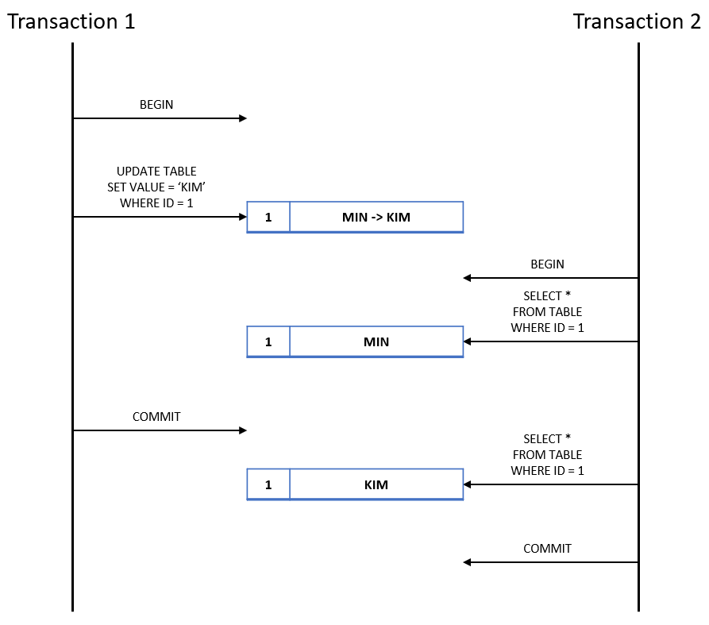

# 트랜잭션 격리 수준

## 동시성과 일관성
<p align="center"></p>

- 트랜잭션의 특성 중 일관성이 완전히 보장될 경우 여러 클라이언트의 요청을 받는 데이터베이스의 특성상 응답의 지연이 발생하는, 동시성이 저해되는 현상이 발생한다.
  - 일관성이 너무 높다면 한 테이블에 접근 및 작업해야 하는 수많은 트랜잭션 중 단 하나만이 접근 및 작업이 가능해지게 된다.
- 그렇다고 해서 동시성을 너무 높여버리면 데이터의 일관성을 잃게 될 가능성이 높기 때문에 운영 중인 서비스의 특성에 따라 적절한 균형을 두어야 한다.
- 이러한 조정을 위한 방법 중 하나가 격리 레벨(Isolation Level)이다.

## 격리 레벨(Isolation Level)
```
Read Uncommitted : 커밋되지 않은 것을 읽는다.
Read Committed : 커밋된 것을 읽는다.
Repeatable Read : 반복적으로 읽는다.
Serializable : 직렬화가 가능하다.
```
- 격리 레벨이 Read Uncommitted 인 경우 동시성이 높아 여러 사용자가 같은 데이터를 읽고 수정할 수 있는 반면 데이터 자체의 일관성이 떨어질 수 있다.
- 반면, Serializable은 직렬화가 가능하다는 뜻으로 테이블 데이터에 여러 트랜잭션이 줄 서서 기다리듯 처리된다.
  - 다시 말해 한 트랜잭션만 읽고 수정할 수 있게 되므로 일관성은 극도로 높아지나 동시성은 현저히 떨어진다.
- 즉, 트랜잭션의 격리 수준이란 DB에 동시에 여러 개의 트랜잭션이 처리될 때 특정 트랜잭션에서 변경 또는 조회하고 있는 데이터를 다른 트랜잭션이 어느 정도까지 조회할 수 있는지를 결정하는 것을 말한다. 

### ① Read Uncommitted
<p align="center"></p>

- 커밋하지 않은 데이터에 접근이 가능한 수준, N개의 트랜잭션이 하나의 공유 데이터에 접근해도 전혀 보호되지 않는다.
- 이 수준에서만 볼 수 있는 데이터의 문제점은 Dirty Read이다.
> Dirty Read : 커밋되지 않은 수정 중인 데이터를 다른 트랜잭션에서 읽을 수 있도록 허용할 때 발생하는 현상

### ② Read Committed
<p align="center"></p>

- 커밋된 데이터만 조회할 수 있어 Dirty Read는 발생하지 않는다.
- 이 격리 수준 이하에서는 Non-Repeatable Read 문제가 발생한다.
> Non-Repeatable Read : 하나의 트랜잭션이 같은 값을 조회할 때 다른 값이 검색되는 현상 (트랜잭션이 조회하는 사이에 다른 트랜잭션이 그 데이터에 접근하여 값을 수정함) 

### ③ Repeatable Read
<p align="center"></p>

- 트랜잭션 시작 전에 커밋된 내용에 한해서만 조회된다.
  - MySQL에서는 트랜잭션마다 트랜잭션 ID를 부여하여 트랜잭션 ID보다 작은 트랜잭션 번호에서 변경된 것만 읽게 된다.
  - UNDO 공간에 백업해두고, 실제 레코드 값을 변경하게 되는데, 백업된 데이터는 불필요하다고 판단되는 시점에 주기적으로 삭제하고, UNDO에 백업된 레코드가 많아지면 MySQL 서버의 처리 성능이 떨어질 수 있다.
- 트랜잭션 2보다 트랜잭션 1의 크기가 크다. 트랜잭션 2는 트랜잭션 1의 변경을 커밋이 되었더라도 반영하지 않는다.
- 하지만, 이 단계에서 UPDATE에 대해서는 동일 데이터를 보장하지만 INSERT와 DELETE에 대해서는 보장하지 않는다. 따라서, Phantom Read 문제가 발생할 수 있다.


#### Phantom Read
<p align="center"></p>

- 다른 트랜잭션에서 수행한 변경 작업에 의해 레코드가 보였다가 안 보였다가 하는 현상이다.
- 이를 방지하기 위해 쓰기 잠금을 걸어야 한다.


### ④ Serializable
- 한 트랜잭션에서 사용되는 데이터는 다른 트랜잭션에서 접근할 수 없게 공유 락을 건다.
- 가장 단순한 격리 수준이지만 가장 엄격한 격리 수준이기도 하다.
- Serializable에서는 Phantom Read가 발생하지 않는다.
- 조회만으로 락이 걸리는 만큼, 다른 격리 레벨에 비해 동시성이 현저하게 떨어진다.
- 데이터베이스에서 거의 사용되지 않는다.
- 트랜잭션이 특정 테이블을 읽으면 다른 트랜잭션은 그 테이블의 데이터를 추가/변경/삭제할 수 없다.


