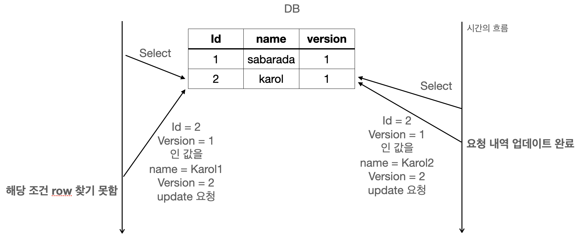

# 낙관적 락(Optimistic Lock)과 비관적 락(Pessimistic Lock)

## DB 충돌 상황을 개선할 수 있는 방법
- database에 접근해서 데이터를 수정할 때 동시에 수정이 일어나 충돌이 일어날 수 있다. 어떻게 해당 문제를 해결할 수 있을까?
  - 첫 번째, 테이블의 row에 접근시 Lock을 걸고 다른 Lock이 걸려 있지 않을 경우에만 수정을 가능하게 한다.
  - 두 번째, 수정할 때 내가 먼저 이 값을 수정했다고 명시하여 다른 사람이 동일한 조건으로 값을 수정할 수 없게 한다.

## 비관적 락(pessimistic lock)
- 비관적 락은 Reeatable Read 또는 Serializable 정도의 격리성 수준을 제공한다.
- 비관적 락이란 트랜잭션이 시작될 때 Shared Lock 또는 Exclusive Lock을 걸고 시작하는 방법이다.
  - 즉, Shared Lock을 걸게 되면 write를 하기 위해서는 Exclucive Lock을 얻어야 하는데 Shared Lock이 다른 트랜잭션에 의해서 걸려 있으면 해당 Lock을 얻지 못해서 업데이트를 할 수 없다.
- 수정을 하기 위해서는 해당 트랜잭션을 제외한 모든 트랜잭션이 종료(commit)되어야 한다.

### 예시
<p align="center"></p>

```
1) Transaction_1 에서 table의 Id 2번을 읽음 ( name = Karol )
2) Transaction_2 에서 table의 Id 2번을 읽음 ( name = Karol )
3) Transaction_2 에서 table의 Id 2번의 name을 Karol2로 변경 요청 ( name = Karol )
  → 하지만 Transaction 1에서 이미 shared Lock을 잡고 있기 때문에 Blocking
4) Transaction_1 에서 트랜잭션 해제 (commit)
5) Blocking 되어있었던 Transaction_2의 update 요청 정상 처리
```

- 이렇듯 Transaction을 이용하여 충돌을 예방하는 것이 바로 비관적 락(Pessimistic Lock)이다.

## 낙관적 락(optimistic lock)
- 낙관적 락은 DB 충돌 상황을 개선할 수 있는 방법 중 2번째인 수정할 때 내가 먼저 이 값을 수정했다고 명시하여 다른 사람이 동일한 조건으로 값을 수정할 수 없게 하는 것이다.
- 이 특징은 DB에서 제공해주는 특징을 이용하는 것이 아닌 Application Level에서 잡아주는 Lock이다.

### 예시
<p align="center"></p>

```
1) A가 table의 Id 2번을 읽음 ( name = Karol, version = 1 )
2) B가 table의 Id 2번을 읽음 ( name = Karol, version = 1 )
3) B가 table의 Id 2번, version 1인 row의 값 갱신 ( name = Karol2, version = 2 ) 성공
4) A가 table의 Id 2번, version 1인 row의 값 갱신 ( name = Karol1, version = 2 ) 실패
  → Id 2번은 이미 version이 2로 업데이트 되었기 때문에 A는 해당 row를 갱신하지 못함
```
- 위 flow를 통해서 같은 row에 대해서 각기 다른 2개의 수정 요청이 있었지만 1개가 업데이트 됨에 따라 version이 변경되었기 때문에 뒤의 수정 요청은 반영되지 않게 된다.
- 이렇게 낙관적 락은 version과 같은 별도의 컬럼을 추가하여 충돌적인 업데이트를 막는다.
  - version 뿐만 아니라 hashcode 또는 timestamp를 이용하기도 한다.

## 롤백(Rolback)
- 만약 업데이트를 하는 테이블이 1개가 아니라 2개의 테이블이며 2번째 테이블을 업데이트하다가 이와 같은 충돌이 발생했다면 하나의 수정 요청에 대해서는 롤백이 필요하게 된다.
- 비관적 락과 낙관적 락이 각각 어떻게 롤백하는지 알아볼 필요가 있다.

### 비관적 락 pseudo code
- 하나의 트랜잭션으로 묶여있기 때문에 수정이 하나 실패하면 database 단에서 전체 Rollback이 일어나게 된다.
  - 만약 theTable이 실패한다고 가정하자.
  - 그렇다면 Transaction이 실패한 것이기 때문에 트랜잭션 전체에 자동으로 rollback이 일어나게 된다.

```
 - SELECT id, `name`
       FROM theTable
       WHERE id = 2;
 - {새로운 값으로 연산하는 코드}
 - BEGIN TRANSACTION;
 - UPDATE anotherTable
       SET col1 = @newCol1,
           col2 = @newCol2
       WHERE id = 2;
 - UPDATE theTable
       SET `name` = 'Karol2',
       WHERE id = 2;
 - {if AffectedRows == 1 }
 -     COMMIT TRANSACTION;
 -     {정상 처리}
 - {else}
 -     ROLLBACK TRANSACTION;
 -     {DB 롤백 이후 처리}
 - {endif}
```

### 낙관적 락 pseudo code
- Transaction은 잡지 않습니다.
- 그렇기 때문에 만약 충돌이 발생하여 수정을 못한 부분에 대해서는 롤백에 대한 책임을 Application 단에서 지며 Application에서 롤백을 수동으로 해주어야 한다.

```
 - SELECT id, `name`, `version`
       FROM theTable
       WHERE iD = 2;
 - {새로운 값으로 연산하는 코드}
 - UPDATE theTable
       SET val1 = @newVal1,
           `version` = `version` + 1
       WHERE iD = 2
           AND version = @oldversion;
 - {if AffectedRows == 1 }
 -     {정상 처리}
 - {else}
 -     {롤백 처리}
 - {endif}
```

## 언제 어떤 경우에 각각 효과적일까?
### 낙관적 락?
- 낙관적 락은 트랜잭션을 필요로 하지 않는다. 따라서 성능적으로 비관적 락보다 더 좋게 된다.
- 트랜잭션을 필요로 하지 않기 때문에 아래와 같은 로직의 흐름을 가질 때도 충돌 감지를 할 수 있다.
- 만약 비관적 락이라면 1번에서 3번 사이의 트랜잭션을 유지할 수가 없다.
```
1. 클라이언트가 서버에 정보를 요청
2. 서버에서는 정보를 반환
3. 클라이언트에서 이 정보를 이용하여 수정 요청
4. 서버에서는 수정 적용 ( 충돌 감지 가능 )
```
- 또한 성능적으로 비관적 락보다 좋다. 때문에 충돌이 많이 일어나지 않을 것이라고 보여지는 곳에 사용하면 좋은 성능을 기대할 수 있게 된다.

### 비관적 락?
- 하지만 낙관적 락의 최대 단점은 롤백이다.
  - 만약 충돌이 발생했다고 한다면 이를 해결하려면 개발자가 수동으로 롤백 처리를 한땀한땀 해주어야 한다.
  - 비관적 락이라면 트랜잭션을 롤백하면 끝나는 작업이지만 낙관적 락은 그럴 수 없다.
  - 수동으로 롤백처리는 구현하기도 까다롭지만 성능적으로 보더라도 update를 한번씩 더 해주어야 한다.
  - 따라서 결과적으로 비관적 락보다 좋지 않을 수 있다.
- 이러한 단점 때문에 낙관적 락은 충돌이 많이 예상되거나 충돌이 발생했을 때 비용이 많이 들것이라고 판단되는 곳에서는 사용하지 않는 것이 좋다.


