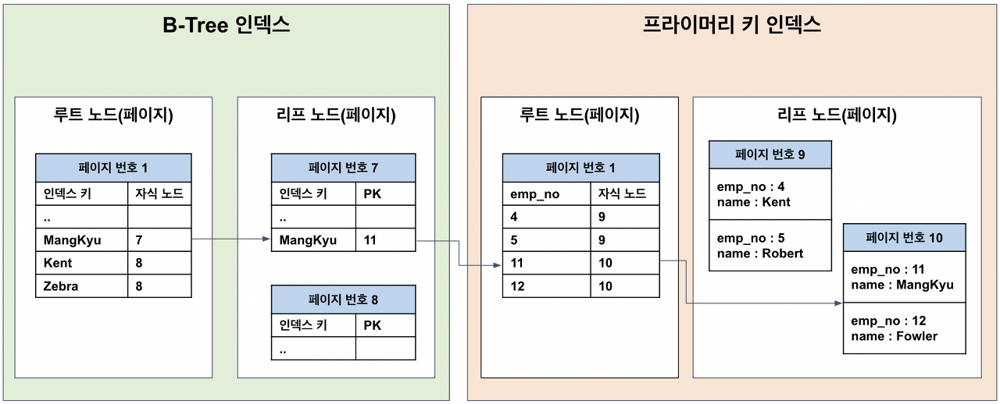
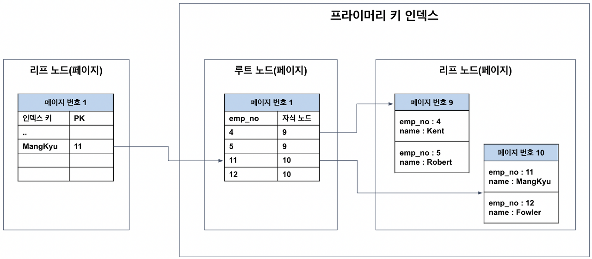
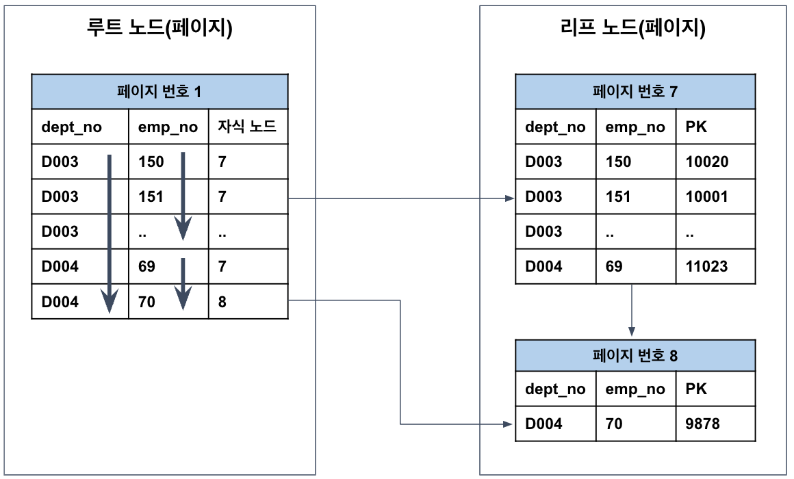
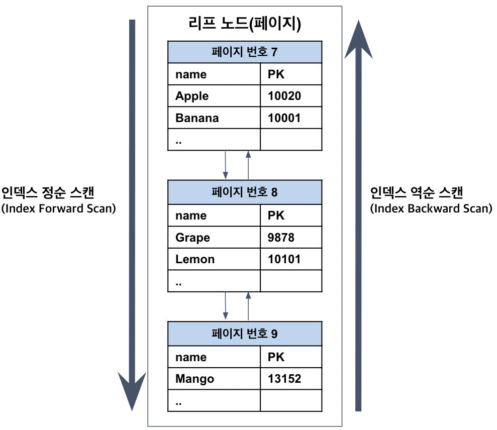
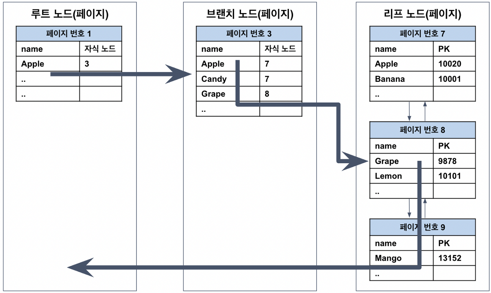
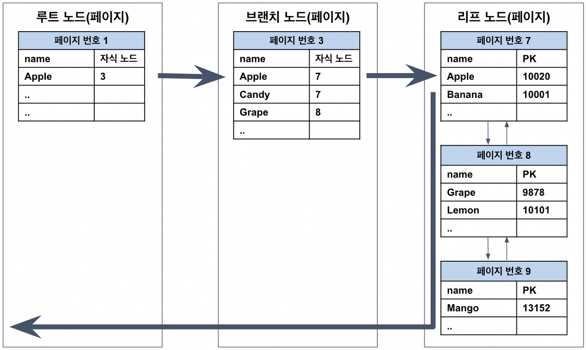
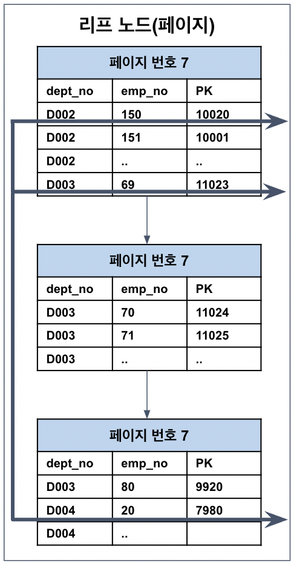
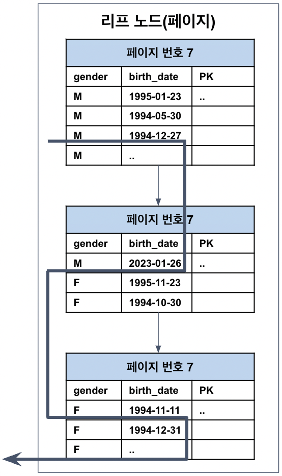

# 인덱스 (Index)
- 인덱스를 저장하는 방식(또는 알고리즘)에 따라 B-Tree 인덱스, Hash 인덱스, Fractal 인덱스 등으로 나눌 수 있다.
- 일반적으로 B-Tree 구조가 사용되기 때문에 B-Tree 인덱스를 통해 인덱스의 동작 방식에 대해 살펴보도록 하자.

## 1. B-Tree 인덱스와 인덱스가 필요한 이유
### B-Tree 구조란? 
- B-Tree(Balanced Tree) 인덱스에 대해 알기 위해서는 먼저 B-Tree 자료구조를 알아야 한다.
  - B-Tree는 자식 2개만을 갖는 이진 트리(Binary Tree)를 확장하여 N개의 자식을 가질 수 있도록 고안된 것이다.
  - 그리고 좌우 자식 간의 균형이 맞지 않을 경우에는 매우 비효율적이라, 항상 균형을 맞춘다는 의미에서 균형 트리(Balanced Tree)라고 불린다.
- B-Tree는 최상위에 단 하나의 노드만이 존재하는데, 이를 루트 노드(Root Node)라고 한다.
  - 그리고 중간 노드를 브랜치 노드(Branch Node), 최하위 노드를 리프 노드(Leaf Node)라고 한다.

### 페이지(Page)란?
- 인덱스의 저장 방식을 이해하기 위해서는 페이지(또는 블럭)에 대해 알아야 한다.
- 페이지란 디스크와 메모리(버퍼 풀)에 데이터를 읽고 쓰는 최소 작업 단위이다.
  - 일반적인 인덱스를 포함해 PK(클러스터 인덱스)와 테이블 등은 모두 페이지 단위로 관리된다.
  - 따라서 만약 쿼리를 통해 1개의 레코드를 읽고 싶더라도 결국은 하나의 블록을 읽어야 하는 것이다.
- 그래서 페이지에 저장되는 개별 데이터의 크기를 최대한 작게 하여, 1개의 페이지에 많은 데이터들을 저장할 수 있도록 하는 것이 상당히 중요하다.
  - 페이지에 저장되는 데이터의 크기가 클수록 다음과 같은 문제가 생길 수 있다.

```
디스크 I/O가 많아질 수 있음
메모리에 캐싱할 수 있는 페이지의 수가 줄어들 수 있음
```

- 만약 레코드를 찾는데 1개의 페이지만으로 처리가 안된다면 다른 페이지를 읽어야 하는데, 추가 페이지를 읽는 디스크 I/O 때문에 성능이 떨어지게 된다.
- 메모리의 효율을 위해서도 중요하다.
  - 디스크 I/O를 통해 페이지를 읽어오면 버퍼 풀이라는 메모리에 캐싱해둔다.
  - 그런데 개별 데이터의 크기가 커지면 페이지 자체의 크기가 커지면서, 메모리에 캐싱해둘 수 있는 페이지 수가 줄어들게 된다.
- DB 성능 개선 혹은 쿼리 튜닝은 디스크 I/O 자체를 줄이는 것이 핵심인 경우가 많다.

### B-Tree 인덱스의 구조 
- B-Tree 인덱스는 가장 일반적인 인덱스로, 앞서 살펴본 B-Tree(Balanced Tree, 균형 트리) 구조를 사용한다.
  - 특수한 경우가 아니라면 대부분 B-Tree 인덱스를 사용하면 된다.
  - 각각의 DBMS는 B-Tree를 변형(B+Tree 또는 B*-Tree 등)하여 사용하기도 한다.
- 인덱스는 페이지 단위로 저장되며, 인덱스 키를 바탕으로 항상 정렬된 상태를 유지한다.
  - 정렬된 인덱스 키를 따라서 리프 노드에 도달하면 (인덱스 키, PK) 쌍으로 저장되어 있다.
- 예를 들어 다음과 같이 설계된 테이블이 있다고 하자.

```sql
CREATE TABLE employee (
    emp_no INT NOT NULL AUTO_INCREMENT,
    name VARCHAR(64),
    PRIMARY KEY(emp_no),
    INDEX idx_name (name)
) ENGINE=InnoDB;
```

- 위와 같은 테이블에 임의의 데이터가 들어있다고 할 때, 이러한 구조를 그림으로 표현하면 다음과 같다.

<p align="center"></p>
 
- 위의 그림은 왼쪽의 B-Tree 인덱스 영역과 오른쪽의 프라이머리 키 인덱스(클러스터 인덱스) 영역 또는 테이블 영역으로 나뉘어져 있다.
  - 그리고 모든 페이지는 키 값을 기준으로 정렬되어 있다.
- idx_name 인덱스의 경우, name 값을 기준으로 정렬되어 있다.
  - 그리고 데이터를 따라 리프노드에 도달하면 인덱스 키에 해당하는 레코드의 PK 값이 저장되어 있다.
- 테이블 영역도 인덱스와 유사한데, 리프 노드에 실제 테이블의 레코드가 저장되어 있다는 점만 다르다.
- 인덱스는 테이블과 독립적인 저장 공간이므로 인덱스를 통해 데이터를 조회하려면 먼저 PK를 찾아야 한다.
  - PK로 레코드를 조회할 때는(인덱스 영역에서 테이블 영역으로 넘어가는 경우) PK가 어느 페이지에 저장되어 있는지 알 수 없으므로 랜덤 I/O가 발생한다.
  - 이후에는 PK를 따라 리프노드에서 실제 레코드를 읽어온다.
  - 참고로 연속된 데이터를 조회하는 경우에는 순차 I/O가 발생하는데, 랜덤 I/O는 임의의 장소에서 데이터를 가져오지만 순차 I/O는 다음 장소에서 데이터를 가져오므로 훨씬 빠르다.

### 인덱스가 필요한 이유 
- 앞서 설명하였듯 인덱스를 통해 데이터를 조회하는 것은 아래의 2가지 작업이 수행되는 것이다.
```
1) 인덱스를 통해 PK를 찾음
2) PK를 통해 레코드를 찾음
```

- 이러한 이유로 옵티마이저는 인덱스를 통해 레코드 1건을 읽는 것이 테이블을 통해 직접 읽는 것보다 4~5배 정도 비용이 더 많이 드는 것으로 예측한다.
  - 하지만 DBMS는 우리가 원하는 레코드가 어디 있는지 모르므로, 모든 테이블을 뒤져서 레코드를 찾아야 한다.
  - 이는 엄청난 디스크 읽기 작업이 필요하므로 상당히 느리다.
- 하지만 인덱스를 사용한다면 인덱스를 통해 PK를 찾고, PK를 통해 레코드를 저장된 위치에서 바로 가져올 수 있으므로 디스크 읽기가 줄어들게 된다.
  - 그렇기 때문에 레코드를 찾는 속도가 훨씬 빠르며, 이것이 인덱스를 사용하는 이유이다.
- 반면에 인덱스를 타지 않는 것이 효율적일 수도 있다.
  - 인덱스를 통해 레코드 1건을 읽는 것이 4~5배 정도 비싸기 때문에,
  - 읽어야 할 레코드의 건수가 전체 테이블 레코드의 20~25%를 넘어서면 인덱스를 이용하지 않는 것이 효율적이다.
  - 이런 경우 옵티마이저는 인덱스를 이용하지 않고 테이블 전체를 읽어서 처리한다.

## 2. 인덱스 사용에 영향을 주는 요소
### 1) PK의 크기 
- MySQL에서는 PK가 레코드의 물리적인 저장 위치를 결정하는 키이다.
  - PK가 레코드의 물리적인 저장 위치를 결정하기 때문에, 인덱스는 PK에 의존한다.
  - 그래야 인덱스를 타고 들어와서 PK를 통해 레코드의 값을 읽어올 수 있기 때문이다.
  - 이러한 구조를 그림으로 표현하면 다음과 같다.

<p align="center"></p>
 
- 인덱스가 PK가 아닌 실제 레코드의 주소를 갖게 할 수도 있지만, 그러면 PK가 변경될 때 레코드의 주소가 변경되고 모든 인덱스에 저장된 레코드 주소를 변경해야 한다.
  - 이러한 오버헤드를 피하기 위해 인덱스는 레코드의 주소가 아닌 PK를 저장하고 있다.
- 따라서 PK 값이 클수록 인덱스에 좋지 않다.
  - PK가 클수록 한 페이지에 담을 수 있는 인덱스 정보도 줄어들고, 메모리도 비효율적으로 사용되기 때문이다.
  - 또한 트리의 깊이도 지나치게 깊어지면서 읽어야 하는 페이지가 많아져 성능에 좋지 않다.

 ### 2) 인덱스의 컬럼 순서
- (PK를 포함하여) 인덱스는 여러 개의 컬럼으로 구성될 수 있는데, 이를 다중 컬럼 인덱스(Multi-column Index)라고 부른다.
  - 다중 컬럼 인덱스에서 중요한 것은 항상 다음 컬럼이 이전 컬럼에 의존하여 정렬된다는 것이다.
- 예를 들어 다음과 같은 dept_emp 테이블이 있다고 하자.

```sql
CREATE TABLE `dept_emp` (
    `id` bigint(20) NOT NULL AUTO_INCREMENT,
    `dept_no` varchar(100) NOT NULL,
    `emp_no` varchar(100) NOT NULL,
    INDEX idx_dept_emp (`dept_no`, `emp_no`),
    PRIMARY KEY (`id`)
);
```

- 위와 같은 테이블 구조를 그림으로 표현하면 다음과 같은데, 두 번째 컬럼은 첫 번째 컬럼에 의존해서 정렬된다.
  - 그렇기 때문에 두 번째 컬럼만으로 질의하는 경우는 인덱스를 제대로 타지 못한다.
  - 즉, 두 번째 컬럼의 정렬은 첫 번째 컬럼이 동일한 레코드에서만 의미가 있는 것이다.
  - 그래서 인덱스에서 컬럼의 순서는 상당히 중요하다.

<p align="center"></p>

### 3) 카디날리티(Cardinality)
- 카디날리티란 특정 컬럼에 존재하는 데이터의 고유성을 의미한다.
  - 따라서 카디날리티가 높을수록 중복도가 낮아지며, 유니크한 값이 많다는 것이다.
  - 항상 그런 것은 아니지만 일반적으로 값이 유니크할수록 검색 대상이 줄어들어서 처리가 빠르다.
- 예를 들어 다음과 같은 dept_emp 테이블이 있다고 하자.
  - 위의 그림과 비교해서 인덱스가 detp_no 만으로 구성되어 있다는 점이 다르다.

```sql
CREATE TABLE `dept_emp` (
    `id` bigint(20) NOT NULL AUTO_INCREMENT,
    `dept_no` varchar(100) NOT NULL,
    `emp_no` varchar(100) NOT NULL,
    INDEX idx_dept (`dept_no`),
    PRIMARY KEY (`id`)
);
```

- 그리고 레코드가 10000건 있는데, 각각 다음과 같은 케이스라고 하자.
  - 케이스 A
    - dept_no 컬럼의 유니크한 값이 10개
    - 1개의 dept_no에 평균 1000개(10000 / 10)의 emp_no가 저장됨
  - 케이스 B
    - dept_no 컬럼의 유니크한 값이 1000개
    - 1개의 dept_no에 평균 10개(10000 / 1000)의 emp_no가 저장됨
 
- 이러한 상황에서 다음과 같은 쿼리를 실행하면 각각의 케이스는 어떻게 다를까? 결과로 얻는 레코드는 1개라고 가정하자.

```sql
SELECT * FROM dept_emp WHERE dept_no = 'D003' AND emp_no = '150';
```

- MySQL은 인덱스의 통계 정보를 관리하는데, 그 중에 유니크한 값의 개수가 있다.
  - 그래서 인덱스 별로 평균적으로 몇 건의 레코드가 있는지를 계산하여 이를 쿼리 시 활용한다.
- 케이스 A의 경우 인덱스 당 평균 1000개의 레코드가 있으므로 1000개의 레코드를 읽어들인다.
  - 하지만 실제 레코드는 1개이므로 상당히 비효율적으로 999개가 추가로 읽힌 것이다.
  - 반면에 케이스 B는 9건만 추가로 읽은 것이므로 상대적으로 효율적이다.
- 이러한 이유로 일반적으로 인덱스는 유니크할수록 효율적이다.
  - 하지만 카디날리티가 낮더라도 정렬 또는 그루핑 등에 효율적으로 사용될 수 있으므로, 용도에 맞게 적절히 설계하는 것이 중요하다.
- 추가로 MySQL에서 값이 1개만 존재하도록 제약이 필요하다면 다른 방법이 없어서 유니크 인덱스를 만들어야 할 수도 있다.
  - 유니크 인덱스는 무결성을 위해 중복 검사가 필요하여 쓰기 성능을 희생해야 한다.
  - 대신 1건만 읽어도 되므로 읽기 성능은 높아진다.

### 4) 인덱스의 정렬 및 스캔 방향 
- 인덱스는 설정된 정렬 규칙에 따라 정렬되어 저장된다.
- 예를 들어 인덱스를 생성 시에 다음과 같이 정렬 순서를 설정할 수 있다.

```sql
CREATE INDEX idx_dept_emp (`dept_no`, `emp_no`) ON employees (dept_no ASC, emp_no DESC);
```

- 인덱스를 정렬 순서대로만 읽을 수 있는 것은 아니다.
- 인덱스가 오름차순으로 생성되었어도 내림차순으로 읽는 것이 가능하며, 인덱스를 읽는 방향은 옵티마이저가 실시간으로 만들어내는 실행 계획에 따라 결정된다.
  - 이렇듯 인덱스를 순서대로 읽는 것을 인덱스 정순 스캔(Index Forward Scan),
  - 반대 방향으로 읽는 것을 인덱스 역순 스캔(Index Backward Scan)이라고 한다.

<p align="center"></p>

- 그렇다면 다음과 같이 name 컬럼에 인덱스가 걸려있는 아래의 쿼리는 어떻게 실행될까?

```sql
SELECT * FROM employees ORDER BY first_name DESC LIMIT 1;
```

- 옵타마이저는 뒤에서부터 읽는 것이 최적임을 알고 역순으로 접근해 레코드를 읽어온다.
  - 이는 ORDER BY나 MIN(), MAX() 등에도 동일하게 적용될 수 있다.
- 하지만 그럼에도 불구하고 인덱스 역순 스캔은 인덱스 정순 스캔보다 느린데, 그 이유는 다음과 같다.

```
페이지 잠금이 인덱스 정순 스캔에 적합한 구조임
페이지 내에서 인덱스 레코드가 단방향으로만 연결된 구조임
```

- 리프 노드의 페이지는 이중 연결 리스트로 되어 있다.
  - 하지만 페이지 잠금 과정에서 데드락을 방지하기 위해 잠금을 획득하는 것이 정순에서만 가능하고, 역순은 복잡한 과정이 필요하다고 한다.
  - 이 부분은 구조적으로 인덱스 스캔이 정순에 적합하다고만 알고 넘어가면 된다.
- 그 다음으로는 페이지 내에서 인덱스가 단방향으로만 연결되어 있기 때문이다.
  - 위의 그림에서는 인덱스가 양방향으로 연결된 것처럼 그려져있지만 실제 내부는 조금 다르다.
  - 페이지 내부에서는 순차적으로 4~8개 정도씩 묶어서 그룹을 만든다.
- 그리고 그룹의 대표 키를 선정해 리스트로 관리하는데, 이를 페이지 디렉토리(Page Directory)라고 한다.
  - 문제는 페이지 디렉토리가 단방향 연결이라서, 역방향으로 접근이 불가능하다.
  - 그래서 역순 스캔의 경우 일부 단방향 접근이 필요하므로 역순 스캔이 정순 스캔보다 느린 것이다.

## 3. 레코드 추가, 삭제, 수정이 인덱스에 미치는 영향
### 레코드 추가 
- 레코드가 추가되면 인덱스도 같이 추가되어야 하며, 인덱스는 항상 정렬된 상태를 유지해야 하므로 적절한 위치 탐색 후에 저장된다.
  - 따라서 레코드 추가 비용이 1이라면 인덱스 추가 비용은 1.5 정도로 가정한다.
  - 인덱스가 없다면 작업 비용이 1이고, B-Tree 인덱스가 3개 있다면 작업 비용을 5.5 정도(1+1.5*3)로 예측한다.
  - 참고로 이 때의 작업 비용은 디스크 I/O 비용이기 때문에 상당히 비싸다.
- 그래서 인덱스 추가 작업을 즉시 처리하지 않고, 메모리에 모아서 한 번에 쓰도록 지연시킬 수도 있다.
  - 그러면 디스크 쓰기 횟수를 줄일 수도 있고, 요청 시에 메모리에서 바로 결과를 반환하는 등의 장점이 있다.
- 하지만 유니크 인덱스처럼 중복 체크 등의 무결성이 필요하다면 즉각 반영되기도 한다.
  - 유니크 인덱스라면 중복 값의 유/무를 검사한 후에 저장해야 한다.
  - 이 때 중복된 값을 체크하기 위해서는 읽기 잠금을, 쓰기를 할 때는 쓰기 잠검을 사용하는데, 이 과정에서 데드락이 아주 빈번히 발생한다.
  - 유니크 인덱스의 저장이나 변경은 상당히 빠르게 처리되지만, 중복 검사 때문에 작업을 지연할 수 없어서 좋지 않다.
  - 그렇기에 유니크 인덱스는 반드시 유일성이 보장되어야 하는 경우에 사용하는 것이 좋다.
- 레코드를 추가하다가 페이지가 꽉 찼다면 추가 디스크 작업이 필요하다.
  - 인덱스의 리프 노드 페이지가 가득 찼다면 리프 노드를 분리해야 하는데, 그러면 상위 노드(루트 또는 브랜치 노드)에 저장된 자식 노드의 값까지 갱신하는 작업이 필요하다.

### 레코드 삭제
- 레코드를 삭제하면 인덱스도 삭제돼야 하는데, 이는 인덱스의 리프 노드에 삭제 마킹만 하면 된다.
  - 삭제 마킹 역시 디스크 쓰기 작업이므로 이 작업도 지연 처리될 수 있다.
  - 또한 삭제 마킹된 공간은 계속해서 방치시킬 수도 있고, 재활용할 수도 있다. 
- 참고로 레코드를 삭제하는 작업이 PK나 인덱스가 사용되는 쿼리라면 이를 활용해서 처리되며, 이는 레코드 수정에서도 동일하다.
- MySQL에서 인덱스는 조금 더 특별한 주의가 필요하다.
  - MySQL의 잠금 중 일부(레코드 잠금, 넥스트 키락 또는 갭락)는 검색을 수행한 인덱스를 잠근 후 테이블의 레코드를 잠그는 방식으로 구현돼 있다.
  - 따라서 UPDATE나 DELETE를 실행 시에 적절히 사용할 수 있는 인덱스가 없으면 불필요하게 많은 레코드를 잠그며, 심지어 테이블의 모든 레코드를 잠글 수도 있기 때문이다.

### 레코드 수정
- 레코드 수정은 결국 레코드를 추가하고 삭제하는 것이며, 수정 대상은 크게 PK, 인덱스, 일반 값이 있다.
- 먼저 PK가 수정되는 경우는 최소 2번(DELETE, INSERT)의 쓰기 작업이 필요하다.
  - 그리고 해당 테이블에 인덱스가 있다면 인덱스에도 추가 작업이 필요하므로 상당히 비용이 많이 든다.
  - 인덱스가 수정되는 경우에는 테이블 뿐만 아니라 인덱스에 추가 작업이 반드시 필요하므로, 해당 작업도 비용이 많이 든다.
  - 따라서 인덱스와 PK는 최대한 변경을 피해야 한다.
- 그 외의 값이 수정되는 경우는 테이블만 작업하면 되므로 비교적 수월하다.
  - 참고로 레코드 수정은 결국 DELETE 후에 INSERT하는 작업이라서 PK나 인덱스가 사용되는 쿼리라면 이를 활용하여 처리된다.

 
### 레코드 검색
- 레코드를 검색하는 작업 역시 PK를 사용하는 경우, 인덱스를 사용하는 경우, 그 외의 값을 사용하는 경우가 있다.
  - 앞서 살펴보았듯 인덱스는 쓰기 작업에 비용이 많이 필요한데, 그럼에도 불구하는 이유는 빠른 검색을 위해서이다.
- PK로 검색하는 경우는 데이터가 저장된 위치를 바로 알 수 있기 가장 효율적이다.
- 그 다음 인덱스로 조회하는 것은 인덱스를 통해 PK 값을 찾고, PK를 통해 레코드를 읽어온다.
- 그래서 PK 보다는 조금 비효율적이지만, 그래도 효율적이다. PK와 인덱스 모두 키를 기반으로 트리 검색을 통해 빠르게 값을 찾아온다. 

만약 인덱스가 유니크 인덱스라면 쓰기 작업과 마찬가지로 약간의 차이가 있다. 인덱스의 유니크 여부는 DBMS 쿼리를 실행하는 옵티마이저에게 1건의 레코드만 찾으면 더 찾지 않아도 된다는 것을 알려주는 것이다. 그 외에도 유니크 인덱스로 인한 MySQL의 처리 방식 변화나 차이점이 상당히 많이 있는데, 유니크 인덱스는 결국 다른 인덱스보다 읽기가 빠르다.

PK나 인덱스가 아닌 일반 값으로 레코드를 찾는 경우라면 작업이 오래 걸린다. 왜냐하면 해당 레코드가 어디에 저장되어 있는지 모르기 때문에, 모든 테이블을 전체 탐색(풀 스캔)하여 찾아야 하기 때문이다.

B-Tree는 인덱스 키 값을 변형하지 않고 정렬된 상태로 저장한다. (물론 VARCHAR 255를 넘어가면 앞 부분만 잘라서 인덱스를 생성하긴 한다.) 그래서 동등 조건 연산(=)이나 부등호 검색 등 대부분의 경우에 인덱스를 활용할 수 있다. 하지만 키 값의 뒷부분만 검색(LIKE “%name%”)하거나 변형된 값으로 쿼리하는 등의 경우라면 인덱스를 활용할 수 없다.

## 4. 읽기 방식에 따른 인덱스의 분류
### 인덱스 레인지 스캔
- 인덱스 레인지 스캔은 범위가 결정된 인덱스를 읽는 방식으로, 정해진 범위만 접근하면 되므로 이 방식은 다른 방식들보다 빠르다.
- 일반적으로 인덱스를 탄다고 하면 인덱스 레인지 스캔으로 데이터를 조회하는 것을 의미한다.
- 예를 들어 다음의 쿼리를 실행했다고 하자.

```sql
SELECT * FROM employee WHERE name BETWEEN 'Lemon' AND 'Mango';
```

- 해당 테이블의 name 컬럼에 인덱스가 걸려있다고 할 때, 쿼리의 실행 순서를 정리하면 다음과 같다.
```
1) (인덱스 탐색) 인덱스의 조건을 만족하는 값이 저장된 위치를 찾는다.
2) (인덱스 스캔) 시작 위치부터 필요한 만큼 인덱스를 순서대로 읽는다.
3) (랜덤 I/O) 읽어들인 인덱스와 PK를 이용해 최종 레코드를 읽어온다.
```

<p align="center"></p>

#### 과정
1. 먼저 루트 노드에서 시작해서 브랜치 노드를 거쳐 원하는 인덱스가 저장된 리프 노드(페이지8)로 이동한다.
2. 읽고 쓰는 단위는 페이지이므로 원하는 인덱스를 찾기 위해서는 8번 페이지의 처음부터 시작해서 시작점(Lemon)을 찾는데, 이를 탐색이라고 한다.
3. 시작점을 찾았으면 이후에는 순서대로 검색 범위의 마지막 인덱스(Mango)까지 읽으면 되는데, 이를 스캔이라고 한다.
4. 이것이 가능한 이유는 인덱스가 정렬되어 있기 때문이며, 스캔을 하다가 페이지의 끝에 도달하면 페이지 간의 링크를 이용해 다음 페이지(9)로 넘어간다.
5. 그리고 계속해서 스캔하다가 마지막 인덱스를 찾으면 지금까지 읽은 레코드를 반환하고 쿼리를 종료한다.
---

- 만약 쿼리가 인덱스나 PK 외의 레코드의 다른 값을 필요로 한다면 테이블로부터 레코드를 조회해와야 하며, 이 때는 PK를 이용해 랜덤 I/O를 통해 레코드들을 조회해야 한다.
- 만약 인덱스나 PK만 필요로 한다면 해당 작업은 실행되지 않는데, 이를 커버링 인덱스라고 한다.
  - 커버링 인덱스는 디스크 랜덤 I/O 작업을 줄일 수 있어서 성능이 훨씬 뛰어나다.
- 다시 한번 설명하지만, 인덱스에 PK가 저장되는 것은 MySQL의 InnoDB가 클러스터 테이블이기 때문에 이러한 구조를 갖는 것이다.
  - 다른 DBMS의 경우에는 다를 수 있음을 참고하도록 하자.

### 인덱스 풀 스캔
- 인덱스 풀 스캔은 처음부터 끝까지 페이지를 이동하며 모든 인덱스를 읽는 방식이다.
  - 쿼리가 인덱스나 PK만 필요로 한다면 해당 방식이 주로 사용되고, 그 외의 컬럼이 필요하다면 절대 이 방식으로 처리되지 않는다.
  - 또한 쿼리의 조건절에 사용된 컬럼이 인덱스의 첫 번째 컬럼이 아닌 경우에 사용된다.
- 예를 들어 인덱스는 (A, B, C) 순서로 되어 있지만, 조건절은 B 또는 C 컬럼으로 검색되는 경우이다.
  - 또는 SELECT COUNT(*) FROM employee의 경우에도 풀 테이블 스캔이 아닌 풀 인덱스 스캔이 사용된다.

<p align="center"></p>
 
- 인덱스 풀 스캔이 사용되는 이유는 테이블에는 다른 레코드들도 포함되어 있으니 비효율적이기 때문이다.
  - 해당 방식이 아주 빠르지는 않지만 테이블 풀 스캔보다는 적은 디스크 I/O로 쿼리를 처리할 수 있다.
  - 그렇다고 하여 인덱스 풀 스캔을 위해서 인덱스를 생성해서는 안되며, 인덱스 풀 스캔은 일반적으로 “인덱스를 사용한다”고 하지도 않는다.

### 루스 인덱스 스캔
- 루스 인덱스 스캔은 말 그대로 인덱스를 듬성듬성 읽는 방식이다.
  - 일반적으로 GROUP BY나 MIN() 또는 MAX()와 같은 집합 함수를 사용하는 쿼리를 최적화할 때 사용되며, 중간에 불필요한 인덱스는 무시하고 넘어간다.
- 예를 들어 (dept_no, emp_no)로 인덱스가 생성되어 있는 테이블에 아래와 같은 쿼리를 실행한다고 하자.

```sql
SELECT 
    dept_no, MIN(emp_no)
FROM
    dept_emp 
WHERE
    dept_no BETWEEN 'D002' AND 'D004'
GROUP BY 
    dept_no;
```

- 위의 쿼리에서 emp_no는 dept_no에 의존하여 정렬되므로, dept_no 그룹별로 가장 처음의 emp_no 값만 읽으면 된다.
  - 옵티마이저는 이러한 부분을 알고 있기 때문에, 처음이 아닌 emp_no는 무시하고 넘어간다.

<p align="center"></p>
 
- 이러한 부분은 인덱스의 정렬 특성 때문이므로, 인덱스를 구성하는 컬럼의 순서는 상당히 중요한 것이다.
  - 앞선 인덱스 레인지 스캔과 인덱스 풀 스캔은 모든 인덱스를 스캔하므로 타이트 인덱스 스캔으로 묶이는데, 이와 반대되는 스캔 방식이다.

### 인덱스 스킵 스캔
- 인덱스 스킵 스캔은 MySQL 8.0부터 추가된 기능으로, 인덱스의 뒷 컬럼만으로 검색하는 경우에 옵티마이저가 자동으로 쿼리를 최적화하여 인덱스를 타도록 하는 읽기 방식이다.
- 예를 들어 아래와 같은 employee 테이블에 다음과 같은 인덱스를 생성했다고 하자.

```sql
ALTER TABLE 
    employee
ADD INDEX 
    ix_gender_birthdate (gender, birth_date);
```

- 이 인덱스를 사용하려면 WHERE 절에 gender에 대한 비교 조건이 반드시 있어야 한다. birth_date 만으로 검색하는 경우라면 인덱스를 새롭게 만들어줘야 했다.

```sql
# 인덱스를 사용하지 못하는 쿼리
SELECT 
    gender, birth_date
FROM 
    employee
WHERE 
    birth_date >= '1994-12-26';
```

- 하지만 MySQL 8.0부터는 옵티마이저가 인덱스를 타지 못하는 쿼리를 최적화하는데, 위와 같은 쿼리는 다음과 같이 실행된다.

```sql
SELECT 
    gender, birth_date 
FROM 
    employee 
WHERE 
    gender = 'M'
    AND birth_date >= '1994-12-26';


SELECT 
    gender, birth_date 
FROM 
    employee 
WHERE 
    gender = 'F'
    AND birth_date >= '1994-12-26';
``` 

<p align="center"></p>

- 인덱스 스킵 스캔이 실행되기 위해서는 다음의 조건들을 모두 만족시켜줘야만 한다.
  - 조회되는 컬럼은 인덱스 만으로 처리 가능해야 함(커버링 인덱스)
  - 인덱스의 선행 컬럼은 WHERE 절에 없어야 함
  - 인덱스 선행 컬럼의 카디날리티가 낮아야 함(유니크한 값이 적어야 함)
- 먼저 조회되는 컬럼이 인덱스만으로 처리 가능해야 한다.
  - 만약 모든 컬럼을 조회하는 쿼리라면 풀 테이블 스캔을 타게 된다.
  - 인덱스 스킵 스캔은 MySQL 8.0부터 추가된 기능이라 아직 최적화가 되지 못한 부분이 많은데, 이 부분이 그 중 하나이다.
- 그 다음으로는 인덱스 선행 컬럼이 WHERE 절에 없으며, 선행 컬럼이 갖는 값이 유니크한 개수가 적을 때에만 최적화가 가능하다는 것이다.
  - 일반적으로는 유니크한 값의 개수가 많을수록 좋다.
  - 하지만 인덱스 스킵 스캔의 경우에는 유니크한 값의 개수가 많다면 인덱스의 스캔 시작 지점을 검색하는 작업이 많아진다.
  - 그래서 쿼리 최적화를 하려다가 오히려 느려질 수 있다.

### 인덱스를 사용하지 않는 경우
- 풀 테이블 스캔은 인덱스를 사용하지 않고 테이블의 데이터를 처음부터 끝까지 읽는 방식이다.
- 옵티마이저는 아래의 경우에 주로 풀 테이블 스캔을 이용한다.
  - WHERE 절이나 ON 절에 인덱스를 이용할 수 있는 적절한 조건이 없는 경우
  - 테이블의 레코드 건수가 너무 적어서 인덱스를 통해 읽는 것보다 풀 테이블 스캔을 하는 것이 더 빠른 경우
    - 일반적으로 테이블이 1개의 페이지만으로 구성되는 경우
  - 인덱스 레인지 스캔을 사용할 수 있더라도 일치되는 레코드 건수가 너무 많은 경우
- 일반적으로 전체 테이블의 크기는 인덱스보다 훨씬 크기 때문에 풀 테이블 스캔은 상당히 많은 디스크 읽기를 필요로 한다.
  - 그래서 MySQL은 특정 테이블의 연속된 페이지가 읽히면 백그라운드 쓰레드를 통해 다음 페이지의 작업을 미리 읽어 메모리(버퍼 풀)에 넣어두는 리드 어헤드(Read ahead) 기능을 갖고 있다.
  - 리드 어헤드 작업은 4개 또는 8개의 페이지부터 시작하여 최대 64개의 페이지까지 읽어오도록 증가된다.
  - 참고로 이는 풀 인덱스 스캔에도 동일하게 적용된다.

## 5. 주의 사항
### 인덱스 사용 시 주의 사항
- 인덱스를 통해 필요한 레코드만 조회하면 효율적일 수 있음
- 인덱스는 SELECT 외에 UPDATE, DELETE 등에도 사용될 수 있음
- 인덱스는 값이 변형되는 경우에 사용될 수 없음
- 인덱스는 정순으로 검색하는 것이 효율적임
- 인덱스를 무조건적으로 생성하는 것은 좋지 않음

---

- 만약 쿼리로 조회하는 데이터가 PK 뿐이라면 프라이머리 키 인덱스 영역까지 넘어갈 필요가 없다.
  - 따라서 B-Tree 인덱스 영역의 리프 노드에서 조회한 PK 값을 바로 반환하는데, 이를 커버링 인덱스라고도 한다.
- 또한 인덱스는 검색 조건에서만 활용되는 것이 아니고 DELETE, UPDATE 시에도 활용될 수 있으며, WHERE절 뿐만 아니라 GROUP BY와 ORDER BY에서도 동일하게 사용될 수 있다.
- 결국 인덱스는 키 값으로 정렬되기 때문에, 정렬된 효과를 누릴 수 없는 경우라면 인덱스를 사용할 수 없다.
  - 예를 들어 값을 잘라서 쿼리에 사용하는 경우가 그러하다.
  - 또한 레코드를 “%Kyu”와 같이 후방 일치 검색하는 경우도 정렬 효과가 전혀 없으므로 인덱스를 타지 않는다.
  - 이러한 부분은 케이스가 워낙 다양하기 때문에 암기가 아니라 동작 원리를 이해하고, 인덱스를 타는 경우인지 따져보는 것이 좋다.
- 인덱스를 정순으로 검색하는 것이 효율적인 이유는 앞에서 살펴보았듯 정순 정렬에 최적화되어 있기 때문이다.
- 인덱스를 무조건적으로 생성하는 것은 좋지 않다.
  - WHERE 절에 사용되는 속성이라고 전부 인덱스를 생성하면 데이터의 저장 성능은 떨어지고 인덱스는 비대해져 오히려 역효과만 불러올 수 있다.
  - 정렬된 상태를 유지하기 위해서는 데이터를 저장할 때 정렬된 위치를 찾고 넣어줘야 한다.
  - 값이 수정된다면 추가적인 작업이 수반되기도 한다.
- 즉, 인덱스는 저장(INSERT, UPDATE, DELETE)의 성능을 희생하고 데이터의 읽기 속도를 높이는 기능이다.
  - 인덱스가 필요한 이유는 쓰기 작업이 조금 느리더라도, 읽기 작업을 빠르게 유지하도록 하기 위함이다.
  - 왜냐하면 일반적인 온라인 환경에서 읽기와 쓰기의 비율이 8:2, 9:1이기 때문이다.

 
### 데이터 변경 시 주의 사항
- MySQL에는 갭 락(Gap lock), 넥스트 키 락(Next key lock), 자동 증가 락(Auto increment lock) 등 많은 락들이 있는데, 그 중에서 레코드 락(Record lock, Record only lock)이 인덱스와 밀접하게 관련되어 있다.
- 레코드 락이란 레코드를 잠그기 위한 락인데, MySQL의 경우에는 실제 레코드 자체가 아니라 인덱스를 잠근다는 점에서 다른 DBMS와 큰 차이가 있다.
  - 그리고 레코드를 잠그는 것과 인덱스를 잠그는 것은 상당히 중요한 차이를 만들어 낸다.
  - MySQL에서는 레코드 자체를 잠그는 것이 아니라 인덱스를 잠그기 때문에, 변경해야 할 레코드를 찾기 위해 검색한 모든 인덱스에 락을 걸어야 한다.
- 예를 들어 다음과 같은 테이블이 있다고 하자.

```sql
# last_name(성)에 대해서만 인덱스가 걸려 있음
CREATE TABLE employee (
    emp_no INT NOT NULL AUTO_INCREMENT,
    first_name VARCHAR(64),
    last_name VARCHAR(64),
    hire_at TIMESTAMP,
    PRIMARY KEY(emp_no),
    INDEX idx_last_name (last_name)
) ENGINE=InnoDB;
```

- 그리고 아래와 같이 업데이트 쿼리를 실행한다고 하자.

```sql
UPDATE 
    employee 
SET 
    hire_at = NOW() 
WHERE 
    last_name = 'Jo'           # 300건
    AND first_name = 'MinKyu'  # 1건
```

- 여기서 last_name = ‘Jo’를 만족하는 레코드는 300건, first_name = ‘MangKyu’를 만족하는 레코드는 1건이라고 하자.
  - 이 경우 last_name까지는 인덱스가 존재하지만, first_name에 대해서는 존재하지 않기 때문에, 1건을 업데이트하기 위해서는 불가피하게 300건의 인덱스에 락을 걸어야 한다.
- 만약 idx_last_name 인덱스조차 없는 상황이라면, UPDATE 쿼리를 위해 테이블을 풀 스캔하면서 레코드를 갱신하게 되는데, 이 때 테이블의 모든 레코드를 잠그게 된다.
- MySQL에서 데이터를 변경하는 경우에 인덱스(PK 포함)는 상당히 중요하므로 신중하게 설계해주어야 한다.
  - 참고로 실제로 레코드 락은 클러스터링 인덱스(프라이머리 키, PK) 또는 유니크 인덱스를 이용해 변경을 하는 경우에 사용된다.

- 인덱스로 모든 성능 문제를 해결할 수 없다.
- 인덱스는 다양한 튜닝 옵션 중 하나일 뿐이며, 큰 테이블에서 아주 적은 일부 데이터를 빨리 찾고자 할 때 주로 사용한다.
- 대량 데이터를 조회해야 하는 경우라면 테이블 풀 스캔이 효율적인 경우가 많으며, 그 외에도 파티셔닝이나 병렬 처리 등이 고려될 수도 있다.

 
