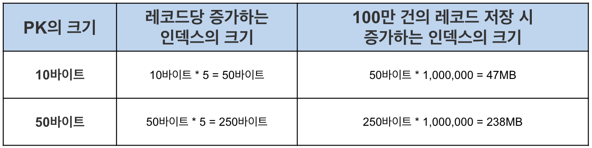

# Primary Key (PK)
## 1. 프라이머리 키(PK, Primary Key)와 클러스터링 테이블 
### 프라이머리 키(PK, Primary Key)의 특성 
- 데이터베이스, 특히 MySQL에서 프라이머리 키(PK, Primary Key)는 상당히 신중하게 결정되어야 한다.
  - 그 이유는 PK가 레코드의 저장 위치를 결정하기 때문이다.
  - 그래서 PK는 NOT NULL, 유니크 등의 특성을 갖는다.
- MySQL은 PK를 기준으로 유사한 값들이 함께 조회되는 경우가 많다는 점에서 착안하여, PK가 유사한 레코드들끼리 묶어서 저장한다.
  - 유사한 것들을 묶는 것을 클러스터링이라고 하는데, 그래서 일반적으로 PK는 클러스터 인덱스(Clustered Index)라고도 불리며, 그 외의 일반적인 인덱스는 논클러스터 인덱스로 불린다.
- 그리고 이러한 클러스터링 특성 때문에 레코드의 저장이나 PK의 변경은 처리 속도가 느리다.
  - 왜냐하면 우선 레코드를 추가하기 위해 PK 기반으로 레코드의 저장 위치를 탐색해야 하기 때문이다.
  - 그리고 PK를 변경하는 것은 레코드가 저장된 물리적인 위치를 변경하는 작업이 수반되기 때문이다.
- 하지만 그럼에도 불구하고 이러한 특성을 갖는 이유는 쓰기 작업을 희생해서라도 빠르게 읽기 작업을 처리하기 위함이다.
  - 읽기 작업이 더욱 우선시되는 이유는 일반적인 온라인 환경에서 읽기와 쓰기의 비율이 8:2, 9:1 정도이기 때문이다.

<p align="center"></p>


### 페이지(Page)란?
- 테이블의 저장 방식을 이해하기 위해서는 페이지(또는 블럭)에 대해 알아야 한다.
- 페이지란 디스크와 버퍼 풀(메모리)에 데이터를 읽고 쓰는 최소 작업 단위이다.
  - 일반적인 인덱스를 포함해 PK(클러스터 인덱스)와 테이블 등은 모두 페이지 단위로 관리된다.
  - 따라서 만약 쿼리를 통해 1개의 레코드를 읽고 싶더라도 결국은 하나의 블록을 읽어야 하는 것이다.
- 그래서 페이지에 저장되는 개별 데이터의 크기를 최대한 작게 하여, 1개의 페이지에 많은 데이터들을 저장할 수 있도록 하는 것이 상당히 중요하다.
- 페이지에 저장되는 데이터의 크기가 클수록 다음과 같은 문제가 생길 수 있다.
  - 디스크 I/O가 많아질 수 있음
  - 메모리에 캐싱할 수 있는 페이지의 수가 줄어들 수 있음
- 만약 조회하는 레코드 수가 많아서 1개의 페이지를 읽는 것만으로 처리가 안 된다면 다른 페이지를 읽어야 한다.
  - 이는 추가 디스크 읽기 작업을 의미하며, 읽어야 하는 페이지의 수만큼 성능이 떨어지게 된다.
  - 데이터베이스 성능 개선 혹은 쿼리 튜닝은 디스크 I/O 자체를 줄이는 것이 핵심인 경우가 많은데, 그만큼 디스크 I/O는 느리다.
- 또한 메모리의 효율을 위해서도 중요하다.
  - 디스크 I/O를 통해 페이지를 읽어오면 버퍼 풀이라는 메모리에 캐싱해둔다.
  - 그런데 개별 데이터의 크기가 커지면 페이지 자체의 크기가 커지면서, 메모리에 캐싱해둘 수 있는 페이지 수도 줄어들게 되고 메모리 효율이 떨어지게 된다.
- 아래의 내용은 5개의 인덱스를 갖는 테이블의 PK 크기에 따라 인덱스의 크기를 비교한 표이다.
  - 레코드 한 건을 생각하면 50바이트 쯤이야 대수롭지 않지만 레코드 건수가 100만건만 돼도 인덱스의 크기가 190MB나 증가했다. 1000만건이 되면 1.9GB 증가한다.
  - 또한 인덱스가 커질수록 같은 성능을 내기 위해 그만큼의 메모리가 더 필요해지므로 PK는 신중히 선택해야 한다.

<p align="center"></p>
 
### 클러스터링 테이블의 저장 방식
- 클러스터링 테이블이란 클러스터 인덱스를 갖는 테이블이다.
  - MySQL에서는 기본적으로 PK가 클러스터 인덱스이며, PK가 없으면 내부적으로 PK를 만들어내므로 모든 테이블이 클러스터링 테이블이라고 볼 수 있다.
- PK가 클러스터 인덱스(Clustered Index)와 동의어라는 부분에서 예측할 수 있듯이, PK는 인덱스와 마찬가지로 별도의 자료구조에서 관리가 된다.
  - PK와 테이블의 저장 방식을 살펴보면 다음과 같은데, 이는 리프 노드에 실제 레코드의 모든 컬럼 값이 저장되어 있다는 점을 제외하면 일반적인 인덱스와 동일하다.

<p align="center"></p>
 
### PK와 인덱스의 관계
- PK가 레코드의 물리적인 저장 위치를 결정하기 때문에, 인덱스는 PK에 의존한다.
  - 그래야 인덱스를 타고 들어와서 PK를 통해 저장된 위치에서 레코드를 읽어올 수 있기 때문이다.
  - 이러한 구조를 그림으로 표현하면 다음과 같다.

<p align="center"></p>
 
- 인덱스가 PK가 아닌 실제 레코드의 주소를 갖게 할 수도 있다.
  - 하지만 그렇게 구현하면 PK가 변경될 때 데이터 레코드의 주소가 변경되고, 그때마다 모든 인덱스에 저장된 레코드의 주소를 변경해주어야 한다.
  - 그러므로 이러한 오버헤드를 피하기 위해 레코드의 주소가 아닌 PK를 저장하도록 구현된 것이다.
- 인덱스가 PK에 의존하기 때문에, 인덱스를 통해 테이블에서 데이터를 가져오려면 2번의 작업이 필요하다.
  - 먼저 인덱스에서 인덱스 키를 통해서 PK를 찾아야 하고, 그 다음 PK를 통해서 테이블로부터 데이터를 읽어와야 한다.
  - 그렇기에 인덱스를 통해 데이터를 읽어오는 것보다는 PK로 읽어오는게 빠르다고 볼 수 있다.

### 클러스터 인덱스의 장점과 단점
#### 장점
- PK로 검색할 때 처리가 매우 빠름
- 연속되는 PK로 조회할 경우 랜덤 I/O가 아닌 순차 I/O를 사용하여 처리 속도가 더욱 빠름
- 인덱스가 PK값을 가지므로 인덱스로 PK 값만 조회하는 경우 효율적으로 처리될 수 있음 (= 커버링 인덱스)

#### 단점
- 모든 인덱스가 PK에 의존하므로 PK 값이 클 경우 전체적으로 인덱스의 크기가 커지고, 페이지 양이 많아짐
- 인덱스를 통해 검색할 때 PK로 다시 한번 검색해야 하므로 처리 성능이 느림
- INSERT 시에 PK에 의해 레코드의 저장 위치가 결정되기 때문에 처리 성능이 느림
- PK를 변경할 때 레코드를 DELETE 및 INSERT 해야 하므로 처리 성능이 느림
 
---

- 먼저 PK는 물리적인 저장 위치를 결정한다.
  - 그래서 PK로 검색 시에 처리가 매우 빠르며, 특히 연속된 데이터를 조회하는 경우에는 순차 I/O가 발생하는데, 랜덤 I/O는 임의의 장소에서 데이터를 가져오지만 순차 I/O는 다음 장소에서 데이터를 가져오므로 훨씬 빠르다.
  - 그 외에도 인덱스가 PK 값을 가지므로, 인덱스를 통해 PK만 조회하는 경우라면 내부 테이블까지 조회하지 않아도 되므로 효율적으로 처리된다.
- 하지만 단점 역시 적지 않다.
  - 먼저 PK가 물리적인 저장 위치를 결정하므로 인덱스를 관리할 때 PK를 같이 저장한다.
  - 데이터의 작업 단위는 페이지인데, PK가 클수록 다른 인덱스 구조도 커지면서 페이지가 많이 쪼개져 디스크 I/O 횟수가 증가하는 문제가 있다.
  - 또한 인덱스에 PK가 의존하여 저장되므로 인덱스로 조회 시에 인덱스로 PK를 찾고, PK로 레코드를 찾아야 한다.
  - 그 외에도 레코드를 INSERT 하거나 PK를 UPDATE 하는 등의 경우에 레코드의 저장 위치를 탐색해야 하므로 추가적인 성능 문제가 생길 수 있다.
- 이러한 단점들에도 불구하고 일반적인 온라인 환경에서는 읽기 비중이 훨씬 높다. 그렇기 때문에 쓰기 성능을 희생해서라도 읽기 성능을 확보하는 것이다.

## 2. 프라이머리 키(PK, Primary Key)의 동작 방식
### PK가 없는 경우 
- MySQL에서 테이블은 PK 기반으로 저장되기 때문에 PK가 필수적이다.
- PK가 없다면 데이터베이스(구체적으로는 스토리지 엔진)에서 별도의 처리를 통해 PK를 설정하는데, 다음과 같은 순서를 따른다.

```
1) 기본적으로 PK를 클러스터링 키로 선택함
2) PK가 없다면 NOT NULL 옵션의 유니크 인덱스 중에서 첫 번째 인덱스를 클러스터링 키로 선택함
3) 후보군이 없다면 내부적으로 자동 증가 유니크 컬럼을 추가한 후 클러스터링 키로 선택함
```
- 3번으로 생성되는 내부 PK는 사용자에게 노출되지 않으며, 쿼리에서 사용할 수도 없다.
- 클러스터 인덱스는 테이블 당 하나만 가질 수 있는 엄청난 혜택이므로 반드시 생성해주는 것이 좋다.

### PK를 변경하는 경우
- 앞서 설명하였듯 PK는 레코드의 저장 위치를 결정한다.
  - 이 말은 PK가 변경되는 경우에 레코드가 저장된 물리적인 위치도 변경되어야 함을 의미한다.
- 예를 들어 PK가 11번인 employee 정보가 10번 페이지에 저장된 상태라고 하자.

<p align="center"></p>

- 그리고 다음과 같이 PK를 변경하는 쿼리를 실행한다고 하자.

```sql
UPDATE employee SET emp_no = 6 WHERE emp_no = 11;
```

- PK를 변경하게 되면 PK 값에 따라 레코드가 있어야하는 페이지가 달라질 수 있다.
- 위의 그림에서 보면 10번 페이지에 있던 데이터가 9번 페이지로 옮겨갈 수 있는 것이다.

<p align="center"></p>
 
- PK는 물리적인 레코드의 저장 위치를 결정하기 때문에 단순히 값만 변경해서는 안되고, 레코드를 DELETE 한 후에 INSERT 해주어야 한다.
- 따라서 2번의 디스크 I/O 작업이 필요하고, 인덱스 쪽에도 추가 작업을 유발할 수 있어서 비용이 상당히 크므로 PK는 변하지 않는 값으로 설정하는 것이 중요하다.
