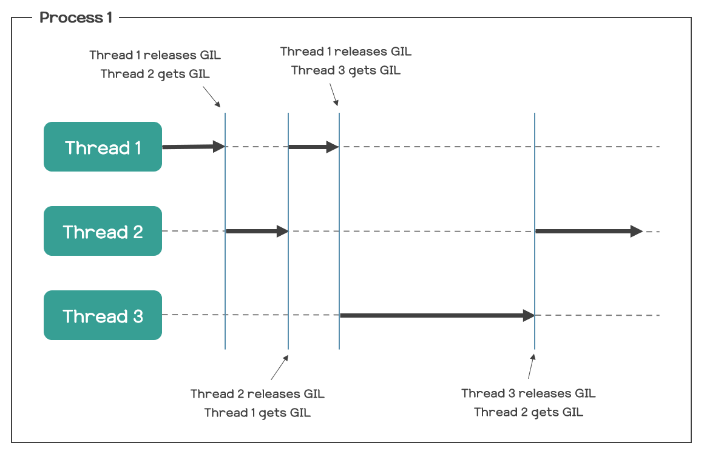

# GIL(Global Interpreter Lock)
> 파이썬에서 멀티스레드를 사용하고자 한다면 마주치는 단어

## Python 인터프리터
- Python 인터프리터란, Python으로 작성된 코드를 한 줄씩 읽으면서 실행하는 프로그램을 말한다.
- 해당 프로그램의 구현체는 여러 가지가 있는데, 표준 구현체로 받아들여지고 있는 것이 CPython이다.
- CPython은 C언어를 이용하여 구현한 Python 인터프리터이다.

## GIL 정의
- Global Interpreter Lock, 즉 전역 인터프리터 락의 약자이다.
- Python의 객체들에 대한 접근을 보호하는 일종의 뮤텍스(Mutex)로서, 여러 개의 쓰레드가 파이썬 코드를 동시에 실행하지 못하도록 한다.
- 즉, 한 프로세스 내에서 Python 인터프리터는 한 시점에 하나의 쓰레드에 의해서만 실행될 수 있다.

- 멀티 쓰레딩이 불가능한 것이 아닌, 원래 멀티 코어라면 멀티 쓰레딩 시 여러 쓰레드가 여러 코어 상에서 병렬(Parallel) 실행될 수 있는데, Python에서는 그러한 병렬 실행이 불가능하다는 것뿐이다.

## GIL이 왜 필요한가
### 개요
- 먼저, Python에서 모든 것은 객체(Object)이다. 그리고 각 객체는 참조 횟수(Reference Count)를 저장하기 위한 필드를 갖고 있다.
- 참조 횟수란 그 객체를 가리키는 참조가 몇 개 존재하는지를 나타내는 것으로, Python에서의 GC(Garbage Collection)는 이러한 참조 횟수가 0이 되면 해당 객체를 메모리에서 삭제시키는 메커니즘으로 동작하고 있다.

### 문제점
- 그렇다면 이것이 GIL이랑 무슨 상관인 걸까? 참조 횟수에 기반하여 GC를 진행하는 Python의 특성상, 여러 개의 쓰레드가 Python 인터프리터를 동시에 실행하면 Race Condition이 발생할 수 있기 때문이다.
  - Race Condition : 하나의 값에 여러 쓰레드가 동시에 접근함으로써 값이 올바르지 않게 읽히거나 쓰일 수 있는 상태, 이러한 상황을 보고 Thread-safe 하지 않다고도 한다.
- 즉, 여러 쓰레드가 Python 인터프리터를 동시에 실행할 수 있게 두면 각 객체의 참조 횟수가 올바르게 관리되지 못할 수도 있고, 이로 인해 GC가 제대로 동작하지 않을 수도 있다는 말이다.
- 물론 이러한 Race Condition은 뮤텍스(Mutex)를 이용하면 예방할 수 있다.
  - 뮤텍스란 멀티 쓰레딩 환경에서 여러 개의 쓰레드가 어떠한 공유 자원에 접근 가능할 때 그 공유 자원에 접근하기 위해 가지고 있어야 하는 일종의 열쇠와 같은 것
  - 만약 한 쓰레드가 어떠한 공유 자원에 대한 뮤텍스를 가지고 있다면, 다른 쓰레드들은 그 공유 자원에 접근하고 싶을 때 그 공유 자원에 접근하고 있는 쓰레드가 뮤텍스를 풀어줄 때까지 기다려야 한다.
- 앞서 말했듯이, Python에서 모든 것은 객체이고, 객체는 모두 참조 횟수를 가진다. 따라서 GC의 올바른 동작을 보장하려면 결국 모든 객체에 대해 뮤텍스를 걸어줘야 한다는 말이 된다.
- 이는 굉장히 비효율적이며, 만약 이를 프로그래머에게 맡길 경우 상당히 많은 실수를 유발할 수도 있는 문제이다.

### 해결
- 한 쓰레드가 Python 인터프리터를 실행하고 있을 때는 다른 쓰레드들이 Python 인터프리터를 실행하지 못하도록 막는다. 이를 보고 "인터프리터를 잠궜다"라고 표현한다.
- 즉, Python 코드를 한 줄씩 읽어서 실행하는 행위가 동시에 일어날 수 없게 하는 것이다.
- 그렇게 되면 모든 객체의 참조 횟수에 대한 Race Condition을 고민할 필요도 없어진다. 뮤텍스를 일일이 걸어줄 필요도 없어지는 것이다. 이것의 GIL의 존재 이유이다.

## 멀티쓰레딩은 무조건 나쁜가?
- CPU 연산의 비중이 큰 작업을 할 때 멀티 쓰레딩은 오히려 성능을 떨어뜨린다. 병렬적인 실행은 불가능한데 괜히 문맥 전환(Context Switching) 비용만 잡아먹기 때문이다.
- GIL은 CPU의 연산 과정에서 공유 자원에 대해 발생할 수 있는 Race Condition 문제 때문에 필요했다는 걸 상기할 필요가 있다.
- 따라서 Python에서는 외부 연산(I/O, Sleep 등)을 하느라 CPU가 아무것도 하지 않고 기다리기만 할 때는 다른 쓰레드로의 문맥 전환을 시도하게 되어 있다. 이 때는 다른 쓰레드가 실행되어도 공유 자원의 Race Condition 문제가 발생하지 않기 때문이다.
- 이러한 이유로, CPU 연산의 비중이 적은, 즉 외부 연산(I/O, Sleep 등)의 비중이 큰 작업을 할 때는 멀티 쓰레딩이 굉장히 좋은 성능을 보인다.
- 따라서 Python에서 멀티 쓰레딩이 무조건 안 좋다는 말은 사실이 아니다. 실제로, I/O 혹은 Sleep 등의 외부 연산이 대부분이라면 멀티 쓰레딩을 통해 큰 성능 향상을 기대할 수 있다. 

