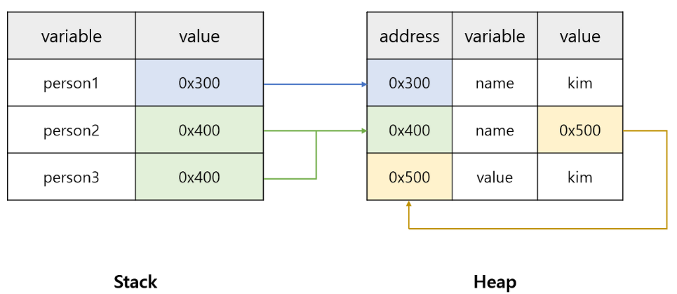
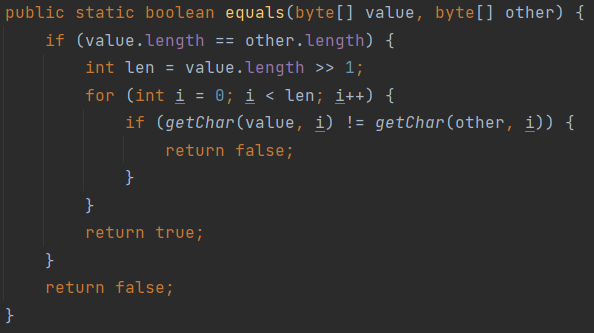
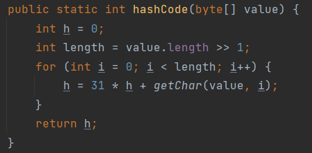

# .equals()와 .hashCode()

## 개요
- Object 메서드에 있는 .hashCode() 메서드는 해당 객체의 주소값을 이용하여 만든 객체만의 고유한 정수 값을 가진다.
- equals()를 오버라이딩할 때에는 반드시 hashCode()도 동일한 결과를 내도록 함께 오버라이딩 해주어야 한다. 왜 그런지 차근차근 알아보도록 하자.

```java
Card a = new Card('트럼프카드',10)
Card b = new Card('트럼프카드',10)
 
a == b // a와 b는 내용만 같을 뿐, 다른 객체라서 False가 나온다.
 
a.equals(b) // 이 결과가 true가 나오게 오버라이딩했다면
a.hashCode() == b.hashCode() // 이 결과도 true가 나오도록 오버라이딩해야 한다.
```

## 동등성(equality)과 동일성(identity)
- 동일성은 완전히 같은 것을 의미하고, 동등성은 다른 객체이지만 가지고 있는 값(정보)가 같음을 의미한다.
- 동일하다의 경우 == 연산자로 표시되고, 동등하다의 경우 equals 연산자로 비교한다. 
  - 즉, 객체 간 == 연산자는 주소값의 비교, equals는 내용의 비교로 사용한다.

## == 연산
- == 연산은 값 자체를 비교하는 연산이다.
  - 레퍼런스 타입인 경우 변수에는 값이 아닌 심볼이 들어가 있기에 동등성이 아닌 동일성을 비교한다.
- 사실 자바에서는 int, double 같은 기본형 타입도 레퍼런스 타입으로 관리되는 경우가 있다.
  - 레퍼런스로 만들고 Constant Pool에 실제 값을 넣어두는 것이다.
  - 이렇게하면 상수 값을 사용할 때 객체를 새로 생성하는게 아니라 Constant Pool 안에 같은 객체를 참조하도록 만들어 최적화시킬 수 있다.
- 하지만 상수 값이 아닌 상수 레퍼런스를 비교한다 하더라도 == 를 이용해서 값을 비교한다.
  - 어차피 같은 상수 객체를 참조하기에 레퍼런스를 비교해도 값이 같기 때문이다.

```java
class Person { ... } 
 
public class Main {
    public static void main(String[] args) {
        Person person1 = new Person("kim");
        Person person2 = new Person(new String("kim"));
        Person person3 = person2;
        
        // 참조 값이 가진 포인터 주소를 비교한다.
        // person1 == person2 는 false
        // person2 == person3 는 true
    }
}
```
<p align="center"></p>

- 그렇다면 동일성이 아닌 동등성, 객체가 가진 값을 비교하려면 어떻게 해야할까?
  - 제일 처음에 언급했지만, 이럴 때 사용하라고 Object.equals() 메서드가 있는 것이다.


## .equlas()
- Object.equals() 의 원형은 ( == ) 연산으로 만들어져있다. 즉 객체의 주소 값을 비교한다

```java
    // Object.equals의 원형.
    public boolean equals(Object obj) {
        return (this == obj);
    }
``` 
- equlas는 동등성(equality)를 비교하는데 사용된다.
  - 하지만 원형을 보면 알겠지만 Object 객체가 객체의 값을 분석해서 자동으로 비교해주는 건 아니다.
  - 필요에 따라 우리가 직접 equals() 객체를 상속하여 구현하여야 한다.


## String.equals()
- String도 마찬가지로 단순히 주소값 비교(==)를 하게 되면 Constant pool에 있는 상수 스트링은 정상 비교가 된다.
  - 하지만, new를 이용하여 String 객체를 비교하면 주소값이 다르기에 정상 비교가 되지 않는다.
- 그래서 String 구현부를 살펴보면 Object.equals()를 오버라이딩하여 새롭게 정의한 것을 볼 수 있다.
- String.equals() 메서드는 객체가 가진 문자열을 한 글자씩 비교하여 동일하다면 true를 반환하도록 오버라이딩되어 있다.

<p align="center"></p>

## 객체의 hashCode()
- 객체가 가진 hashCode는 일종의 객체 지문이라고 생각하면 된다.
- 그 객체의 값을 대표하는 건데, 기본 구현은 객체의 주소에 hash 함수를 적용시켜 만든다.
- 그래서 이름이 해쉬코드이다. (주소값을 그대로 가져와 쓰는건 아니고 사용하기 좋게 변형한다.)

### Object.hashCode()는 native 메서드이다.
- 이를 쉽게말하면, 자바 코드상에서는 .hashCode()의 인터페이스만 적혀있을 뿐 구현체는 없다.

```java
public class Object {
	public native int hashCode(); // 인터페이스마냥 구현부가 없음.
}
```

- 이렇게 native 키워드를 사용하면, 외부에서 다른 언어로 컴파일된 네이티브 메서드를 사용할 수 있다.
  - 자바의 hashCode() 메서드는 운영체제에 작성되어 있는 메서드(보통 C언어로 작성되어 있다.)를 이용해 hashCode 메서드를 가져와 사용한다.
- 참고로 자바에서 자바가 아닌 언어를 사용하는 JNI라는 기술이 있다. 


## String의 hashCode()
- 하지만 String의 경우는 조금 다르다.
- String 객체가 가진 주소값이 아니라 문자열에서 한 글자씩 가져와 변환하여 String 객체간의 동일성을 비교하는 hashCode()를 생성한다.
  - 즉, 주소가 아닌 문자열 내용 자체를 비교(=동등성 비교) 하는 hashCode를 생성하는 셈.
- 참고로 자바는 32비트 운영체제만 사용할 때 개발된 언어라 32비트 주소값을 이용해서 해쉬함수를 만든다.
  - 64비트 운영체제의 경우 주소값에 절반만 사용하는데, 알고리즘으로 최대한 겹치지 않게 만들었어도 정말 정말 낮은 확률로 같은 주소값이 2개 나올 수 있다는걸 상식으로 알고만 있자.
- 주소값이 같으면 당연히 해쉬코드의 값도 같다.

<p align="center"></p>

### hashCode를 만드는 해쉬함수 수식을 만들 때 숫자 31을 자주 사용한다.
- 이유는 만들어진 hashCode를 사용할 때 연산 성능을 조금이나마 향상시키기 위함이다.
  - 무거운 곱셈 연산을 뺄셈으로 바꿔 최적화하기 위해 적당한 숫자를 곱해 비트를 왼쪽으로 쉬프트 해야하는데 31이 소수 + 홀수 + 2의 배수 $(2^5-1)$ 인 완벽한 숫자이기 떄문이다.
- 2의 배수는 애초에 목적이 비트 쉬프트 (00011 -> 01100)를 이용한 해쉬코드의 연산 최적화라서 그렇다.
- 불편하게 2의 배수(짝수)를 그대로 사용하지 않고 -1 해서 홀수를 사용하는건 한쪽이 0으로 고정되는걸 방지하기 위함이다.
  - 해시코드를 만드는 과정에서 짝수를 사용하게 되면 연산할 때마다 오른쪽에 0이 계속해서 추가되어 (5120000000) 같은 값이 나오기 때문이다.
- 비트 쉬프트에 굳이 소수를 이용하는 건.. 사실 별 이유가 없다. 그냥 소수를 쓰면 알고리즘에 좋을거 같다는 미신 때문이다. (실제 JVM 개발자가 언급한 말이다.)


## equals()와 hashcode()의 동작은 같아야 한다.
- 이는 일종의 규칙이다. 물론 지키지 않는다고 프로그램이 멈추거나 컴파일 타임에 예외가 발생하는 건 아니다.
- 이렇게 해야하는 이유는 코드의 확장성 같은 추상적인 이유도 있겠지만 제일 중요한건 자바의 표준 라이브러리, 컬렉션 프레임워크가 hashCode()와 equals()를 둘 다 사용하기 때문이다.
- 컬렉션 프레임워크에서 사용하는 hashCode() 와 equals()를 살펴보자.
  - 이해하기 쉽게 HashMap에서 키 값을 새로 입력할 때, 중복된 키가 있는지 비교하는 연산을 한다고 가정하겠다.
```
hashCode()
메서드를 실행해서 리턴된 hashCode() 값이 같은지 본다. 만약 다르다면 다른 객체로 판단한다.
hashCode() -> equals()
hashCode의 값이 같다면 equals(~)로 다시 비교한다. 이 두 개가 모두 맞아야 동등한 객체로 판단한다.
```
- 만약 hashCode의 값이 다르면 비교 연산 자체를 하지 않음을 유의하자.
- 만약 equals()를 변경하지 않았다면, ( == ) 를 이용해서 동일성 비교를 하기 때문에 해당 작업에 아무런 문제가 없다.
  - 하지만 내 객체의 비교를 위해 equals()를 수정했다면 반드시 hashCode() 비교도 같은 동작을 하도록 해시함수를 수정해야 한다.
  - 그렇게 하지 않는다면 컬렉션 프레임워크를 포함한 많은 자바 라이브러리에서 제대로 된 비교 동작을 하지 못하게 된다.

## 결론 : equals를 재정의 → hashCode도 재정의
- 동일성(==)이 아닌 동등성(.equals)을 비교하려면 Object.equals()를 오버라이딩해야 한다.
- 단, equals()를 오버라이딩했다면 반드시 hashCode() 비교도 동일한 동작을 하도록 오버라이딩한다.
- 즉 [ A.equals(B) ]가 True라면 [ A.hashCode() == B.hashCode ]도 True가 되도록 만들어야 한다.
```java
Card a = new Card('트럼프카드',10)
Card b = new Card('트럼프카드',10)
 
a == b // a와 b는 내용만 같을 뿐, 다른 객체라서 False가 나온다.
 
a.equals(b) // 이 결과가 True 나오게 오버라이딩했다면
a.hashCode() == b.hashCode() // 이 결과도 True가 나오도록 오버라이딩해야 한다.
``` 

- hashCode()를 오버라이딩할 때에는 Object.hash( 값 )을 이용해 해시함수를 구현해도 되는데, 사실 직접 만들어도 크게 어렵지 않다.
- 참고로 이클립스와 인텔리제이는 equals와 hashcode를 자동 생성하는 기능을 가지고 있다.

```java
    @Override
    public boolean equals(Object obj) {
        // equals를 kind 와 number를 이용하여 비교하도록 오버라이딩하였다.
        if (!(obj) instanceof Card) {
            return false;
        }
        
        Card c = (Card)obj;
        return this.kind.equals(c.kind) && this.number == c.number
    }
 
    @Override
    public int hashCode() {
        // 그렇다면 반드시 hashCode()도 kind와 number를 이용하여 만들어야 한다.
        // 즉 해시코드 비교가 equals와 동일한 결과를 반환하도록 구현해야 한다. 
        return Object.hash(kind, number)
    }
```

