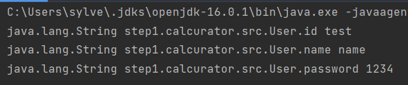

# 바이트코드 조작(리플렉션, 다이나믹 프록시, 애노테이션 프로세서)

## 자바의 바이트코드를 조작하는 방법
- 리플렉션 기법이 아니라 그냥 바이트코드 자체를 조작하는 라이브러리도 있다.
  - CGLib (Code Generator Library) : 리플렉션을 이용한 다이나믹 프록시 생성도구
  - ASM 바이트코드 조작 (low level)
  - Javassist
  - ByteBuddy 바이트코드 조작 (ASM을 기반으로 만듦)

## 리플렉션
> 스프링의 Dependency Injection은 어떻게 동작할까?

```java
@Service
public class BookService {
	@Autowired // 스프링은 어떻게 bookRepository 인스턴스를 넣어 준 것일까?
	BookRepository bookRepository;
}
```

### 리플렉션이란?
- 리플렉션이란 [Class 정보를 담는 객체]를 이용해 해당 클래스의 정보를 분석해내는 프로그래밍 기법을 의미한다.
- 즉 구체적인 클래스 타입, 정보를 알지 못하더라도 객체 이름("my.ClassName")으로 런타임 시점에서 [리플렉션 객체의 바이트코드]를 이용해 내가 원하는 객체와 메서드를 사용할 수 있다는 말이다.
- 동적 바인딩이 되지 않던 자바에서, 리플렉션 기법을 이용해 런타임에 동적인 바인딩을 제공하는 것이라고 이해하면 쉽다.
- 자바의 Object 객체에는 Object.Class 라는 리플렉션 객체(=해당 Class의 정보를 담고있는 객체)를 가지고 있는데, 컴파일 타임에 클래스의 이름을 알 수 있다면 이 Object.Class 객체를 얻을 수 있다.

```java
// Class.forName("패키지 전체 경로") 
// 클래스이름.class
MyHello.class
Class.forName("mypackage.core.MyHello")
 
// 또는 인스턴스에서 getClass()로 받아오는 방법도 있다.
Book book = new Book();
Class<? extends Book> aClass = book.getClass();
```
```java
Class myObjectClass = Class.forName("me.package.className"); // 클래스를 생성 후 반환
Class.forName("oracle.jdbc.driver.OracleDriver");
 
// 참고 :: Class.forName() 메서드 정의
public static Class<?> forName(String className)
                        throws ClassNotFoundException {...}
```

### 리플렉션 사용해보기, java.lang.Class<T>
```java
public class App {
    public static void main(String[] args) {
        Class<User> userClass = User.class;
        User user = new User("test", "name", "1234"); // 테스트용 인스턴스
        
        Arrays.stream(userClass.getDeclaredFields())
                .forEach(filed -> {// User.class에 정의된 필드를 모두 가져와서
                    try {
                        filed.setAccessible(true); // private 접근제어자 무시
                        // filed.get(인스턴스)로 해당 인스턴스의 데이터를 읽어서 반환함.
                        // 만약 .get(null)을 한다면 static인 클래스 데이터를 반환함.
                        System.out.println(filed + " " + filed.get(user));
                        
                    } catch (IllegalAccessException e) {
                        // 잘못된 접근, 해당 메서드가 없는 경우 등등..
                    }
                });
    }
}
```
<p align="center"></p>

- 이렇게 해당 클래스의 정보를 얻거나, 컴파일 이후 런타임에 동적으로 인스턴스를 만들 수 있다.

### 리플렉션과 어노테이션
- Class<T> 에는 getAnnotation()이라는 메서드가 있다.
- 그래서 클래스에 어노테이션을 달고 아래와 같은 코드를 작성해보면 어노테이션들이 나와야할 것 같지만 실제로는 아무런 값도 찍히지 않는다.

```java
// 등록된 어노테이션이 없음. 콘솔창에 찍어도 아무것도 안 나온다.
Arrays.stream(User.class.getAnnotations()).forEach(System.out::println);
```

- 그 이유는 어노테이션 자체가 주석(//)과 동일한 취급을 받기 때문이다. 컴파일러를 위한 주석.
- @MyAnnotation의 정보는 JVM이 읽어들여 처리한다. 즉 자바 코드와 바이트코드(.class)까지는 남지만 해당 바이트코드가 읽어들여진 후에 런타임 메모리에는 어노테이션에 대한 어떠한 정보도 남아있지 않다.
- 다만 자바에서는 코드에서 리플렉션을 사용할 수 있도록 어노테이션을 정의할 때 생명주기(@Retention)를 런타임까지 남아있도록 설정할 수 있다.
  - Class.getAnnotation()을 사용하고 싶다면 아래와 같이 어노테이션을 만들면 된다.

```java
import java.lang.annation.*;
 
@Documented
@Retention(RetentionPolicy.RUNTIME) // 런타임에도 어노테이션 사용가능(리플렉션)
@Target( ElementType.TYPE, ElementType.FILED )
public @interface FunctionalInterface{...}
```

- 이후 getAnnotation()을 콘솔에 찍어보면 다음과 같이 애노테이션 데이터를 보고, 사용할 수 있다.

```java
// 해당 클래스에서 사용된 모든 어노테이션 조회
//ex:: @my.package.MyAnnotation(value="haha", number=100)
Arrays.stream(User.class.getAnnotations()).forEach(System.out::println);
 
// 특정 필드, 메소드에 있는 어노테이션만 가져올 수도 있다.
Arrays.stream(User.class.getDeclaredFields()).forEach(
        field -> {     // 해당 필드에 있는 어노테이션들을 모두 꺼낸다
            Arrays.stream(field.getAnnotations()).forEach(
                    annotation -> {   // 어노테이션은 타입을 비교해서 찾을 수 있다.
                        if (annotation instanceof MyAnnotation) {
                            MyAnnotation myAnno = (MyAnnotation) a;
                            System.out.println(myAnno.value() + " " + myAnno.myNumber());
                        }
                    });
        }
);
```

### 리플렉션 API - 인스턴스 생성 , 클래스 수정
```java
import java.lang.reflect.Constructor;
import java.lang.reflect.Field;
import java.lang.reflect.InvocationTargetException;
 
public class App {
    // 리플렉션 사용시 발생할 수 있는 예외들.
    public static void main(String[] args) throws ClassNotFoundException, NoSuchMethodException,
            InvocationTargetException, InstantiationException, IllegalAccessException, NoSuchFieldException {
 
        // Class<User> userClass = User.class; 제네릭 생략 가능
        Class userClass = Class.forName("my.package.User");
 
        // (~) 에는 파라메타의 타입을 적는다. 만약 없다면 null
        Constructor constructor = userClass.getConstructor(String.class, String.class, String.class);
        User user = (User) constructor.newInstance("생성자에 매개변수 문자열값", "name", "1234");
 
        Field a = User.class.getDeclaredField("name"); // 클래스 멤버(static 멤버)를 가져온다.
        a.setAccessible(true); // 접근제어자(private) 를 무시함.
        
        String classMember = (String) a.get(null); // 클래스 멤버(static) name 값을 가져옴
        String name = (String) a.get(new User("a","b","c")); // 해당 인스턴스의 name 값을 가져옴
    }
}
```
- 참고로 메서드는 아래와 같이 가져와서 사용할 수 있다.

```java
Method m = User.class.getDeclaredMethod("methodName");
m.setAccessible(true); // 접근제어자(private) 를 무시함.
m.invoke(메소드 파라메타); // 메서드 실행
```

### 나만의 DI 컨테이너 만들어보기
- 스프링 컨테이너에서 getBean()은 어떻게 동작하는 걸까? 간단한 나만의 어노테이션 컨테이너를 만들어보자.
```java
public Class BookService(){
    @Inject // 직접 만든 어노테이션
    BookRepository bookRepository;
}
```
```java
public class Container {
    private static <T> T createInstance(Class<T> classType) {
        try {
            // 매개변수가 없는 기본생성자를 사용하여 인스턴스 생성
            return classType.getConstructor(null).newInstance();
        } catch (Exception e) {
            throw new RuntimeException(e);
        }
    }
 
    public static <T> T getObject(Class<T> classType) {
        T myInstance = createInstance(classType); // 1. 리플렉션으로 해당 객체를 만듬
 
        Arrays.stream(classType.getDeclaredFields()).forEach(
                field -> { // 2. 필드 중에 Inject 어노테이션이 있다면 동작
                    if (field.getAnnotations(Inject.class) != null) {
                        // 3. 리플렉션으로 주입할 객체의 인스턴스를 만듬.
                        Object fieldInstance = createInstance(field.getType());
                        field.setAccessible(true); // private 접근제어자 무시
                        try {
                            // 4. @Inject가 붙은 필드를 찾아, 그 필드에 알맞은 객체 만들어 주입함.
                            field.set(myInstance, fieldInstance);
 
                        } catch (IllegalAccessException e) {
                            throw new RuntimeException(e);
                        }
                    }
                }
        );
        
        // @Inject 를 이용하여 필드값에 원하는 객체를 주입한 [classType] 객체를 반환함.
        return myInstance;
    }
}
```

- 이렇게 어노테이션이 달린 객체, 메서드를 찾아 원하는 필드를 삽입할 수 있다.
- 스프링의 싱글톤 빈도 이런 식으로 만들어진다. 이는 아래에서 프록시를 배우며 더 자세하게 알아보자.

```java
@Bean
public MemberRepository memberRepository() {
        if (memoryMemberRepository가 이미 스프링 컨테이너에 등록되어 있으면?) {
            return 스프링 컨테이너에서 찾아서 반환;
            
        } else { //스프링 컨테이너에 없으면
            기존 로직을 호출해서 MemoryMemberRepository를 생성하고 스프링 컨테이너에 등록
            return 반환
        }
}
```

### 주의사항
- 리플렉션은 프레임워크를 포함해서 다양한 곳에서 활용된다.

```
스프링 : 의존성 주입, MVC 뷰에서 넘오온 데이터를 객체에 바인딩할 때
하이버네이트(JPA) : @Entity 클래스에 Setter가 없다면 리플렉션을 사용
JUnit : 어노테이션을 이용한 테스트 환경설정
```

- 그만큼 강력한 기능이지만, 리플렉션의 잘못된 사용은 아래와 같은 문제점을 만들 수 있다는 걸 명심하자.

```
리플렉션의 과도한 사용은 성능 이슈를 발생시키기 쉽다. 리플렉션이 꼭 필요한 곳에만 사용하자.
리플렉션은 런타임 시에 객체를 조작하는 기술이므로 컴파일 타임에 확인되지 않는 문제를 만들 수 있다.
런타임에 객체를 조작하기에 마음만 먹는다면 접근 지시자(private)를 무시할 가능성이 있다. (캡슐화 파괴)
```


