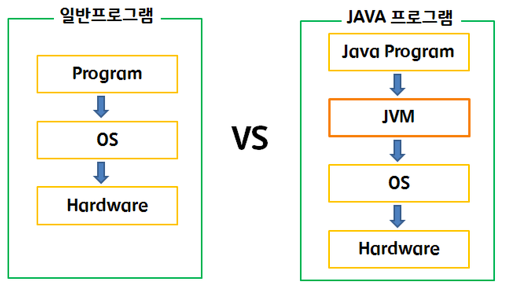
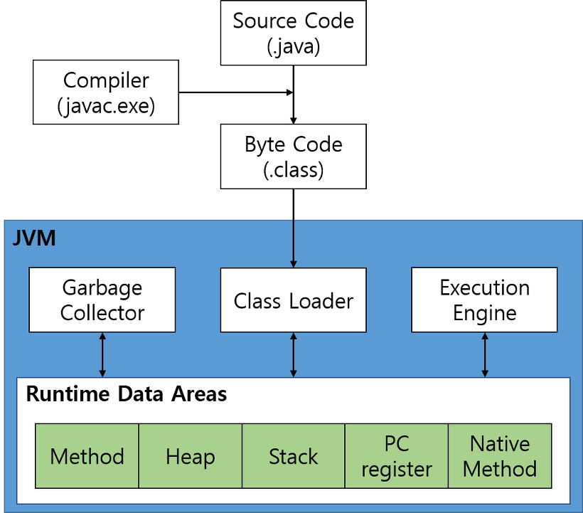

# JVM(자바가상머신)과 JRE, JDK

## 1. 자바 가상머신 (Java Virtual Machine, JVM)
- 가상머신이라는 개념은 여러가지로 정의할 수 있지만, 의미만 따지자면 어떠한 프로그램을 실행하는 물리적 머신을 소프트웨어로 구현한 것을 말한다.
  - 윈도우에서 '리눅스 가상머신 프로그램'을 통해 리눅스 운영체제를 실행시키는 것을 상상하면 이해하기 쉽다.
- 자바에서는 코드를 컴파일할 때 바로 기계어로 번역하는게 아니라 중간단계의 '바이트 코드 (.class 파일)'로 변환한다.
- 이후 자바실행환경(JRE)에 바이트코드를 실행시키면 JVM(자바가상머신) 위에서 모든 종류의 하드웨어에 동작할 수 있도록 번역, 실행된다.

<p align="center"></p>

- 좀 더 간략하게 설명하자면, 자바 바이트 코드는 JRE에서 동작한다.
- JRE는 크게 <자바 API>와 <JVM> 으로 구성되어 있으며 JVM의 역할은 자바 코드를 Class Loader를 통해 읽어들여 자바 API와 함께 프로그램을 실행하는 것이다.
- 참고로 JDK는 (JRE + 개발, 컴파일도구)를 의미하며 Java 11 버전 이후로는 JRE를 따로 제공하지 않고 JDK를 제공한다.

## 2. JVM의 특징
- JVM에서 동작하는 자바 바이트코드(.class)는 CPU, 운영체제에 독립적이고 컴파일 결과물의 크기가 기존 소스코드와 크게 다르지 않아 네트워크로 전송하여 실행하기 쉽다.
- 이것이 가능한 이유는 아래와 같은 특징 덕분이다.

### 스택기반의 가상머신
- 컴퓨터 구조에 대해 배웠다면, CPU의 아키텍쳐에 따라 명령어와 레지스터의 수가 다름을 알고있을 것이다.
- JVM에서는 다양한 플랫폼 지원을 위해 레지스터를 사용하지 않고 메모리 '스택 기반'으로 동작한다.

### symbolic references (심볼릭 레퍼런스)
- 기본 자료형을 제외한 모든 타입은 메모리 주소 기반 레퍼런스가 아닌 심볼릭 레퍼런스로 제공된다.
- 쉽게 말해 참조하는 라이브러리를 포함하지 않고 해당 라이브러리의 이름(=심볼)만 기록해 놓는 방법.
- 이는 자바 코드가 바로 기계어로 번역되는게 아니라 바이트코드를 통해 JVM 내에서 실행되기에 가능하다.

### 자료형의 명확성, 플랫폼 독립성 보장
- 자바는 애초부터 여러 운영체제에 사용하려고 설계되었기에 플랫폼에 따라 자료형의 메모리 구조가 변하지 않는다.
  - C언어 같은 전통적인 언어는 운영체제에 따라 int 형과 같은 기본 자료형의 크기가 다르다.

### Network byte order (네트워크 바이트 오더)
- 자바 바이트코드(.class)는 네트워크 바이트 오더를 사용한다.
- 쉽게 말하면 메모리 저장방식(빅엔디안, 리틀엔디안)에 플랫폼 독립성을 유지하기 위해 네트워크 전송시에 표준으로 사용하는 바이트 오더(= 빅엔디안)을 사용한다는 말. 
- 그리고 메모리를 직접 관리하지 않는 가비지 컬렉터 개념이 자바에서 처음 등장하였다.


#### Garbage Colletcion
- 자바 이전의 프로그래밍에서는 프로그래머가 직접 메모리를 생성과 회수를 관리하였다.
- 자바에서는 JVM에 내장된 가비지 컬렉터를 이용하여 메모리의 할당과 회수를 관리한다.
- 간단하게 설명하면 참조되지 않는 객체 메모리를 찾아 런타임에서 자동으로 메모리를 회수한다고 생각하면 된다.

#### JIT (Just-In-Time)
- 자바의 바이트코드(.class)는 기본적으로 인터프리터처럼 동작한다. 즉 바이트코드를 한 줄씩 실행하여 해석한다.
- 컴파일러와 다르게 인터프리터의 경우 전체 코드를 분석하는 것이 아니라서 최적화가 어렵기 때문에 동일한 메서드를 여러 번 해석하는 비효율적인 상황이 발생한다.
- 이를 해결하기 위해 자바에서는 JIT(Just-In-Time) 방식의 컴파일을 사용한다.
  - 초기 실행 시점에 자주 사용될만한 코드들을 미리 기계어로 해석하여 저장(=캐싱)해 놨다가 재사용하는 방법이다.

## JVM의 동작
<p align="center"></p>

### Class Loader
- 자바 컴파일러가 코드(.java)를 바이트코드(.class)로 변환하면 이를 JRE에 로딩하여 프로그램을 실행하게 된다.
- 바이트코드는 JVM 안에있는 Class Loader에 의해 런타임 시점에 로딩되는데, 이 시점에서 Lazy Loading을 구현하기도 한다.

### 실행 엔진 (Execution Engine)
- Class Loader로 불러온 바이트코드들을 실행한다.
- 1 바이트의 OpCode와 피연산자로 구성된다.
- 이 시점에 위에 설명한 JIT 컴파일러가 사용된다.

### Garbage Collector
- Heap 영역에서 참조되지 않는 오브젝트를 제거한다.
- 더 많은 정보는 [GC in Java](https://github.com/hgleeee/overall-study/blob/main/GC%20in%20Java.md) 에서 참조하자.

### Runtime Data Areas
- OS(운영체제)로 부터 JRE가 할당받은 메모리 영역이다. 자바 어플리케이션을 실행하는 필요한 데이터를 담는다.


## 바이트코드에 대해서 알아야할까?
### 1. 현상
- 기존에 잘 작동하던 자바 어플리케이션이 갑자기 다음과 같은 오류(NoSuchMethodError)를 낸다고 가정해보자.

```bash
Exception in thread "main" java.lang.NoSuchMethodError: com.user.UserAdmin.addUser(Ljava/lang/String;)V  
at com.service.UserService.add(UserService.java:14)  
at com.service.UserService.main(UserService.java:19)  
```

- 내가 개발한 자바 코드는 기존의 잘 작동되던 코드에서 따로 변경한 것이 없으며, 아래와 같은 간단한 코드이다.

```java
// UserService.java
…
public void add(String userName) {  
  admin.addUser(userName);  
}
```

- 다만 사용하는 라이브러리가 업데이트 되었는데, 내용은 다음과 같다.
- 코드상에는 별 문제 없어보이는데, 왜 위에서는 NoSuchMethodError가 발생하는 것일까?

```java
// UserAdmin.java - 업데이트된 소스코드
…
public User addUser(String userName) {  
  User user = new User(userName);  
  User prevUser = userMap.put(userName, user);  
  return prevUser;  // 반환값을 사용하는 코드로 변경되었다.
  // 단순히 보기에는 com.user.UserAdmin.Admin.addUser() 메서드 사용에 문제가 없어보인다.
}

// UserAdmin.java - 원래 소스코드
…
public void addUser(String userName) {  
  User user = new User(userName);
  userMap.put(userName, user);
}
```

### 2. 원인
- 원인은 어플리케이션 코드를 '새로운 라이브러리' 버전으로 다시 컴파일하지 않았기 때문이다.
- 자바 코드상으로 보기에는 반환값과 무관하게 메서드를 호출하고 있는 것 같지만, 실제 컴파일 된 바이트코드(.class) 파일은 반환값까지 지정된 메서드를 사용한다.

```bash
Exception in thread "main" java.lang.NoSuchMethodError:
com.user.UserAdmin.addUser(Ljava/lang/String;)V
```
- 해당 오류의 의미는 com.user.UserAdmin.addUser()라는 메서드를 찾지 못했다는 의미이다.
- 메서드에 적혀있는 L, V는 오타가 아니라 자바 바이트코드 표현에서 (Ljava/lang/String) 에서 L은 클래스 인스턴스를, (...)V는 반환값이 없는 메서드임을 의미한다.
- 즉, 해당 자바코드는 이전의 라이브러리를 참조하므로 업데이트된 신규 라이브러리에서 객체 1개를 입력값으로 받고 반환값이 없는 addUser()라는 메서드를 찾지 못했다는 의미이다. 

## 3. 설명
- 물론 오류 자체는 메서드 시그니처를 마음대로 변경한 라이브러리 제공자의 잘못이 매우 크다.
- 하지만 실제 개발함에 있어 이러한 상황을 마주한다면 어떻게 대처할 수 있을까? 하루종일 코드를 디버깅한다 한들 과연 문제를 찾을 수 있을까?

- 이런 상황에서 큰 도움을 줄 수 있는 것이 바로 바이트 코드에 대한 이해이다.
- 물론 클래스(.class) 파일 자체는 바이너리 파일이라 이해하기 어렵기에 JVM에 함께 제공되는 역어셈블러(disaasembler)를 이용해서 분석한다.
  - 라이브러리 업데이트 하기 전 add() 코드를 javap -c 명령어로 역어셈블한 결과물은 다음과 같다.

///java
/*
 // 라이브러리 업데이트 전 add 코드
  public void add(String userName) {  
 	 admin.addUser(userName);  
  }
*/
 
public void add(java.lang.String);  
Code:  
0: aload_0  
1: getfield #15; //Field admin:Lcom/nhn/user/UserAdmin;  
4: aload_1  
5: invokevirtual #23; //Method com/nhn/user/UserAdmin.addUser:(Ljava/lang/String;)V  
8: return  
```

- 이 바이트코드에서 addUser()를 호출하는 부분은 [ 5: invokevirtual #23 ]이다. 이는 23번 인덱스에서 해당 메서드를 실행하라는 의미이며 이해하기 쉽게 javap 프로그램에서 주석을 달아주었다.
- invokevirtual은 이름에서 유추 할 수 있듯이 자바 바이트코드에서 메서드를 호출하는 기본적인 명령어의 OpCode 이다.

```
invokeinterface: 인터페이스 메서드 호출
invokespecial: 생성자, private 메서드, 슈퍼 클래스의 메서드 호출
invokestatic: static 메서드 호출
invokevirtual: 인스턴스 메서드 호출
그 외 피연산자 (Operand)
```

- 이를 업데이트된 바이트코드를 역어셈블하면 다음과 같은 결과를 볼 수 있다.

```java
/*
 // 라이브러리 업데이트 후 add 코드 (동일)
  public void add(String userName) {  
 	 admin.addUser(userName);  
  }
*/
public void add(java.lang.String);  
Code:  
0: aload_0  
1: getfield #15; //Field admin:Lcom/nhn/user/UserAdmin;  
4: aload_1  
5: invokevirtual #23; //Method com/nhn/user/UserAdmin.addUser:(Ljava/lang/String;)Lcom/nhn/user/User;  
8: pop  
9: return
```

- 이렇게 바이트코드 분석을 통해 어떤 부분이 달라져서 문제가 생겼는지 쉽게 유추할 수 있다.
