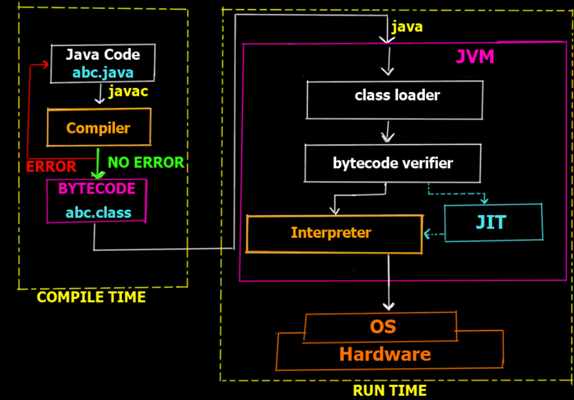
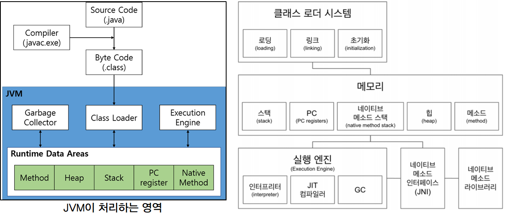
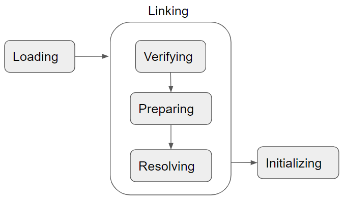

# JVM의 원리와 바이트코드
## 1. JVM 용어 정리
- 자바 바이트 코드는 JRE(자바 런타임 환경)에서 동작한다. JRE에는 [JVM]과 [자바 API] 영역으로 나눌 수 있다.
- 최근 자바 스펙에서는 JRE를 별도로 제공하지 않고, 개발도구와 함께 JDK로 포장하여 제공한다.

<p align="center"></p>

### JVM (Java Virtual Machine)
- 바이트코드(.class)를 해당 OS에 특화된 코드로 변환한다. 인터프리터와 JIT 컴파일러를 사용한다.
- JVM은 API 스펙만 제공할 뿐, 특정 회사가 만든 원하는 구현체(벤더)를 선택할 수 있다.
- JVM 프로그램은 특정 플랫폼에 종속적이다. 자바는 각 플랫폼에 맞는 JVM을 제공한다.
 
### JIT 컴파일러 (Just In Time)
- 자바의 바이트코드는 인터프리터 방식으로 코드를 즉시 읽어들여 동작하는 방식이다.
- 이러한 방식의 성능을 개선하기 위해, 초기 실행시점에 자주 사용될만한 바이트코드를 미리 기계어로 해석하여 저장(캐싱)해놨다 재사용하는데, 이를 JIT 컴파일 방식이라고 부른다.

### JRE (Java Runtime Environment): JVM + 자바 라이브러리 API
- 자바 앱을 실행할 수 있도록 구성된 배포용 프로그램이다.
- JVM과 핵심 라이브러리 및 자바 런타임 환경에 사용되는 설정값과 리소스를 가지고 있다.
- 개발과 관련된 도구는 포함하지 않는다. (* 오라클 11부터 JRE는 따로 제공해주고 있지않다. JDK로 제공)

### JDK (Java Development Kit)
- JRE + 자바 컴파일러, 자바 개발 도구
- Java 코드는 JDK에 있는 컴파일러(javac)를 통해 런타임에 사용되는 바이트코드(.class)로 컴파일 된다.
- OpenJDK 벤더는 오픈소스이지만 [오라클 SE]는 패키지로 판매해왔다. 2019년 부터 구독형 결제로 변경됨.

### JVM의 유연한 언어지원, Java와 Kotlin
- 위에서 말했듯이, 바이트코드를 만들 수 있는 언어는 자바만 있는 것이 아니다.
- 대표적으로 Kotlin과 Scala. 그리고 클로저, 그루비, JRuby, Jython(다른 언어를 바이트코드로 전환)이 있다.

## 2. JVM 구조
### 클래스 로더
- 바이트코드(.class)를 읽고 메모리에 저장. 메모리 레퍼런스를 연결하고 static 값들을 초기화, 변수에 할당함.

### 메모리 (스택, PC, 네이티브, 힙, 메소드)
- 메소드 : 클래스 수준의 정보가 저장됨. 여러 스레드에서 공유해서 자용하는 자원 (클래스 이름, 메소드, 변수 정의)
- 힙 : 객체를 저장, 여러 스레드에서 레퍼런스 심볼(* 포인터 주소값이 아님)로 접근할 수 있는 공유 자원
- 스택 : 쓰레드마다 런타임 스택을 만듦. 그 안에 메소드 호출, 지역 변수등을 스택에 쌓아서 사용
- PC : 프로그램 카운터 레지스터처럼 사용할 메모리. 스레드마다 현재 실행할 스택 프레임을 가르키는 포인터
- 네이티브 메소드 스택 : 바이트코드가 아닌 다른언어(C,C++) 메서드를 사용할 수 있게 저장하는 공간. (JNI 기술)

### JNI (Java Native Interface)
- 자바 앱에서 다른 언어로 작성된 함수 (C, C++, 어셈블리등)를 사용할 수 있는 표준 API.
- 자바 코드에서 native 키워드를 이용하여 메소드를 호출하고 사용할 수 있음.

### 실행 엔진
- 인터프리터 : 바이트코드를 한줄 씩 읽어들여 기계어로 번역, 실행함.
- JIT 컴파일러 : 인터프리터의 효율을 높이기 위해 자주사용되는 코드를 네이티브(기계어)로 변환해서 사용
- Garbage Collector : 더 이상 참조되지 않는 객체를 모아서 소멸시킨 후 메모리를 확보함. 

<p align="center"></p>

#### JVM의 클래스로더의 동작과정
- JVM은 여러 개의 클래스 로더를 계층 구조로 사용하며 기본적으로 3가지 클래스 로더가 제공된다.
```
Bootstrap 클래스로더 : JAVA_HOME/lib에 있는 Core Java API를 읽어들임. 최상위 우선순위
Platform 클래스로더 : JAVA_HOME/lib/ext 또는 java.ext.dirs 시스템 변수에 있는 클래스를 읽어들임
App 클래스로더 : 개발자가 만든 자바 앱의 클래스 경로(-classpath 또는 java.class.path 환경변수 값에 해당하는위치)의 클래스들을 읽음.
```
- 참고로 모든 객체의 조상인 Object에는 getClassLoader()라는 메서드가 있다. 이는 해당 클래스를 읽은 클래스 로더 객체를 반환받을 수 있다.
  - 다만 Bootstrap ClassLoader는 C언어로 작성되어 있기에 호출하면 null을 반환한다.
- * 잉? 자바코드를 읽는 클래스로더는 누가 읽고 어떻게 객체로 받죠?? 하면서 헷갈릴 수도 있다.
  - * 결국 컴파일러도 기계어로 한땀한땀 찍어서 만든게 아니라 다른 컴파일러를 이용해서 기계어로 컴파일 된 프로그램임을 기억하자.

<p align="center"></p>

##### 로딩
- 클래스 로더가 바이트코드(.class)를 읽고 적절한 이진 데이터를 [메소드 영역]에 저장함.
- FQCN(Fully Qualified Class Name), 클래스, 인터페이스, Enum, 메소드, 변수 정보를 저장함
- 이렇게 [메소드 영역]에 저장하고 로딩이 완료되면 이후 [힙 영역]에 해당 Class 객체 메모리를 생성.

##### 링크
- Verify(검증) : 바이트코드(.class)가 변형되지 않고 유효한지 확인함.
- Prepare(준비) : 클래스 변수(static)와 기본값에 필요한 메모리를 할당받음.
- Resolve(완료) : 심볼릭 레퍼런스(myClass)를 메소드 영역에 있는 실제 레퍼런스(힙 메모리 주소)로 교체함. 
* 심볼릭 -> 실제 레퍼런스 교체는 링크가 아닌 다른시점에 일어날 수도 있음.

##### 초기화
- Static 변수의 값을 할당함. (static block이 있다면 이 시기에 실행됨)

#### 이렇게 자세하게 설명하는 이유가 뭐죠?
> JVM은 바이트코드를 유연하게 생성할 수 있도록 제공해준다. 즉 컴파일된 바이트코드를 조작하여 내가 원하는 동작을 하도록 만들 수 있다.
- 실제로 아래와 같이 다양한 바이트코드 조작 라이브러리들이 존재한다.
```
CGLib (Code Generator Library)
ASM
Javassist
ByteBuddy
```
