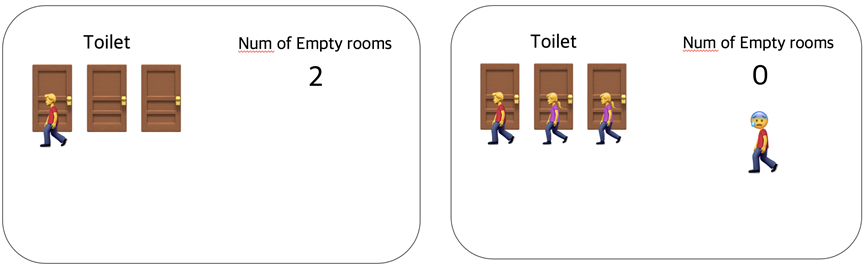
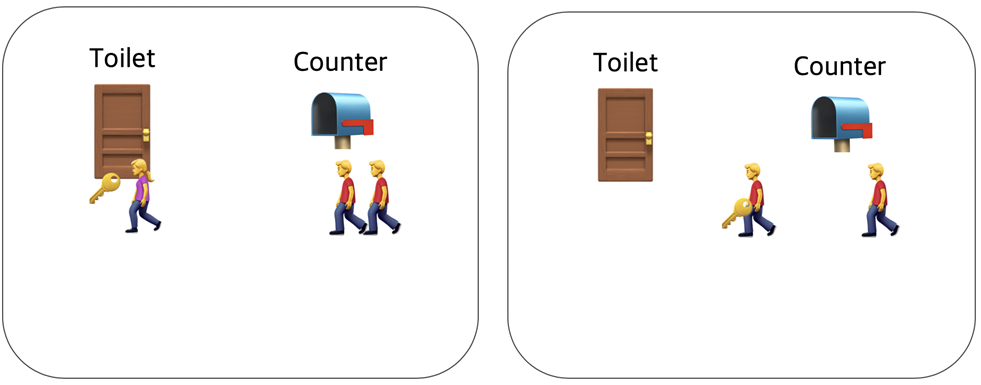
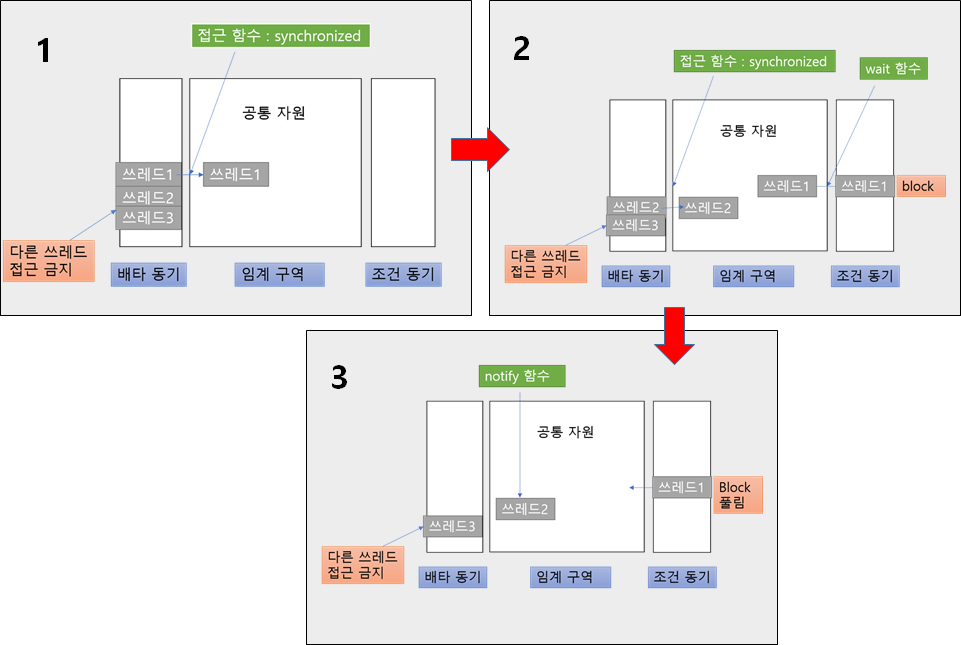
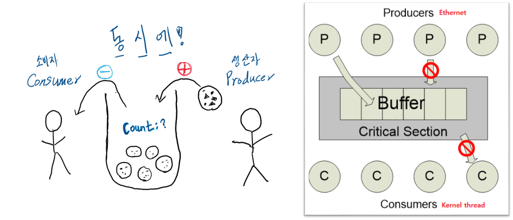
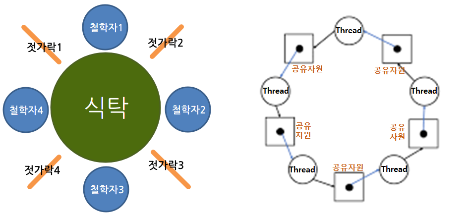
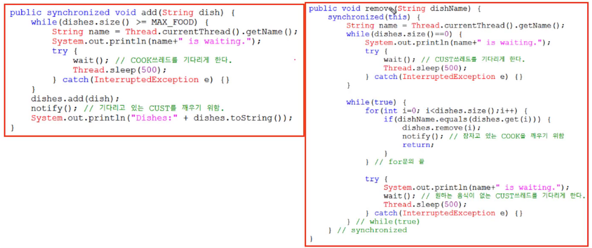

# Java에서의 임계 영역과 데드락
## 개요
- 여러 프로세스가 특정 데이터를 공유할 때, 각 프로세스에서 공유 데이터를 접근(access)하는 코드나 동작 부분을 임계영역(Critical Section)이라고 한다. 
- 공유된 자원에 여러 개의 프로세서가 동시에 접근해서 사용하면 치명적인 오류를 발생시킬 수 있기에 한 번에 하나의 프로세서만 접근할 수 있게 만들어야 한다.
  - 이를 상호배제 문제라고 한다.
- 운영체제에서 임계영역 (Critical Section) 동기화는 아주 중요한 부분이기에, 해당 문제를 해결하려고 여러 가지 방법이 등장한다.
  - 그 중 대표적인 것이 세마포어, 뮤텍스, 모니터이다.

## 동기화(상호배제) 방법
### 세마포어 (Semaphore)
<p align="center"></p>

- 카운터를 이용하여 자원을 할당한다.
- 리소스의 상태를 나타내는 간단한 카운터이며 공유된 자원의 데이터 혹은 임계영역(Critical Section) 등에 여러 Process 혹은 Thread가 접근하는 것을 막아준다.
  - 즉, 동기화 대상이 하나 이상이다.

### 뮤텍스 (Mutex)
<p align="center"></p>

- 뮤텍스는 키 값을 이용한다. 카운터 값으로 0과 1만 사용하는 세마포어라고 생각할 수 있다.
- 상호배제(Mutual Exclusion)에서 나온 말로 공유된 자원의 데이터 혹은 임계영역(Critical Section)을 가진 쓰레드들의 런타임에 서로 겹치지 않게 각각 단독으로 실행되게 하는 기술이다.
- 다중 프로세스들의 공유 리소스에 대한 접근을 조율하기 위해 locking과 unlocking을 사용한다. 
- 위의 뮤텍스와 세마포어는 둘 다 데이터의 무결성을 보장하기는 어렵다.
  - 데드락이 발생할 수도 있기 때문에 좀 더 복잡한 매커니즘을 추가로 적용해야 한다.

### 모니터 (Monitor)
- 현대의 운영체제는 임계영역 동기화(상호배제 방법)으로 세마포어, 뮤텍스보다는 모니터를 많이 사용한다.
- 모니터는 2개의 큐(상호베타 큐, 조건동기 큐)로 구성된다.
  - 상호배타 큐는 말 그대로 공유 자원에 하나의 프로세스만 진입하도록 하기 위한 큐이다.
  - 조건동기 큐는 이미 공유 자원을 사용하고 있는 프로세스의 wait() 호출을 통해 조건동기 큐로 들어갈 수 있다.

- 그림을 보면 이해가 쉽다.

<p align="center"></p>

- 왼쪽 큐에 자원이 필요한 쓰레드들을 담아, 한 개씩 임계영역 메모리를 사용하게 한다.
- 임계영역에 접근하였으나 I/O 등으로 아직 데이터가 준비되지 않아 해당 쓰레드가 기다려야 하는 경우 wait()으로 오른쪽 큐에 들어갈 수 있다.
  - 이는 쓰레드를 종료하는 것이 아니라 잠시 기다리게(block)하는 개념이다.
- 오른쪽 큐(조건동기)에 들어가있는 다른 쓰레드에서 notify()로 깨워줄 수 있다.
  - 다만 이미 임계영역을 사용중이거나 앞에 다른 쓰레드가 대기중이라면 notify()를 호출했다고 해서 바로 실행되는 것은 아니다. 

## 자바의 synchronized 모니터
- 자바는 쓰레드 동기화 방법으로 모니터를 제공한다.
  - synchronzied 키워드를 이용해 임계구역을 만들 수 있다.
  - Object에 내장된 메서드(wait, notify)를 이용하여 모니터를 사용할 수 있다.

```
wait(): 호출한 쓰레드를 조건동기 큐에 삽입한다.
notify(): 조건동기 큐(waiting pool)에 있는 하나의 쓰레드를 깨워준다.
notifyAll(): 조건동기 큐(waiting pool)에 있는 모든 쓰레드를 깨워준다.
```

```java
// 임계구역은 '공유변수에 접근하는 코드 구간'을 의미한다. 메모리 자체가 아니다.
 
class C {
  private int value, ...;     // 사용할 공유 변수
  
  public synchronized void Foo() {   
    // 이 메서드 안은 전부 임계구역
  }
  
  public void Goo() { 
    synchronized {
    	// synchronized {~} 블럭은 전부 임계구역
      // 임계구역은 적게만들수록 성능에 좋다. 동기화는 비용이 큰 작업이다.
    }
  }
}
```

## 전통적인 동기화 문제들
### 1. Producer and Consumer Problem (생산자 - 소비자 문제)
<p align="center"></p>

- 다른 말로 유한한 버퍼 문제(Bounded Buffer Problem)라고도 한다.
- 출금과 입금, 제작과 사용처럼 생산자가 데이터를 생산하면 소비자가 그것을 소비하는 구조에서 저장공간인 buffer가 무한하지 않을 때 생기는 문제이다.
  - 쉽게 말해 [ 10000개 생산 - 10000개 소비 = 0개 ]가 되어야 하는데, 실제 동작은 그렇지 못한 문제이다.
  - 왜 이런 문제가 발생할까? 대표적으로 Busy-Wait 문제(생산은 바쁜데 소비자는 오래 기다려야 하는)가 있다.

#### Busy-Wait 문제
- 생산된 데이터는 버퍼에 저장한다.
- 현실 시스템에서 버퍼의 크기는 한계가 있다. 즉, 버퍼가 가득 차면 더 이상 생산할 수 없다.
- 생산보다 소비가 너무 빠르면 버퍼가 비어버린다. 소비하려고 해도 남은 자원이 없어 계속 기다리게 된다.
- 여러 쓰레드의 접근을 동기화를 제대로 해주지 않는다면 버퍼 count가 음수 (-1)가 될 수도 있다.
- [남은 자원이 없어서 소비자 기다림] + [쓰레드 동기화 때문에 생산자 자원 추가 안됨] = 프로그램 멈춤
- 참고로 이렇게 교착상태에 빠져 영원히 프로그램이 멈추는걸 데드락(Dead-lock)이라고 말한다.

### 2. Reader-Writer Problem
- 데이터베이스에서 동기화를 할 때 생기는 성능 문제이다.
- 무지성으로 Reader와 Writer를 같이 동기화하게 되면 그냥 읽기만 100번 하는데도 100번 다 lock을 걸어버린다.
  - 이는 상당히 비효율적이고, DB 성능을 크게 하락시킨다.

### 3. Dining Philosopher Problem (식사하는 철학자 문제)
<p align="center"></p>

- 원형 테이블에서, 5명이 밥을 먹는데 젓가락이 4개인 경우를 말한다.
  - 철학자들은 교양이 있어서 멀리 있는 젓가락을 빼앗아 오지는 않고, 양 옆에 있는 젓가락만을 사용한다고 가정한다.
- 젓가락이 공유되는 메모리, 젓가락 양쪽에 앉아있는 사람은 해당 메모리를 사용하는 쓰레드이다.
- 실제로 시스템 상에서 이런 식으로 공유 자원이 엮여있을 수 있다.
  - 이 경우 교착상태에 빠진 데드락이 생길 수도 있고 특정 쓰레드(사람)은 영원히 자원을 할당받지 못해 굶어죽는(Starvation) 문제가 있을 수 있다.

## 자바의 동기화 문제 해결책
### 1. 소비자와 생산자
- 문제 : 버퍼가 비었을 때 소비자가 버퍼 lock을 걸고 풀어주지 않는다. 그럼 생산자는 버퍼에 자원을 못 채운다.
- 해결 : 자원이 없다면 소비자 lock을 걸지 말고 wait()으로 재워두자. 생산자가 자원을 추가할 때 notify()로 알리자.

<p align="center"></p>
 
- 하지만 이렇게 해결하는 경우, 단순히 큐에 넣고 빼는 것이지 왜 스레드가 wait 되었는지 상태를 알 수 없다.
  - 즉, wait()가 버퍼가 가득 차서 소비자를 위해 작동한건지 아니면 위에 문제처럼 생산자를 기다리려고 wait을 한건지 알 수 없다.
  - 어느 시점에 notify()를 걸어 다시 동작시켜야 하는지도 상당히 애매해진다.
  - 그래서 JDK 1.5에는 상태값도 함께 관리할 수 있고, 더 다양한 동기화 기능을 제공하는 동시성 패키지 (java.util.concurrent)를 제공한다.
