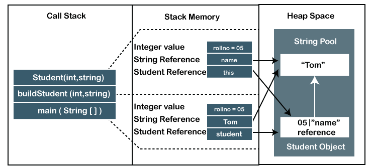

# Stack 메모리 & Heap 메모리
> 자바는 기본 자료형(primary type)을 제외하고 다른 모든 것을 레퍼런스(포인터 참조값)으로 사용한다. 즉 힙 메모리를 사용한다는 뜻인데, 왜 이렇게 만들었고 스택, 힙 메모리를 구분지어 사용하는 이유는 무엇일까?

## 1. 프로그램의 메모리 할당
- C와 같은 고급 언어로 작성된 프로그램 코드를 바로 실행 가능한 명령어(.exe)로 바꾸는 과정은 다음과 같다.
<p align="center"></p>

- 이를 조금 더 큰 그림으로 보게되면 아래와 같은데

```
1. 사용자가 운영체제에 프로그램 실행을 요청하고
2. 운영체제는 프로세스를 만들고 메모리를 할당하게 된다.
3. 이 때, 프로세스마다 할당되는 메모리는 Code, Data, Heap, Stack 영역으로 효율적으로 나누어 사용한다.
```

<p align="center"></p>

<p align="center"></p>

## 2. 자바의 메모리 할당
<p align="center"></p>

- 자바 코드는 기계어가 아닌 바이트 코드로 번역되고 JVM을 거쳐서 실행된다.
- 그래서 프로그램에 실행에 필요한 데이터를 JVM에서 받아와 제공하긴 하지만, 큰 그림으로 봤을 때의 메모리 구조는 크게 다르지 않다.
- Runtime Data Area에서 필요한 메모리를 운영체제로부터 할당받으면 JVM 내부에서 Method(=Data), Stack, Heap, Native-Method, PC-register로 메모리를 나누어 사용한다.

<p align="center"></p>

- Method Area : 모든 Thread에 공유 되는 정적인 전역 데이터이다. 클래스나 변수의 정보, Static변수, 상수등이 저장된다.
- Heap Area : 모든 Thread에 공유되며 인스턴스와 객체가 저장되는 구역이다. (레퍼런스 참조, new 키워드)
- Stack Area : 각 스레드마다 전용 스택 메모리가 존재한다. 지역변수, 파라메타, 리턴 값등이 저장된다.
- PC Register : 각 스레드마다 하나씩 생성되며 Program Counter의 역할을 담당한다. (현재 실행중인 메모리 주소 값) 자바에서는 CPU 독립성을 위해 레지스터기반이 아닌 스택기반으로 프로그램 명령이 동작함을 알아두자.
- Native Method Stack : 각 스레드마다 하나씩 생성되며 다른 언어의 네이티브 메서드를 호출하기 위한 공간이다. 
 
<p align="center"></p>

### 2-1. Stack 메모리
- Java의 JVM 에서 스택 메모리는 정적인 메모리 할당 및 각각 스레드 공간에서 따로 실행된다.
- 이는 스택 구조로 저장되며 새로운 메서드가 호출되면 스택 맨 위에 새로운 블럭(Stack Frame)을 생성하여 각 객체나 메서드마다 필요한 지역변수들을 저장한다.
- 그리고 메서드가 실행을 마치면 스택 블럭(Stack Frame)을 비우는 방식이다.

#### 특징
- 새로운 메서드가 호출되고 반환될 때마다 스택의 크기가 달라진다.
- 스택 내부의 변수는 해당 메서드(=스레드)가 실행되는 동안에만 존재한다.
- 메소드 실행이 완료되면 자동으로 스택에서 할당 해제된다.
- 각 스레드가 고유의 스택 메모리를 가지고 있으므로 다른 스레드로부터 안전한 메모리를 가진다.
- 이러한 스택 구조의 메모리 접근은 힙 메모리에 비해 속도가 빠르다.

##### 왜 빠를까??
- 스택은 미리 예약된 메모리이기 때문에 메모리 할당이 따로 필요 없다.
- 사용한 메모리를 굳이 반납하지 않고 (= 삭제 작업을 거치지 않고) 단순히 스택 포인터를 감소시킴으로써 스택 공간을 제한시킨다.
- 스택 포인터를 감소시키면서 남아있던 데이터는 스택 포인터가 다시 증가할 때 사용했던 공간을 단순히 덮어쓰는 식으로 사용된다.
- 때문에 객체는 속한 영역(scope)을 벗어나면 스택 포인터의 위치가 바뀜에 따라 알아서 사라진다.
  - 따라서 함수를 통해 메모리가 할당되고 해제되는 힙 메모리에 비해 매우 빠르다는 이점을 가지고 있다.
- 스택에 저장되는 데이터들은 그 크기가 컴파일 타임에 이미 정해지기 때문에 스택은 미리 정해진 크기를 따라 움직이게 된다.
- 따라서 런타임, 즉 실행 중에 메모리를 계산하거나 판단할 일이 없이 한번에 원하는 메모리를 바로 접근할 수 있기에 힙 메모리 할당보다 훨씬 빠른 이유기도 하다.
- 하지만 힙 메모리처럼 메모리 크기를 유연하게 연장하기 어렵고, 스택 메모리를 과도하게 사용하다가 스택 프레임이 무수히 중첩되어 메모리를 초과하게 되는 stack overflow가 발생할 수 있다. 
 

### 2-2 Heap 메모리
- Stack이 컴파일 타임에 크기가 지정되는 정적인 메모리 공간이라면, Heap은 런타임에 동적으로 할당하는 메모리이다.
- 자바에서 새로운 객체는 항상 힙 공간에 생성되고, 이 객체에 대한 참조 주소는 스택 메모리(변수)에 저장되어 사용된다.
- Heap에서 만든 메모리는 모든 스레드에서 참조, 접근 가능하기 때문에 메모리 누수가 발생하기 쉽다.
 - 그래서 메모리 할당 & 해제 관리에 있어 어려움이 따르는데 이를 JVM의 Gabage Collector가 개발자 대신 관리해준다.

#### 특징
- GC의 Young Generation, Old Generation, Permanent Generation을 포함하는 복잡한 메모리 관리 기술에 의해 메모리를 관리, 사용할 수 있다.
- 운영체제에게 할당받은 힙 공간이 가득차 메모리가 부족하면 OutOfMemoryError를 발생시킨다.
- Heap은 스레드로부터 안전하지 않으며 코드를 적절하게 동기화하여 메모리를 보호해야 한다.
- 메모리 공간이 정적이지 않고, 크기가 변할 수 있기에 메모리 할당과 접근이 스택보다 느리고 어렵다.
- 스택은 독립적인 스레드에서 실행되고 스택포인터 값을 변경함으로써 메모리 공간이 자동으로 해제되지만,
 - Heap에서는 누구나 메모리를 참조할 수 있고 메모리 공간이 유동적이라 자동으로 할당 해제되지 않는다.
- 이러한 동적인 메모리 사용은 메모리 단편화가 생길 수 있고, 정기적으로 사용하지 않는 메모리를 찾아 해제해야 한다.


