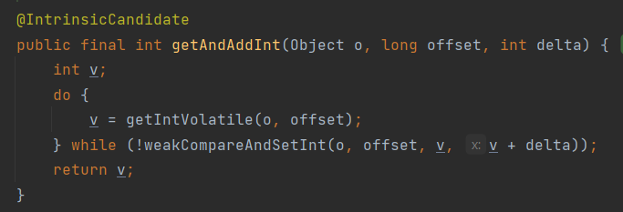
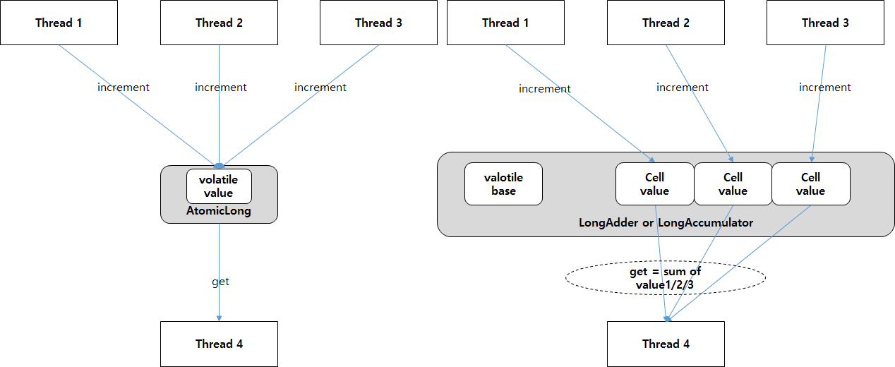
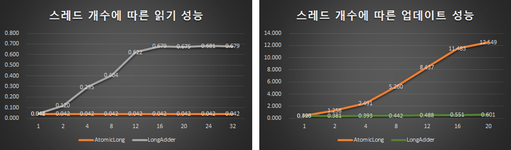
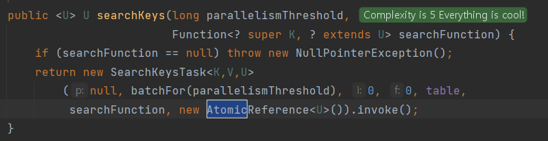

# 동시성 라이브러리의 동작 구조 (Atomic, Adder, Accumulator)

## 📌 개요
```java
public synchronized void method() {
  // 임계 영역
}

public void function() {
  synchronized(객체의 참조 변수) {
    // 임계 영역
  }
}
```

- synchronized는 다수의 쓰레드에게 공유되는 객체 접근을 통제하는 자바의 첫 번째 동기화 메커니즘이다.
  - 하지만, 이것만으로는 다양한 상황에 대처가 힘들었기에 Java5에 Concurrent 관련 클래스들을 추가하였다.
 
### Atomic 클래스 (java.concurrent.atomic)
- 키워드 말고도 자바에서는 CAS(Compare And Swap) 방식으로 스레드 안정성을 보장하는 Atomic 패키지를 제공한다.

```java
import java.util.concurrent.atomic.AtomicInteger

private AtomicInteger counter = new AtomicInteger();

public int getNextUniqueIndex() {
  return counter.getAndIncrement();
}
```

## 📌 스레드에 Lock을 거는 이유
- 동기화를 위해 Lock을 거는 이유를 조금 더 깔끔하게 정리해보자.
1. __Critical Section(임계 영역)에서 Mutual Exclusion(상호 배제)를 제공하기 위해서이다.__
    - 쉬운말로 [공유하는 데이터 영역]에서 [한 스레드만 접근할 수 있도록 허용 및 제한]하기 위함.
2. __스레드 간의 협업과 동기화의 역할을 수행하기 위함이다.__
    - 특정 상태에 도달할 경우, 다른 스레드에게 알려주어 다음 작업을 문제 없이 할 수 있게 작업을 동기화해준다.
3. __데이터의 가시성 (Visiblity)를 보장하기 위함이다.__
    - volatile 키워드처럼 캐시에만 데이터가 있어 변경되었음에도 데이터 값이 동기화되지 않는 문제를 해결한다.

- 딱히 순서가 필요한 작업이 있는 것도 아닌데 [공유 데이터의 값]을 읽거나 업데이트할 때마다 이렇게 스레드 Lock을 걸게 된다면 앱의 성능은 크게 저하된다.
- 그래서 Lock을 걸기보다는, 아예 연산의 원자성(Atomic)을 보장하는 변수, 라이브러리 사용을 권장한다.

## 📌 원자성을 보장한다의 의미
- 아래의 한 줄 코드를 보자. 해당 코드는 원자성을 보장하고 있을까?

```java
// 아래의 코드는 원자성을 보장하는 작업일까?
value = value + 1;
```

- 코드를 단 한 줄밖에 작성하지 않았고, 단순히 1을 더하고 있기 때문에 별 문제가 없다고 생각할 수 있다.
- 하지만 해당 코드는 CPU에 의해 처리될 때 아래와 같은 여러 작업을 거치게 된다.

```
1 LOAD - value의 값을 레지스터로 로딩함.
2 ADD - 레지스터의 값을 1을 더함
3 STORE - 레지스터의 값을 value 메모리로 저장함.
```

- 이 3개의 연산이 [전부 실행되지 않거나] or [항상 함께 실행됨]을, 즉 원자성을 보장하고 있다고 말할 수 있을까?

1. A 스레드가 값을 레지스터에 LOAD하고, 더하고 있는 와중에
2. B 스레드가 접근해서 그 값을 읽고 수정하고 STORE로 저장하였다.
3. 그리고 A 스레드가 값을 다시 STORE하면 어떤 문제가 발생할까?

- 즉, value = value + 1; 연산은 원자적으로 실행되는 연산이 아니다.
  - 각각의 연산 중간에 다른 스레드가 끼어들어 메모리 값을 덮어쓰거나 수정 중인 더러운 데이터를 읽을 수 있다는 말이다.

## 📌 Atomic 라이브러리는 어떻게 원자성을 보장할까?
- 그렇다면 java.util.concurrent.atomic 은 어떻게 원자성을 보장하는 덧셈을 하는걸까?

```java
import java.util.concurrent.atomic.AtomicInteger;
 
private AtomicInteger counter = new AtomicInteger();
 
public int getNextUniqueIndex() {
    return counter.getAndIncrement();
}
```
- AtomicInteger를 뜯어보자. getAndIncrement()는 아래와 같이 동작한다.

```java
public long incrementAndGet() {
 
    long oldValue;
    long newValue;
 
    do {
        oldValue = value;
        newValue = oldValue + 1;
    } while (!compareAndSwap(value, oldValue, newValue));
 
    return newValue;
 
}
```

- 흔히 이런 방식을 CAS (Compare And Swap)이라고 부른다. Atomic 클래스는 기본적으로 CAS로 동작한다.
  - 값을 변경하기 전, 스레드의 스택 메모리(oldValue)에 저장하고 값을 계산한다.
  - 그리고 연산을 완료한 후 현재 존재하는 값과 저장해놨던 oldValue가 같을 때만 작업을 진행하고, 만약 다르다면 연산 자체를 취소하고 다시 진행하여 연산의 원자성을 보장하는 방식이다.
- 물론 CAS 방식을 사용하면 Race Condition, 스레드 경합이 심하다면 CPU 사용률이 증가하겠지만, 적어도 Lock으로 해당 스레드를 아무것도 못하게 잠궈버리는 것보다는 성능적인 측면에서는 훨씬 좋다.
- 또한 Atomic은 JVM 에서 제공하는 Unsafe 객체를 사용한다.
  - 이는 native 메서드로 이루어져있는데 자바에서 C/CPP 처럼 메모리를 다를 수 있게 만든 저수준 포인터라고 생각하면 된다.
  - 메모리를 직접 다루는 만큼 성능 향상이 가능하지만 그만큼 위험성을 가지기 때문에 리플렉션으로만 사용 가능하게 생성자와 팩토리 메서드가 막혀있다.
- 그래서 실제 코드를 살펴본다면 아래와 같이 구성되어 있음을 알 수 있다.

```java
public class AtomicInteger extends Number implements java.io.Serializable {
    /*
     * This class intended to be implemented using VarHandles, but there
     * are unresolved cyclic startup dependencies.
     */
    private static final Unsafe U = Unsafe.getUnsafe();
    
    public final int incrementAndGet() {
        return U.getAndAddInt(this, VALUE, 1) + 1;
    }
}
```
 
<p align="center"></p>
 
## 📌 Atomic Adder와 Accumulator, 경합의 최소화
- 위에서 설명한대로 단순히 CAS를 구현한다면, 스레드에 Lock을 걸지 않고 메모리의 원자성은 보장할 수 있다.
- 값을 수정하지 않고 '읽기'만 많이 한다면 특별한 동작 없이 그대로 훨씬 성능이 좋을 것이다.
- 하지만 수정이 자주 발생한다면? 즉 스레드들이 서로 엎치락 뒤치락하며 실행 / 롤백을 반복하게 되며 CPU의 사용률이 증가하게 된다.
  - 이런 경우에 사용하라고 Java Atomic에서는 Adder와 Accumulator 인터페이스를 따로 제공해준다.
- AtomicLong 으로 예를 들면 LongAdder와 LongAccumulator가 존재한다.
  - 이 두 클래스는 API만 조금 다를 뿐, 내부 구조는 비슷하다.
  - CAS 연산에서 경합 과정에 의한 CPU 소모를 줄이기 위해 고안된 메서드들이다.

<p align="center"></p>
 
- 간단히 설명하자면, [공용 메모리인 Base]와 [스레드 별 메모리인 Cell]로 나눈다.
- 그리고 Base 변수를 CAS 방식으로 읽다가 만약 실패한다면 while(...)로 반복하는게 아니라 스레드 별로 Cell 메모리에 별도의 연산을 진행한다.
  - 그리고나서 최종적으로 각 스레드의 값을 합쳐 결과를 반환하는 방식이다.

<p align="center"></p>

- 세로는 연산에 소요되는 시간을, 가로는 동작하는 스레드의 개수를 의미한다.
- 이렇게 데이터를 분산해서 저장하는 방식을 스트라이핑(Striping)이라 하며 상황에 따라 동적으로 동작이 달라진다고 하여 이 방식을 Dynamic Striping 이라고 부른다.

## 📌 운영체제의 이해, CPU Cache의 False Sharing 최소화
- 위의 메모리 구조를 보면 알겠지만, Cell 영역은 일반적으로 메모리 상에 근접할 수 밖에 없게 된다. 
- 운영체제의 CPU cache는 지역 참조성을 바탕으로 설계되어 있다.
  - 컴퓨터 프로그램의 특성 상 데이터를 연달아 읽을 확률이 높으므로 다음 데이터를 CPU에 Cache 해놓아 성능을 높인다.
- 즉 Cell 영역은 Cpu Cache의 한 라인에 위치할 가능성이 높고, 한 스레드가 자신의 Cell을 변경할 경우 같은 라인에 있는 다른 스레드의 Cpu Cache 영역도 계속 업데이트하게 된다.
  - 쓸데 없이 캐시 메모리를 공유해 성능이 나빠지는 False Sharing(거짓 공유)가 발생할 가능성이 높다.
  - 이를 해결하기 위해 Atomic에서는 이는 Cell의 크기가 Cpu Cache Line의 크기와 같아지도록 빈 공간을 붙여 Padding 하도록 만든다.

<p align="center"></p>
 
## 📌 그래서 Atomic이 Synchroized보다 왜 좋을까?
> 다시 본론으로 돌아가보자. Atomic은 어떻게 원자성을 보장하며, 왜 성능이 좋은 것일까?
- CAS 방식으로 스레드 Lock 없이 동기화를 보장한다.
- Unsafe를 이용하여 메모리를 저수준으로 다뤄 성능을 최적화한다.
- 쓰기가 많이 발생해서 스레드 경합(Racing)이 자주 발생한다면, 필요 없는 가시성 보장(volatile)이 자주 발생한다.
  - 이 경우 Atomic의 API를 사용하면 많은 성능 향상을 얻을 수 있다. 읽기에는 그냥 사용하다가 Dynamic Striping 을 통해 경합이 발생한다면 스레드 별 메모리(Cell)에 따로 연산한 후, 나중에 합치는 방법이다.
- 또한 Cpu Cache의 False Sharing을 최소화하기 위해 Cpu Cache Line의 크기로 패딩을 구현한다.
 
## 📌 ConcurrentHashmap의 Lock Striping
- ConcurrentHashMap은 어떻게 원자성을 보장할까? 간단한 예제를 통해 알아보자.
- 단순히 메서드에 synchronized를 사용해서 동기화를 하면 아래와 같을 것이다.

```java
class SharedData {
    private int intData;
    private boolean boolData;
 
    public synchronized int getInt() { return intData; }
    public synchronized void setInt(int n) { intData = n; }
    public synchronized boolean getBool() { return boolData; }
    public synchronized void setBool(boolean b) { boolData = b; }
};
```

- 이렇게 한다면 딱히 Lock을 걸 필요가 없음에도 스레드가 멈춰버려 성능히 상당히 나빠진다.
- 그래서 데이터베이스가 레코드 별로 Lock을 거는 것처럼 객체나 배열 등을 이용해 Lock을 여러 개로 쪼갠다.

```java
class SharedData {
    private int intData;
    private boolean boolData;
    private Object intSync = new Object(); // 참고로 intData 자체를 Lock으로 사용하면 성능이 나쁘다.
    private Object boolSync = new Object(); // 읽기 같은 필요 없는 동작에도 Lock이 걸리니까.
	
    // intSync, boolSync 로 각각 다른 Lock을 가지며, 이 두 개는 동시에 실행 가능하다.
    public int getInt() { synchronized (intSync) { return intData; } }
    public void setInt(int n) { synchronized (intSync) { intData = n; } }
    public boolean getBool() { synchornized (boolSync) { return boolData; } }
    public void setBool(boolean b) { synchronized (boolSync) { boolData = b; } }
}
```

- 이를 Lock을 여러 개로 나눴다는 Lock Splitting 방식이라 부른다.
  - 아직 분산 저장을 의미하는 Striping 이 아니다.

## 📌 SharedData를 더 개선할 방법이 떠오르지 않는가?
- 우리가 위에서 했던 방법. Atomic 자료형을 사용하면 된다.
- 그럼 복잡한 처리 없이 Lock Striping(스트라이핑)을 사용하게 되고, 이는 Lock을 걸지 않아 위의 방식보다 성능이 훨씬 좋다.

```java
class SharedData {
    private AtomicInteger intData = new AtomicInteger(0);
    private AtomicBoolean boolData = new AtomicBoolean(false);
 
    public int getInt() { return intData.get(); }
    public void setInt(int n) { intData.set(n); }
    public boolean getBool() { return boolData.get(); }
    public void setBool(boolean b) { boolData.set(b); }
}
```

- 실제 ConcurrentHashmap의 코드를 살펴보면 AtomicReference를 사용함을 알 수 있다.

<p align="center"></p>

- AtomicClass를 사용하는 것과 동작은 동일하지만, AtomicReference로 한번 더 감싼 이유는 HashMap 구조상 메모리 누수와 관련있다.
  - 궁금하면 WeakHashMap의 WeakReference에 대해 찾아보면 이해할 수 있을 것이다.

```java
public void atomicReference1() { // AtomicClass와 사용법에 큰 차이는 없다.
    AtomicReference<Integer> atomic = new AtomicReference<>();
    System.out.println("atomic : " + atomic.get()); // atomic.get() == null
 
    AtomicReference<Integer> atomic2 = new AtomicReference<>(10);
    System.out.println("atomic2 : " + atomic2.get()); // atomic.get() == 10
}
```

## 📌 ConcurrentHashMap의 효율적인 동기화를 위한 API
- 그냥 Map을 사용할 때의 코드를 살펴보자. 해당 코드는 원자성을 보장하는가?

```java
if (map.containsKey(key) == false) {
    map.put(key, value);
} else {
    doSomthing();
}
```

- 아니다. 비교를 하는 동작과 put으로 삽입하는 동작 사이에 다른 스레드가 침범하여 값을 변경할 수 있다.
- 따라서 ConcurrentHashMap은 아래와 같은 메서드를 제공해줘서 해당 동작의 원자성을 보장해준다.

```java
// 참고로 putIfAbsent는 해당 값이 없다면 추가하는 메서드이다.
// 반환값으로는 현재 Map에 업데이트된 값을 반환한다. (즉 이미 있다면 기존 값을 반환함.)
if (map.putIfAbsent(key, value) != value) {
    doSomthing();
}
```


