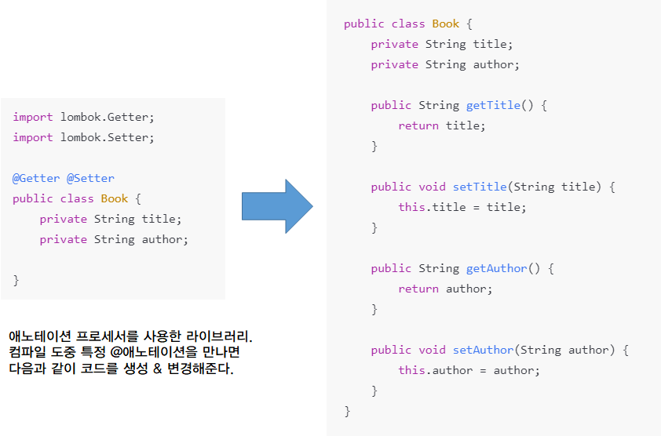
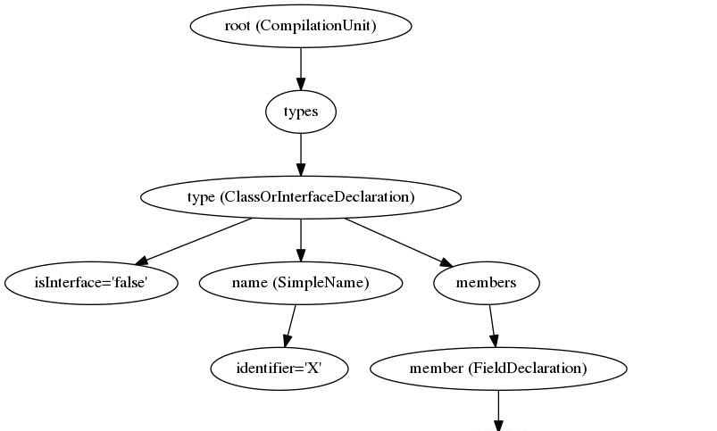

# 애노테이션 프로세서 (Annotation Processor)
- 음! 그렇다면 Lombok도 다이나믹 프록시처럼 리플렉션을 활용해서 동작하겠구나! 하고 생각할 수 있지만, 이는 리플렉션을 이용해서 구현한 것이 아니다. 이에 대해서 알아보도록 하자.

## JDK 1.5, 애노테이션의 등장
- 애노테이션은 소스코드에 컴파일 타임에 읽을 수 있는 주석을 통해 메타데이터(설정정보)를 추가하는 기능이다.
- 기존의 자바 프로그램은 소스코드와 그에 대한 문서를 따로 작성하는게 일반적이었다.
- 하지만 매번 코드와 문서를 동기화해주는 작업은 매우 번거로웠고, 자바 개발자들은 소스코드의 주석으로부터 HTML 문서를 자동 생성해내는 javadoc.exe를 만들게 되었다. 
- 기존의 자바 설정파일은 프로젝트 내에 XML 파일의 형태로 관리했었는데, 이것도 문서와 마찬가지로 소스코드와 함께 관리할 수 없을까? 라는 아이디어에서 나오게 된 것이 컴파일러를 위한 주석, [@애노테이션]이다.
- 애노테이션의 등장으로 설정 파일을 자바코드 내에 삽입하고 간단하게 설정을 변경할 수 있게 바뀌었다.

### 자바에서 어노테이션 정보를 이용하는 방법
1. 컴파일러에게 문법 에러를 확실하게 체크하도록 정보 제공 (@Override등)
2. 컴파일 타임에 자동으로 코드를 생산할 수 있는 정보 제공 (애노테이션 프로세서)
3. 런타임에 동적으로 특정 기능을 수행할 수 있도록 정보를 제공 (리플렉션)
 
## Java(JVM)의 다양한 기능
- 컴파일된 바이트코드(.class)는 JVM이 읽어들여 프로그램을 실행한다.
- JVM에서는 특정 인터페이스를 상속받았을 때 다른 동작을 하도록 컴파일해주거나 아예 런타임 시점에서 특정 동작이 발생하였을 때 중간에 가로채서 다른 코드를 실행하게 만드는 hook등을 제공한다. 

#### Shutdown Hook
- JDK1.3에 나온 기능으로 JVM이 종료될 때 작업을 가로채서 특정 코드를 실행하도록 만들 수 있다.
#### Annotation Processor
- JDK1.5~1.6에 나온 기능으로 어노테이션 기반 빌드 툴이다.(javac.exe, 즉 자바 컴파일러에 포함되어있음)
- 컴파일 도중 애노테이션을 만나면 특정한 동작을 하도록 만들 수 있다.
- AbstractProcessor 객체를 상속받아 사용할 수 있다.
#### 객체 직렬화
- JDK1.1에 나온 기능으로 Serializable 인터페이스를 상속받으면 JVM이 자동으로 해당 객체가 직렬화(객체 -> 바이트코드 전환)될 수 있도록 만들어준다. 
 
## Lombok이란
> [https://projectlombok.org/features/all]
- 애노테이션 기반으로 자주 사용하는 코드를 대신 생성해주는 자바 오픈소스 라이브러리이다.
- 현재 자바에서 가장 많이 쓰는 라이브러리로, @Getter @Setter @Builder 등의 전용 어노테이션과 어노테이션 프로세서 코드(AbstractProcessor)를 제공한다.

- 애노테이션 프로세서는 Javac(자바 컴파일러)에 포함되어 있는 프로그램이다.
 
## Lombok의 동작원리
- 우선 lombok 라이브러리를 가져오면 전용 어노테이션을 사용할 수 있다.
- [애노테이션 프로세서]를 이용해 만든 라이브러리이다. 내부에서 AbstractProcessor를 상속받아 사용한다.
- 애노테이션들로 적은 정보를 바탕으로 컴파일 시점에 [애노테이션 프로세서]를 이용하여 소스코드의 AST(abstract syntax tree)를 조작한다.
  - 이를 이용해서 마치 코드가 바뀐 것처럼 동작하게 만든다.

> AST객체. javac(컴파일러)에서는 내부 메서드를 이용해서 AST를 만든다.

- 다만 이는 자바에서 공식적으로 제공하는 참조만 가능한 객체(TypeElement 와 RoundEnvironment)를 하위타입으로 강제 캐스팅하여 javac가 사용하는 메서드를 사용하여 AST를 조작한다.
  - 일종의 컴파일러 해킹이라고 볼 수도 있다.
- 그래서 이클립스는 agent로, VsCode와 IntelliJ는 플러그인으로 lombok을 사용할 수 있도록 제공해준다.
  - IntelliJ에서는 플러그인을 설치하고, Lombok 라이브러리를 import한 후 어노테이션 프로세서를 활성화시키면 사용할 수 있다.

## 정리
- 애노테이션 프로세서는 컴파일 시점에 작동하는 빌드 툴이다.
- 즉, 리플렉션과 다르게 컴파일 시점에 모두 조작이 완료되기에, 추가적인 런타임 비용은 없다. (그냥 동일한 바이트코드이다).
  - 그래서 기존의 코드를 조작하더라도 리플렉션에 비해 위험성이 덜하다.
- 다만 애노테이션 프로세서는 코드 생성이 아니라 기존의 코드를 수정하기는 어려운데, 이를 구현하려면 lombok처럼 컴파일러 메서드를 해킹해야 한다는 단점이 있다.

- lombok
  - 어노테이션 프로세서 + 컴파일러 메서드 해킹
- 구글의 AutoService
  - 서비스로더용 리소스를 자동으로 만들어줌. java.util.ServiceLoader용 라이브러리
- Javapoet 라이브러리
  - 자바 코드를 쉽게 생성할 수 있게 도와주는 라이브러리 (애노테이션 프로세서등에서 주로 사용)
- @Override
  - 엥? 이건 어노테이션 프로세서가 아닌데요? 라고 할 수 있지만 사실 이러한 태그들도 어노테이션 프로세서를 이용하여 구현한다. 궁금하면 해당 링크에 들어가서 읽어보자

- 그 외에 어노테이션 프로세서를 사용한 라이브러리들
  - Dagger2(컴파일 타임의 DI 제공, 근데 보통 Spring core에 있는 IoC, DI, AOP를 사용)
  - 안드로이드 라이브러리 (안드로이드 OS도 JVM 바이트코드 기반으로 만들어졌다.)
    - ButterKinfe: @BindView (뷰 아이디와 애노테이션 붙인 필드 바인딩)
    - DeepLinkDispatch: 특정 URI 링크를 Activity로 연결할 때 사용

