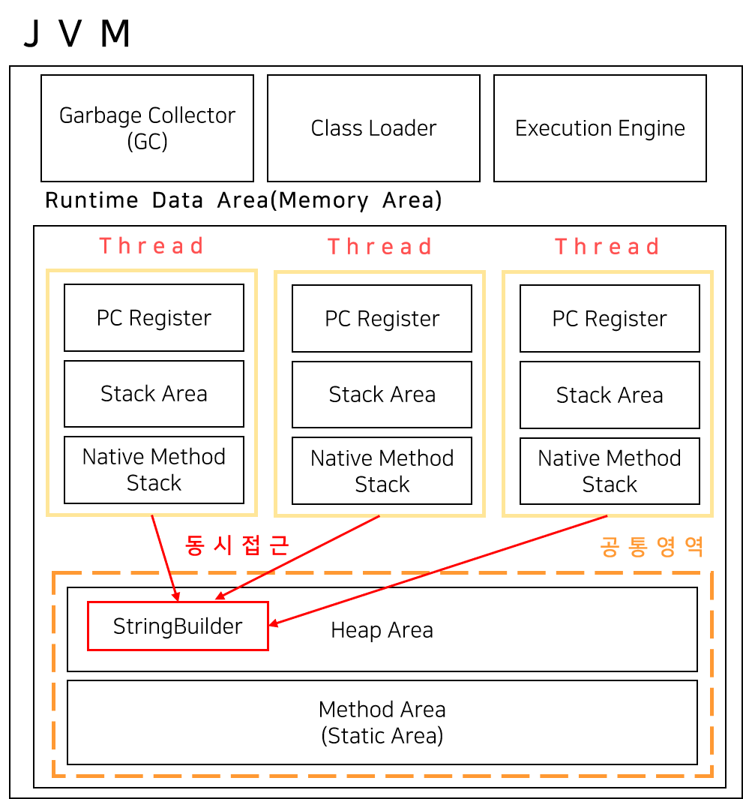
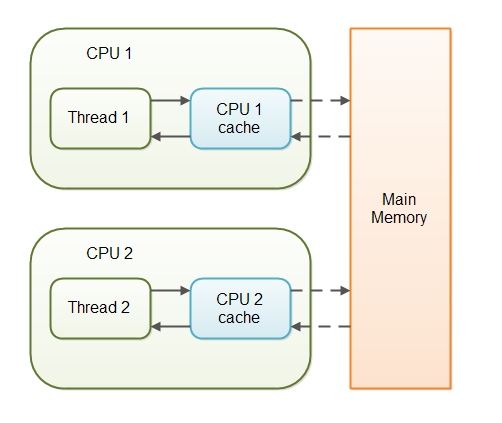
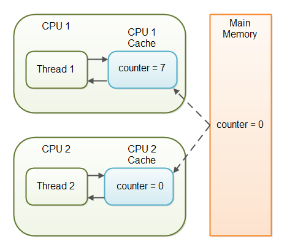

# 쓰레드 동기화 (sync, volatile, AtomicClass)

## 개요
- 쓰레드의 동기화란 한 쓰레드가 진행중인 작업을 다른 쓰레드가 간섭하지 못하도록 하는 것이다.
- 쓰레드는 class의 멤버 변수(자원)을 사용한다.
  - 멀티쓰레드 환경에서는 쓰레드 동기화를 하지 않으면, 심각한 문제가 생길 수 있다.

<p align="center"></p>

## 자바의 synchronized 키워드
- 자바는 synchronized 키워드를 사용하여 해당 메서드를 임계영역으로 만들 수 있게 해준다.
- 임계영역에서는 동시에 한 쓰레드만 접근해서 사용할 수 있도록 다른 쓰레드의 접근을 막는다(lock) 

```
1. synchronized 메서드를 사용한다.
2. synchronized block을 만들어 일부만 동기화 처리한다. (성능 향상을 위함)
```
```java
public synchronized void method() {
	// 임계 영역
}
 
public void function() {
    synchronized(객체의 참조변수) {
        // 임계 영역
    }
}
```

- synchronzied는 다수의 쓰레드에게 공유되는 객체 접근을 통제하는 자바의 첫 번째 동기화 메카니즘이었다.
- 하지만 이것만으로는 다양한 상황에 대처하기 힘들었기에 Java5에 Concurrent 관련 클래스들을 추가하였다.

## Atomic 클래스 (java.concurrent.atomic)
- 키워드 말고도 자바에서는 CAS(compare and swap) 방식으로 스레드 안정성을 보장하는 Atomic 패키지를 제공한다.

```java
import java.util.concurrent.atomic.AtomicInteger;
 
private AtomicInteger counter = new AtomicInteger();
 
public int getNextUniqueIndex() {
    return counter.getAndIncrement();
}
```

- CAS 방식은 자신이 읽었던 변수의 값을 기억하고 있다가 변경을 완료하기 직전에 읽었던 변수의 값이 그대로인지 확인하고 아니라면 실행을 무산시키는 방식이다.

```cpp
// C언어로 구현한 CAS
int compare_and_swap(int* reg, int oldval, int newval){ 
// 변경전 값을 저장해뒀다가, 편집 완료 후에도 메모리에 기존 값이 남아있어야 swap하는 방식.
  int old_reg_val = *reg;
  if (old_reg_val == oldval){
      *reg = newval;
  }
   return old_reg_val;
}
```

## volatile 키워드
- volatile 키워드는 자바 변수를 CPU 캐시가 아닌 '메인 메모리에 저장' 할 것을 명시해 변수의 가시성을 보장한다.
- 즉, volatile은 변수의 읽기/쓰기 명령을 메인 메모리로부터 수행한다는 것을 보장한다.
  - 이는 읽기 스레드와 쓰기 스레드가 함께 동작했을 때 일어나는 문제를 해결하는 방법이다

### 왜 읽기/쓰기를 같이 하면 문제가 생길까?
- CPU 에서 데이터를 읽을 때, 성능을 향상시키기 위해 Main Memory에서 계속 읽는 것이 아니라 각 CPU 코어의 캐시에 저장하여 사용한다.
- 그렇다면 멀티스레드를 사용하는 App에서, CPU 코어가 여러 개라면 어떻게 될까?

<p align="center"></p>

- 이렇게 일반 변수(non-volatile)에 대한 작업은 JVM 이 메인 메모리로부터 CPU 캐시를 통해 변수를 읽거나 반대로 CPU 캐시로 부터 메인 메모리에 데이터를 쓰거나 할 때 어떠한 동기화 보장도 해주지 않는다.
- 예를 들어 둘 이상의 쓰레드가 다음과 같은 공유 객체로 접근하는 경우를 생각해보자.

```java
// Thread-1 : counter 변수를 수정함. (+1씩 증가시킴)
// Thread-2 : counter 변수를 읽음
 
public class SharedObject {
    public int counter = 0;
}
```
- 만약 volatile 키워드를 선언하지 않는다면, counter 변수가 언제 CPU 캐시에서 메인 메모리로 이동될지 보장할 수 없다.
- 즉, 멀티코어 CPU의 경우 같은 변수임에도 다른 값을 가지고 있을 수 있다는 말이다.
- 이렇게 쓰레드가 변경한 값이 메인 메모리에 반영되지 않아 다른 스레드가 해당 값을 볼 수 없는 문제를 __'가시성 문제'__ 라고 한다.

<p align="center"></p>

- 여기에서 다음과 같이 volatile 키워드를 사용하게 된다면 해당 변수에 대한 쓰기 작업은 캐시 없이 바로 메인 메모리에 이루어진다.
  - 즉, 다른 쓰레드의 쓰기 작업에 대한 가시성을 보장한다.

### JDK1.5 이후의 volatile
- 참고로 JDK1.5 부터는 volatile 키워드는 단순히 가시성을 보장하는 것보다 더 많은 기능을 제공하도록 바뀌었다.
```
1. volatile 변수를 수정할 때 현재까지 수정한 모든 변수들이 메인 메모리에 저장(flushed)된다.
2. volatile 변수를 캐시로 읽어들일 때 앞에서 같이 저장한 변수들도 같이 읽는다.
```

### 그럼 volatile이 무조건 좋은걸까?
- volatile은 한 변수를 두고 오직 한 쓰레드만 읽기/쓰기 작업을 하고, 다른 쓰레드들은 읽기 작업만 한다면 사용했을 때 논블로킹 멀티쓰레드를 구현할 수 있다.
  - 하지만 이 경우가 아니라면 말이 달라진다.
- volatile 선언은 변수에 접근하는 쓰레드들을 블록시키지 않는다.
  - 그래서 공유 변수를 여러 쓰레드가 동시에 쓰는(write) 임계영역에 대해서 명령이 무시될 가능성이 있다.
  - 즉, 해당 명령의 원자성을 보장을 보장하지 않는데, 이런 경우에는 synchronized 키워드가 필요하다.
  - 만약 synchrozined 로 기능이 부족하다면 위에서 언급한 java.util.concurrent에 있는 Atomic 클래스들을 사용하면 된다. 
- 또한 volatile 때문에 CPU 캐시를 쓰지 못해서 성능이 떨어질 가능성이 있고, JVM의 코드 재정리, 최적화도 해당 키워드 때문에 동작하지 않을 수 있음을 유의하자.
