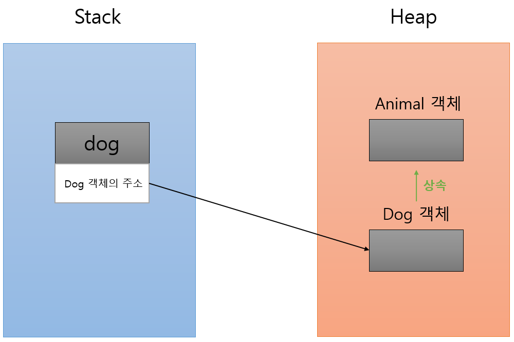

# 자바의 생성자 동작 방식
## 1. 객체 생성 순서
- 자식 클래스의 객체를 생성될 때, 부모 클래스 객체가 먼저 생성되고 자식 클래스가 생성된다.
  - 이러한 방식으로 동작하는 이유는 자바는 업캐스팅, 다운캐스팅을 둘 다 지원하기 때문이다.
 
<p align="center"></p>

- 위와 같이 부모 생성자를 호출하지 않으면 컴파일이 불가능하다.
- 쉽게 말하면 부모 레퍼런스( Animal dog = new Dog() )에 업캐스팅한 객체를 다시 자식객체( Dog newDog = dog )로 다운캐스팅해도 정상 동작한다.
- 즉, 자식 객체는 부모 레퍼런스(super)를 가지고 있어 필요하다면 자식 객체 안에서 부모 메서드를 호출할 수 있다.
- 이는 this의 동작 원리와 비슷하다.
  - 힙 메모리 또한 부모와 자식이 구분지어서 가지고 있게 된다.

### 부모와 자식이 똑같은 이름의 필드를 사용한다면?
```java
class Parent {
 
    public String name;
 
    public Parent(String name) {
        this.name = name;
    }
 
    public String getName() {
        return name;
    }
}
 
class Child extends Parent {
 
    public String name; // 부모와 똑같은 이름의 필드
 
    public Child(String pName, String cName) {
        super(pName);
        this.name = cName;
    }
}
```

- 이 경우, 같은 인스턴스라도 Parent 타입이냐 Child 타입이냐에 따라 다른 힙 메모리의 name을 가져온다.

```java
public static void main(String[] args) {
    Parent parent = new Child("parent", "child");
    System.out.println(parent.name); // "parent"가 반환됨
    System.out.println(parent.getName()); // "parent"가 반환됨
 
    Child child = (Child) parent;
    System.out.println(child.name); // "child"가 반환됨
    System.out.println(child.getName()); // getter를 오버라이딩 안했으므로, parent가 반환됨
}
```

<p align="center"></p>

- hashcode를 보면 실제로 부모와 자식의 name 메모리가 다름을 알 수 있다.
- 참고로 이는 Outer - Inner에서도 동일하게 동작한다.
  - 결국 클래스가 2개 만들어지고, 레퍼런스를 가지는거니까
  - 그래서 Outer의 레퍼런스를 가지지않는 static Inner는 Outer.name을 사용할 수 없다. 컴파일에러!


```java
class Shadowing {
    String name = "Outer John";
 
    class innerShadowing {
        String name = "Inner John";
 
        public void print() {
            System.out.println("Inner/name: " + name);
//            System.out.println(Shadowing.name); 참고로 이건 Static 필드를 가져오는 문법이다.
            System.out.println("Inner/Shadowing.this.name: " + Shadowing.this.name);
        }
    }
 
    public void outerPrint() {
        System.out.println("Outer/name: " + name);
    }
}
 
class Main {
 
    // Main driver method
    public static void main(String[] args) {
        Shadowing obj = new Shadowing();
 
        Shadowing.innerShadowing innerObj
            = obj.new innerShadowing();
 
        obj.outerPrint(); // Outer.name
        innerObj.print();
        System.out.println("Main/inner.name :" + innerObj.name); // Inner.name
    }
}
```
<p align="center"></p>

- 이런 식으로 필드 이름이 가려져서, 숨겨진 부모.name이 있는걸 Shadowing 이라고 한다.

--- 

- 사실 자바에서는 Method의 정보는 Static 영역에 저장해서 모든 객체가 공유해서 사용한다.
- 그러다가 본인 객체의 필드가 필요해진 경우, 메서드가 가지고 있는 this(힙 메모리 레퍼런스)를 통해서 본인 객체의 필드를 가져와 메서드를 실행시키고, this를 이용해 힙 메모리에 다시 저장하는 방식이다.
- 즉 super도 마찬가지로 힙 메모리에 부모 메서드 정보가 있는게 아니라, 단지 부모 힙 메모리 레퍼런스일 뿐이다.

<p align="center"></p>

```java
Dog dog = new Dog();
```

## 2. 디폴트 생성자(Default Constructor)
- 자식 객체는 부모 객체를 만들 때 부모의 생성자를 호출한다.
- 다만 원한다면 명시적으로 원하는 부모 생성자를 호출할 수 있다.
  - 하지만 반드시 생성자 제일 첫 문장에 super()를 호출해야 하며, 이를 어긴다면 컴파일 시 오류가 발생하게 된다.

```java
public class Dog(){
 
  Public Dog() {
      super(); // 명시적인 부모 생성자 선언. 반드시 생성자 첫 줄에 사용.
      ...
    }
}
```

- 이 때 명시적으로 생성자를 작성하지 않아도 자동으로 만들어서 호출되는 생성자를 Default 생성자라고 한다.
- 물론 생성자를 작성하지 않았을 때 이야기이고, 만약 명시적으로 작성한 생성자가 있다면 직접 파라메타가 없는 생성자를 만들어야한다.

```java
public class Animal {
 
    public Animal() { } // 생성자가 없다면 자동생성.
    
    public Animal(name) { } // 이렇게 개발자가 작성한 생성자가 있다면 자동 생성되지 않음.
   
}
```

<p align="center"></p>

- 생성자가 없어도 이런 식으로 사용이 가능했던 건, Default 생성자의 자동 생성 때문이다.

### Inner 클래스의 동작방식 (내부 정적 클래스)
- Q. static 클래스는 컴파일 에러가 뜨는데, 왜 Inner 클래스에는 static을 붙일 수 있을까?
- 일단 정적 클래스라는 것은 존재하지 않는다. 정확히는 '정적이 아닌' 클래스라는 개념이 없다.
  - 애초에 클래스의 정보는 JVM의 ClassLoader가 읽어들일 때 전부 정적 영역(메서드 영역)에 저장하기 때문이다.
  - 다만 JVM은 Lazy하게 클래스를 읽는다. 코드를 작성했다 해도 실제 사용하기 전까지 ClassLoading을 미룬다.
- 클래스 정보, static 필드 뿐 아니라 메서드 정보도 정적영역(메서드 영역)에 저장해서 모든 클래스가 공유한다. (static 붙지 않은 일반 메서드 전부)
- 이렇게 사용하면 메서드를 실행할 때 [힙 메모리에 있는 현재 객체의 멤버변수]를 사용하면 문제가 생기게 된다.
  - 그래서 JVM은 추가적으로 [이 메서드를 사용하고있는 객체의 힙 메모리 레퍼런스]를 파라미터로 주게 되는데, 그게 바로 this 키워드이다.
  - this 키워드는 단순히 편의상 제공되는 기능이 아니라, 이런 비밀이 숨어 있었다고 한다.

- 다시 본론으로 돌아와서, 클래스에 static을 붙였다고 해서 정적 클래스가 되는게 아니라 원래 정적 공간에 저장된다.
- 자바는 class 단위로 바이트 코드를 만든다.
  - 컴파일을 해보면 알겠지만 inner 클래스, outer 클래스의 바이트코드(.class)가 따로 존재한다.
- 그래서 inner 클래스만 따로 사용할 수 있지만, 기본적으로 자바에서는 inner 클래스는 outer 클래스가 없으면 만들 수 없게 설정되어 있다.
  - 단 inner 클래스에 static을 붙이게 되면 outer 클래스가 없어도 만들 수 있도록 허용해준다.
  - 다만 이렇게 억지로 inner 클래스를 꺼내서 사용하게 되면 메모리 누수등의 문제가 있다.


